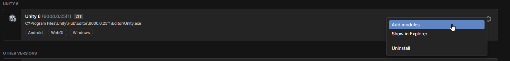
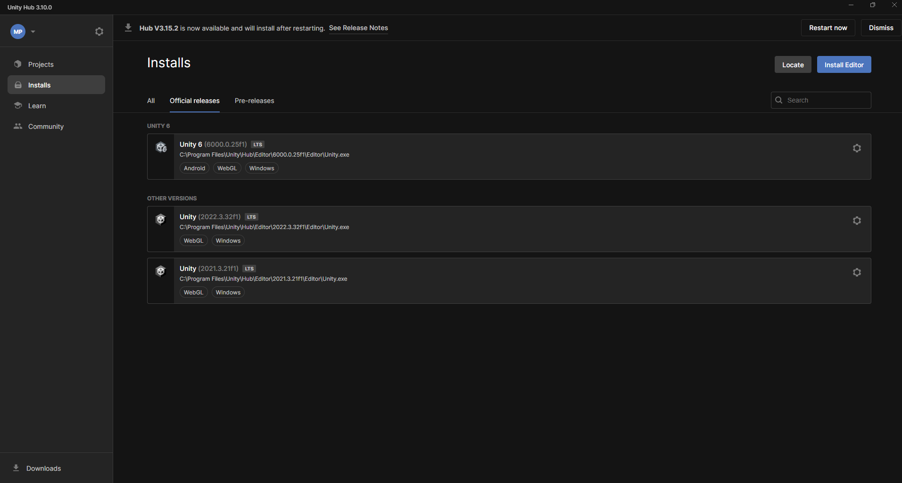
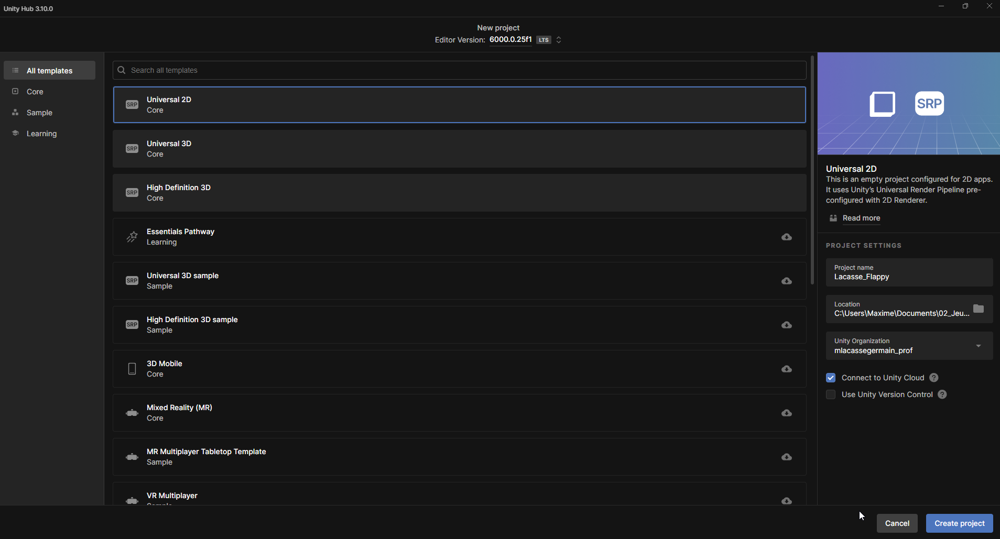
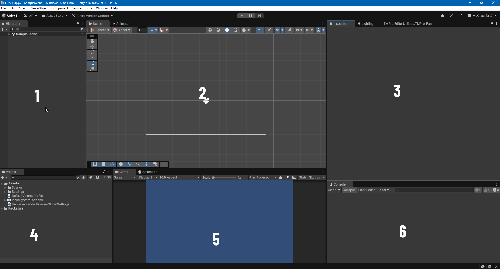
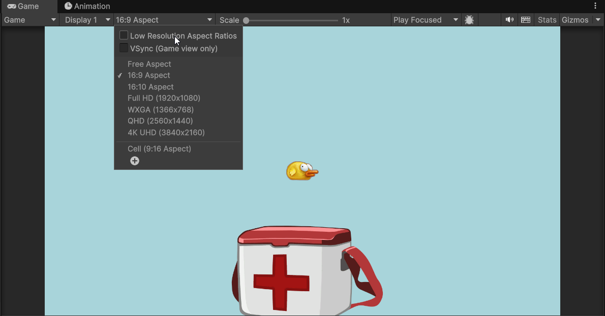
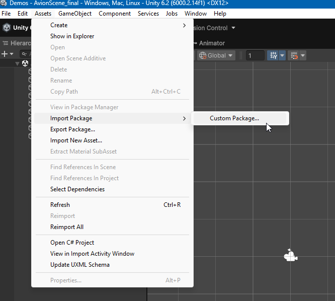

# Introduction à Unity

Unity est un moteur de jeu puissant et polyvalent utilisé pour créer des jeux vidéo et des expériences interactives en 2D et 3D. Cette introduction couvre les bases de l'interface utilisateur, la création de projets, l'importation d'assets, et les concepts fondamentaux nécessaires pour commencer à développer avec Unity.

Ce n'est pas le seul moteur de jeu. D'autres moteurs populaires incluent Unreal Engine, Godot, et CryEngine. Chacun a ses propres avantages et inconvénients, mais Unity est particulièrement apprécié pour sa facilité d'utilisation, sa large communauté, et son support multiplateforme. Il est rapide à apprendre, même pour les débutants, et offre une grande flexibilité pour les développeurs expérimentés.

Unity permet de créer à la fois des jeux en 2D et en 3D. Les jeux 2D utilisent des sprites (images plates) et se déroulent généralement sur un plan bidimensionnel, tandis que les jeux 3D utilisent des modèles tridimensionnels et offrent une profondeur supplémentaire.

## Jeux professionnels réalisés avec Unity

-   **Hollow Knight** : Un jeu d'action-aventure en 2D acclamé pour son design artistique et son gameplay.
-   **Cuphead** : Un jeu de plateforme en 2D connu pour son style visuel inspiré des dessins animés des années 1930.
-   **Ori and the Blind Forest** : Un jeu de plateforme en 2D avec une narration émotionnelle et des graphismes magnifiques.
-   **Monument Valley** : Un jeu de puzzle en 3D avec des niveaux artistiques et des illusions d'optique.
-   **Subnautica** : Un jeu d'exploration en 3D sous-marine avec un monde ouvert immersif.
-   **Pokémon Go** : Un jeu mobile en réalité augmentée qui utilise Unity pour créer des expériences interactives dans le monde réel.
-   **Beat Saber** : Un jeu de réalité virtuelle en 3D où les joueurs coupent des blocs au rythme de la musique.
-   **Rust** : Un jeu de survie en ligne en 3D avec un monde ouvert et des interactions multijoueurs.
-   **Among Us** : Un jeu multijoueur en 2D où les joueurs doivent identifier les imposteurs parmi eux.
-   **Hearthstone** : Un jeu de cartes à collectionner en ligne en 2D avec des mécaniques de jeu stratégiques.
-   **Cult of the Lamb** : Un jeu d'action-aventure en 2D avec des éléments de gestion de base et un style artistique unique.

## Langage C#

Unity utilise principalement le langage de programmation C# pour le développement de scripts. C# est un langage orienté objet, moderne et puissant, qui permet de créer des comportements complexes pour les jeux. Il est recommandé d'avoir une compréhension de base de la programmation pour tirer le meilleur parti de Unity.

Comme JavaScript appris la session dernière, C# utilise des concepts similaires tels que les variables, les fonctions, les boucles, et les conditions. Cependant, C# est plus strict en termes de typage et de structure, ce qui peut aider à prévenir certaines erreurs courantes.

Nous aborderons les concepts de base de C# au fur et à mesure que nous progressons dans les exercices et les projets Unity.

## Configuration requise

Pour utiliser Unity, assurez-vous que votre ordinateur répond aux exigences minimales suivantes :

-   Système d'exploitation : Windows 10 (64 bits) ou macOS 10.14+
-   Processeur : Processeur multi-cœur avec prise en charge de SSE2
-   Mémoire RAM : 8 Go minimum (16 Go recommandé)
-   Carte graphique : Compatible DirectX 11 ou Metal
-   Espace disque : Au moins 10 Go d'espace libre pour l'installation de Unity
-   Connexion Internet : Requise pour l'installation et les mises à jour

## Installation de Unity

1. Aller sur le site officiel de Unity : [https://unity.com/](https://unity.com/)
2. Télécharger et installer Unity Hub, un gestionnaire de versions et de projets Unity.
3. Ouvrir Unity Hub et créer un compte Unity si vous n'en avez pas déjà un.
4. Dans Unity Hub, aller à l'onglet "Installs" et cliquer sur "Add" pour installer la version de Unity souhaitée (recommandé : la dernière version stable). Nous utiliserons la version Unity 6 LTS.
5. Sélectionner les modules supplémentaires nécessaires, tels que le support pour les plateformes spécifiques (Windows, macOS, Android, iOS, etc.). Assurez-vous d'inclure le module `Visual Studio Community` pour le développement de scripts C#, `WebGL build support`. Au besoin, vous pouvez ajouter d'autres modules plus tard.

## Création d'un nouveau projet

Pour créer un nouveau projet Unity

1. Ouvrir Unity Hub
2. Aller à l'onglet "Projects"
3. Cliquer sur "New Project"
4. Sélectionner le template "Universel 2D Core" pour nos projets 2D
5. Nommer le projet de manière appropriée (exemple : "VotreNom_ExFlappyBird")
6. Choisir un emplacement pour sauvegarder le projet. **NE PAS utiliser OneDrive ou un dossier synchronisé en ligne.**

## Importer un projet existant

Pour ouvrir un projet Unity existant:

1. Ouvrir Unity Hub
2. Aller à l'onglet "Projects"
3. Cliquer sur "Add"
4. Naviguer jusqu'au dossier du projet Unity existant
5. Sélectionner le dossier et cliquer sur "Select Folder"
6. Le projet apparaîtra maintenant dans la liste des projets disponibles dans Unity Hub. Cliquer dessus pour l'ouvrir.

Si votre projet utilise une version différente de Unity que celle installée, Unity Hub vous proposera de télécharger et d'installer la version appropriée. **TRAVAILLEZ TOUJOURS AVEC LA MÊME VERSION DE UNITY entre chez vous et le laboratoire du Collège.**

## Interfaces et fenêtres principales de Unity

Une fois dans Unity, vous verrez plusieurs fenêtres principales. Déplacez et organisez-les selon vos préférences, mais voici une description des fenêtres les plus importantes . Si vous ne voyez pas une fenêtre, vous pouvez l'ouvrir via le menu `Window` en haut.
Déplacez les fenêtres pour qu'elles correspondent à cette image.

1.  **Hierarchy** : Cette fenêtre liste tous les objets présents dans la scène actuelle. Vous pouvez organiser les objets en les faisant glisser pour créer des relations parent-enfant. Une scène peut être vue comme un niveau ou un environnement dans lequel le jeu se déroule.
2.  **Scene View** : C'est ici que vous construisez et organisez votre scène de jeu. Vous pouvez y déplacer, faire pivoter et redimensionner les objets. La fenêtre possède une barre d'outils en haut pour naviguer dans la scène (panoramique, zoom, rotation) et manipuler les objets (déplacer, faire pivoter, redimensionner).
3.  **Inspector** : Cette fenêtre affiche les propriétés et les paramètres de l'objet actuellement sélectionné dans la Hierarchy ou le Project. Vous pouvez modifier les composants, les scripts, et d'autres réglages de l'objet ici.
4.  **Project** : Cette fenêtre affiche tous les fichiers et assets de votre projet Unity. C'est ici que vous importez des images, des sons, des scripts, et d'autres ressources nécessaires pour votre jeu.
5.  **Game View** : Cette fenêtre affiche ce que la caméra principale voit dans le jeu. C'est la vue que les joueurs auront lorsqu'ils joueront à votre jeu.
6.  **Console** : Cette fenêtre affiche les messages de débogage, les erreurs, et les avertissements générés par votre jeu ou vos scripts. C'est un outil essentiel pour le développement et le débogage.

### Enregistrer le positionnement des fenêtres

Une fois que vous avez organisé les fenêtres selon vos préférences, vous pouvez enregistrer cette disposition pour une utilisation future :

1. Aller dans le menu `Window` > `Layouts` > `Save Layout...`
2. Donner un nom à votre disposition personnalisée et cliquer sur `Save`

Si jamais vous souhaitez revenir à cette disposition, vous pouvez la sélectionner dans le menu `Window` > `Layouts`.

L'utilisation de packages Unity permet de partager facilement des assets, scripts, et autres ressources entre différents projets Unity. Cela peut être une façon d'archiver temporairement des éléments ou de les transférer vers un autre projet.

Les packages peuvent contenir des scripts, des textures, des modèles 3D, des scènes, et bien plus encore.

## Ajuster la fenêtre Game View

La fenêtre Game View peut être ajustée pour simuler différentes résolutions d'écran. Cela est particulièrement utile pour tester comment votre jeu apparaîtra sur différents appareils. Pour l'instant, sélectionnez la résolution `16:9` et sélectionnez l'option `Play Focussed` (icône de cible) pour que la fenêtre Game reste active lorsque vous appuyez sur le bouton Play mais sans être mise en plein écran.

Si vous trouvez que les graphiques sont flous, décochez l'option `Low Resolution Aspect Ratios` dans le menu déroulant des résolutions si votre ordinateur le permet.

### Ajuster la résolution de la fenêtre de jeu

Vous devriez toujours tester votre jeu en fonction de la résolution cible prévue. Pour ajouter une résolution personnalisée :

1. Cliquer sur le menu déroulant des résolutions dans la fenêtre Game View (par défaut, il peut afficher `Free Aspect`).
2. Sélectionner une résolution prédéfinie ou cliquer sur le signe `+` pour ajouter une résolution personnalisée.
3. Donner un nom à la résolution personnalisée, définir la largeur et la hauteur, puis cliquer sur `OK`.

### Exemples de résolutions courantes

-   1920 x 1080 (Écran standard HD)
-   1366 x 768 (Écran ordinateur portable)
-   768 X 1024 (Tablette - portrait)
-   1024 x 768 (Tablette - paysage)
-   640 x 360 (Mobile - paysage)
-   360 x 640 (Mobile - portrait)

Pour voir les statistiques de format d'écrans courants: https://gs.statcounter.com/screen-resolution-stats

### Pour tester votre jeu

Pour tester votre jeu dans l'éditeur Unity, vous pouvez utiliser le bouton `Play` situé en haut au centre de l'interface. Lorsque vous cliquez sur ce bouton, Unity passe en mode de jeu, et vous pouvez interagir avec votre jeu comme si vous étiez un joueur. Si vous avez cliqué en dehors de la fenêtre Game View pendant le test, recliquez dans cette fenêtre pour lui redonner le focus.

## Importer un package Unity

1. Ouvrir Unity et le projet dans lequel vous souhaitez importer le package.
2. Aller dans le menu principal et sélectionner `Assets` > `Import Package` > `Custom Package...`.
3. Naviguer jusqu'à l'emplacement du fichier `.unitypackage` que vous souhaitez importer.
4. Sélectionner le fichier et cliquer sur `Open`.
5. Une fenêtre d'importation s'ouvrira, affichant tous les assets contenus dans le package. Vous pouvez cocher ou décocher les éléments que vous souhaitez importer.
6. Cliquer sur `Import` pour commencer l'importation. Les assets seront ajoutés à votre projet Unity.

## Exporter un package Unity

1. Ouvrir Unity et le projet contenant les assets que vous souhaitez exporter.
2. Dans la fenêtre `Project`, sélectionner les assets que vous souhaitez inclure dans le package. Vous pouvez sélectionner plusieurs éléments en maintenant la touche `Ctrl` (ou `Cmd` sur Mac) enfoncée.
3. Aller dans le menu principal et sélectionner `Assets` > `Export Package...`.
4. Dans la fenêtre d'exportation, vérifier que tous les assets souhaités sont cochés. Si vos assets dépendent d'autres assets, cochez l'option `Include dependencies`.
5. Cliquer sur `Export` et choisir l'emplacement où enregistrer le fichier `.unitypackage`.
6. Cliquer sur `Save` pour créer le package.

## Documentation officielle

Unity dispose d'une documentation officielle très complète qui couvre tous les aspects du moteur, des concepts de base aux fonctionnalités avancées. Vous pouvez y accéder en ligne à l'adresse suivante : [https://docs.unity3d.com/Manual/index.html](https://docs.unity3d.com/Manual/index.html). Si vous ne vous souvenez plus comment faire quelque chose dans Unity, la documentation est souvent le meilleur endroit pour trouver des réponses.

## Ressources supplémentaires

-   Liste vidéos du cours : [Vidéos officielles du cours](https://www.youtube.com/watch?v=fiDW-0GYLsg&list=PL0_-lSQN5AZQC3Wd3HTILptbWASZ4AY-z)

-   Tutoriels Unity Learn : [https://learn.unity.com/](https://learn.unity.com/)
-   Chaîne YouTube Unity : [https://www.youtube.com/user/Unity3D](https://www.youtube.com/user/Unity3D)
-   Brackeys Unity Tutorials : [https://www.youtube.com/c/Brackeys](https://www.youtube.com/c/Brackeys)
-   Cours C# pour débutants : [https://learn.microsoft.com/en-us/dotnet/csharp/](https://learn.microsoft.com/en-us/dotnet/csharp/)
