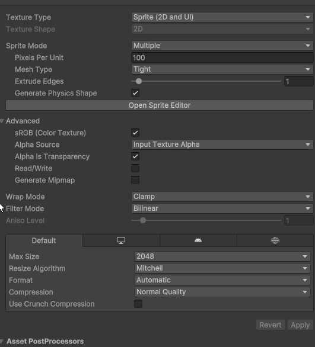
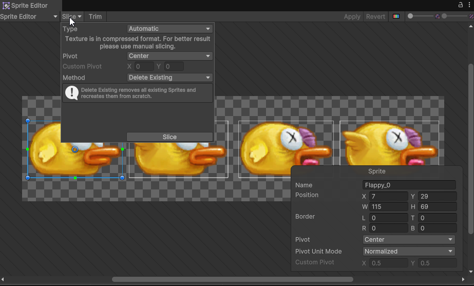
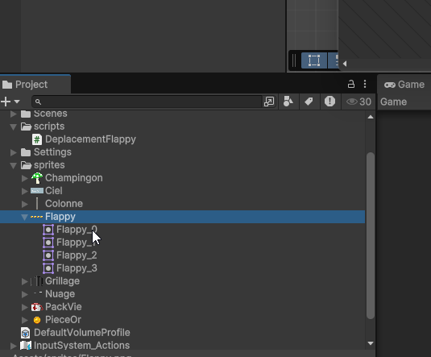

# Gestion des images et des sprites dans Unity

Les sprites sont des images 2D utilisées dans les jeux vidéo pour représenter des personnages, des objets, des arrière-plans, etc. Unity offre une gestion complète des sprites, permettant de les importer, de les organiser et de les manipuler facilement.

## Importation des sprites

Vous pouvez simplement glisser-déposer des fichiers image (comme PNG, JPEG, etc.) dans le dossier `Assets` de votre projet Unity. Unity reconnaît automatiquement ces fichiers comme des sprites. Les fichiers Psd (Photoshop) sont également pris en charge, mais il est recommandé de les convertir en PNG pour une meilleure compatibilité.

Une fois importés, vous pouvez sélectionner les images dans le dossier `Assets` et, dans l'inspecteur, définir leur `Texture Type` sur `Sprite (2D and UI)` pour les utiliser comme sprites si ce n'est pas déjà fait.

Les sprites ont les propriétés suivantes dans l'inspecteur Unity :

-   **Pixels Per Unit** : Définit combien de pixels dans l'image correspondent à une unité Unity. Par défaut, c'est 100 pixels par unité.
-   **Mesh Type** : Définit la forme du maillage utilisé pour le sprite. Les options sont `Full Rect` (rectangle complet) ou `Tight` (maillage ajusté autour du sprite). Cela retire de l'espace vide autour du sprite.
-   **Pivot** : Définit le point d'ancrage du sprite. Vous pouvez choisir parmi des options prédéfinies ou définir une position personnalisée.
-   **Filter Mode** : Définit la manière dont le sprite est filtré lorsqu'il est mis à l'échelle. Les options sont `Point` (pixelisé), `Bilinear` (lissé) et `Trilinear` (lissé avec mipmaps). À changer selon le style graphique souhaité.
-   **Compression** : Permet de compresser la texture pour économiser de l'espace mémoire, avec des options comme `None`, `Low`, `Medium`, et `High`.

## Sprite Editor

Unity dispose d'un outil appelé `Sprite Editor` qui permet de découper des images en plusieurs sprites, ce qui est particulièrement utile pour les feuilles de sprites (sprite sheets). Pour accéder au Sprite Editor :

1. Sélectionnez l'image dans le dossier `Assets`.
2. Dans l'inspecteur, cliquez sur le bouton `Sprite Editor`.
3. Utilisez les outils disponibles pour découper l'image en plusieurs sprites selon vos besoins. Dans le menu "slice", vous pouvez choisir entre `Automatic` (découpe automatique basée sur la transparence) ou `Grid By Cell Size` / `Grid By Cell Count` (découpe en grille selon la taille ou le nombre de cellules).
4. Cliquez sur `Apply` pour enregistrer les modifications.
5. Une fois découpés, les sprites individuels apparaîtront comme des sous-éléments de l'image dans le dossier `Assets`, et vous pourrez les utiliser séparément dans votre scène.

## Utilisation des sprites dans la scène et Sprite Renderer

Pour utiliser un sprite dans votre scène Unity, il suffit de le glisser-déposer depuis le dossier `Assets` vers la fenêtre `Hierarchy` ou directement dans la fenêtre `Scene`. Cela crée un GameObject avec un composant `Sprite Renderer` qui affiche le sprite. Le composant `Sprite Renderer` a plusieurs propriétés que vous pouvez ajuster, telles que la couleur, l'ordre de tri (pour gérer la superposition des sprites), et le matériau.

### Mon sprite n'apparaît pas correctement...

Pour afficher un sprite devant un autre, vous pouvez ajuster la propriété `Order in Layer` du composant `Sprite Renderer`. Un nombre plus élevé signifie que le sprite sera rendu au-dessus des sprites avec des nombres plus bas.

Pour retourner un sprite horizontalement ou verticalement, vous pouvez cocher les cases `Flip X` ou `Flip Y` dans le composant `Sprite Renderer`.

