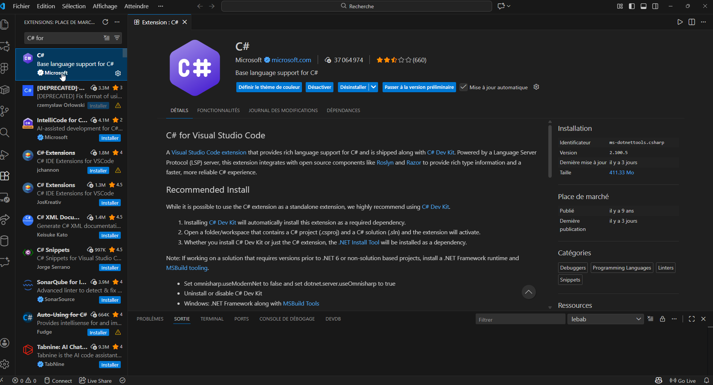
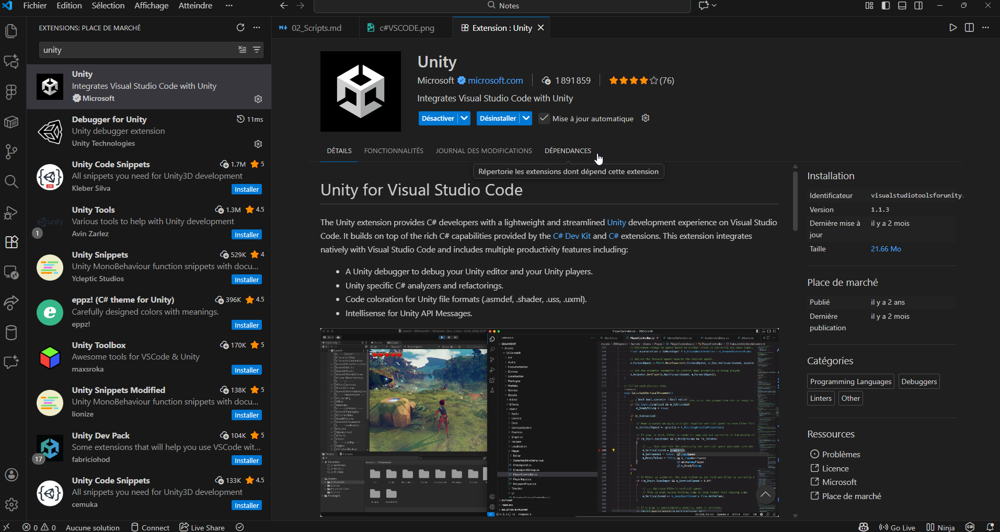
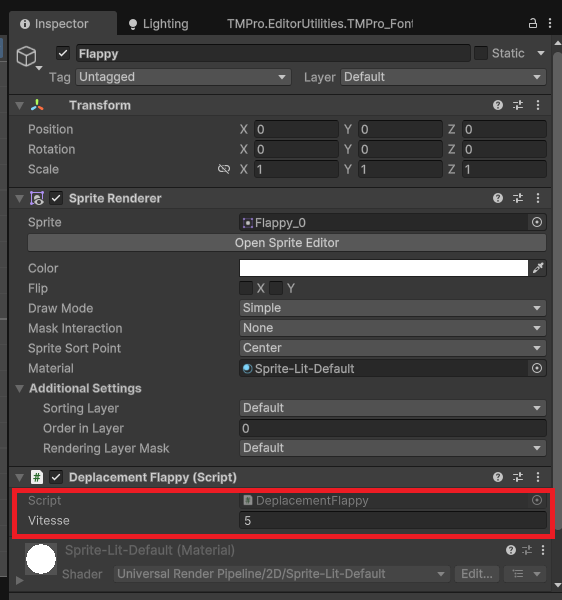
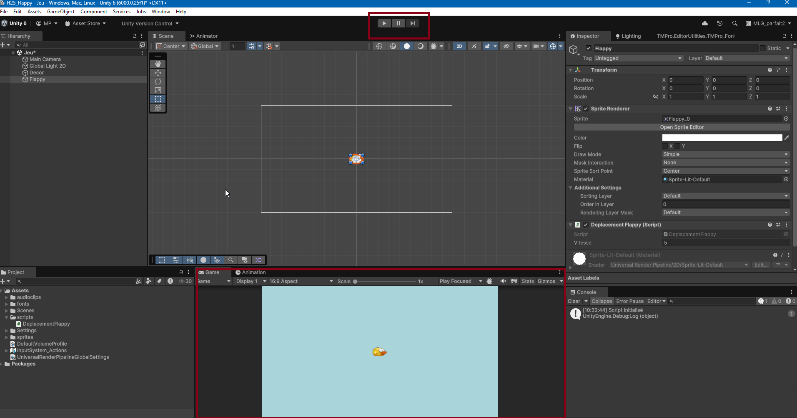

# Programmation de scripts dans Unity

Les scripts dans Unity sont principalement écrits en C#. Ils permettent de contrôler le comportement des objets dans une scène, de gérer les interactions utilisateur, de manipuler les données du jeu, et bien plus encore. Voici un guide pour commencer à programmer des scripts dans Unity. On ajoute un script à un GameObject pour définir son comportement. Il est considéré comme un composant du GameObject.

Il est possible d'ajouter plusieurs scripts à un même GameObject, permettant ainsi de combiner différents comportements. Pour l'instant, nous nous concentrerons sur la création et l'ajout d'un seul script à un GameObject.

## Intégration avec VSCode ou Visual Studio

Unity s'intègre parfaitement avec des éditeurs de code externes tels que Visual Studio Code (VSCode) (logo bleu) ou Visual Studio Community (logo violet).


### VSCode ou Visual Studio Community ?

Visual Studio Code est un éditeur de code léger et polyvalent, tandis que Visual Studio Community est un environnement de développement intégré (IDE) plus complet. Les deux offrent d'excellentes fonctionnalités pour le développement en C# avec Unity, telles que la complétion de code, le débogage, et la gestion des projets. Le deux sont gratuits et largement utilisés dans la communauté Unity mais VSCode est plus léger et plus rapide à lancer.

Voici comment configurer Unity pour utiliser l'un de ces éditeurs :

1. Ouvrir Unity et aller dans `Edit` > `Preferences` (Windows) ou `Unity` > `Preferences` (macOS).
2. Dans la section `External Tools`, sélectionner `Visual Studio Code` ou `Visual Studio` dans le menu déroulant `External Script Editor`.
3. Assurez-vous que les options `Generate all .csproj files` et `Generate .csproj files for:` sont cochées pour inclure les fichiers de projet nécessaires.

### Installation de Visual Studio Community

Si vous choisissez d'utiliser Visual Studio Community, voici comment l'installer :

1. Rendez-vous sur le site officiel de Visual Studio : [https://visualstudio.microsoft.com/fr/downloads/](https://visualstudio.microsoft.com/fr/downloads/)
2. Téléchargez l'installateur de Visual Studio Community.
3. Lancez l'installateur et sélectionnez les charges de travail suivantes :
    - **Développement de jeux avec Unity** : Cela installera les outils nécessaires pour le développement Unity.
4. Suivez les instructions à l'écran pour terminer l'installation.
5. Une fois l'installation terminée, redémarrez Unity pour que les modifications prennent effet.

### Installation des extensions pour VSCode

Dans VSCode, il est recommandé d'installer l'extension `C# for Visual Studio Code` pour une meilleure prise en charge de C# et de Unity. Cela inclut la complétion de code, le débogage, et d'autres fonctionnalités utiles et le package `Unity Tools` pour des fonctionnalités supplémentaires spécifiques à Unity.




## Création d'un script C# dans Unity

Pour créer un script C# dans Unity, suivez ces étapes :

1. Dans la fenêtre `Project`, faites un clic droit dans le dossier où vous souhaitez créer le script.
2. Sélectionnez `Create` > `C# Script`.
3. Nommez le script (par exemple, `DeplacementFlappy`). Indiquez un nom pertinent qui reflète la fonctionnalité du script.
4. Double-cliquez sur le script pour l'ouvrir dans votre éditeur de code configuré (VSCode ou Visual Studio).
5. Glissez-déposez le script sur un GameObject dans la fenêtre `Hierarchy` pour l'ajouter en tant que composant.


## Structure de base d'un script C#

Les scripts C# dans Unity suivent une structure de base. Ils importent généralement l'espace de noms `UnityEngine` et contiennent une classe qui hérite de `MonoBehaviour`. C'est ce qui permet au script de fonctionner comme un composant Unity.

**!!NE PAS modifier le nom de la classe ou le fait qu'elle hérite de `MonoBehaviour`, sinon Unity ne pourra pas reconnaître le script correctement.**

Les scripts ont deux méthodes principales lors de la création que vous utiliserez fréquemment:

-   Start() : appelée une fois au début, lorsque le script est initialisé.
-   Update() : appelée à chaque frame, utilisée pour les mises à jour continues. C'est la boucle de jeu principale du script. Chaque script peut contenir plusieurs autres méthodes pour gérer des événements spécifiques, comme les collisions, les entrées utilisateur, etc.

```cs
using UnityEngine;
public class DeplacementFlappy : MonoBehaviour
{
    // Méthode appelée une fois au début
    void Start()
    {
        Debug.Log("Le script a démarré !");
    }

    // Méthode appelée à chaque frame
    void Update()
    {
        // Code à exécuter à chaque frame
    }
}

```

## Propriétés et champs

Les scripts peuvent contenir des propriétés et des champs pour stocker des données. Les champs publics sont visibles et modifiables dans l'inspecteur Unity, ce qui permet de configurer les valeurs directement depuis l'éditeur. La valeur dans l'inspecteur peut être différente de celle définie dans le code et c'est cette valeur qui sera utilisée lors de l'exécution.

```cs
public class DeplacementFlappy : MonoBehaviour
{
    // Champ public visible dans l'inspecteur Unity
    public float vitesse = 5.0f;

    void Update()
    {
        // Utilisation du champ vitesse pour déplacer l'objet
        transform.Translate(Vector3.right * vitesse * Time.deltaTime);
    }
}
```

### Time.deltaTime?

`Time.deltaTime` représente le temps écoulé entre la dernière frame et la frame actuelle. Il est utilisé pour rendre les mouvements indépendants de la fréquence d'images (FPS). En multipliant un mouvement par `Time.deltaTime`, vous vous assurez que l'objet se déplace à une vitesse constante, quel que soit le nombre de frames par seconde.

Si vous testez avec un vieil appareil ou un appareil très puissant, la vitesse de déplacement restera la même en utilisant `Time.deltaTime`.



## Exécution du script

Pour voir le script en action, assurez-vous que le GameObject auquel il est attaché est actif dans la scène. Lorsque vous lancez le jeu en cliquant sur le bouton `Play`, les méthodes `Start()` et `Update()` seront appelées automatiquement par Unity.



## Commenter et documenter le code

Il est important de commenter et de documenter votre code pour le rendre plus compréhensible, surtout lorsque vous travaillez en équipe. Utilisez des commentaires pour expliquer la logique complexe ou les décisions de conception.

Pour ce faire, utilisez `//` pour les commentaires sur une seule ligne et `/* ... */` pour les commentaires sur plusieurs lignes.

```cs
/**
* Script pour déplacer un objet vers la droite à une vitesse constante.
* @author VotreNom
*/
public class DeplacementFlappy : MonoBehaviour
{
    // Vitesse de déplacement de l'objet
    public float vitesse = 5.0f;

    void Update()
    {
        // Déplace l'objet vers la droite en fonction de la vitesse
        transform.Translate(Vector3.right * vitesse * Time.deltaTime);
    }
}
```

## Débogage

Le débogage est une étape cruciale dans le développement de scripts. Unity offre plusieurs outils pour vous aider à identifier et corriger les erreurs dans votre code.

1. **Console Unity** : La fenêtre Console affiche les messages de débogage, les avertissements et les erreurs. Vous pouvez utiliser `Debug.Log()` pour envoyer des messages à la console.

```cs
Debug.Log("Ceci est un message de débogage.");

```

### Je ne vois pas la console?

Si la fenêtre Console n'est pas visible, vous pouvez l'ouvrir en allant dans le menu `Window` > `General` > `Console`.

## Ressources supplémentaires

Pour aller plus loin dans la programmation de scripts dans Unity, voici quelques ressources utiles :

-   [Utilisation de scripts pour débutants sur Unity Learn](https://learn.unity.com/course/beginner-scripting)
