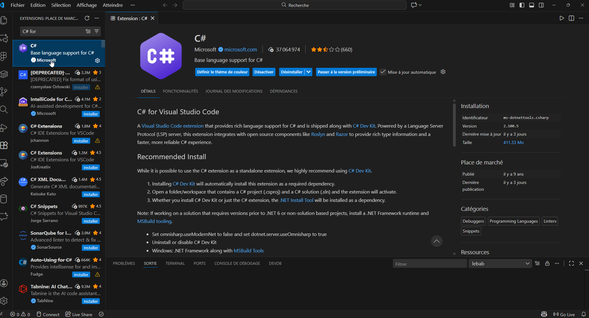
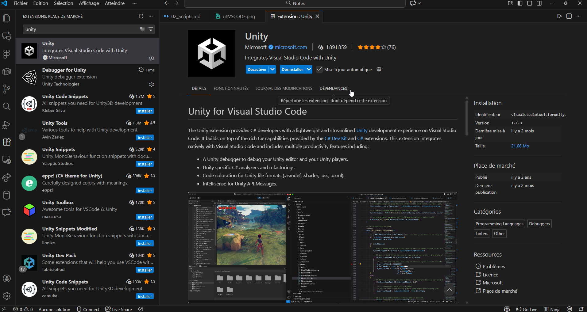

# Outils de programmation de scripts avec Unity

Les scripts dans Unity sont principalement écrits en C#. Pour les éditer, on utilise des éditeurs externels. Les deux options gratuites les plus utilisées sont **Visual Studio** et **VS Code** parce qu'elles ont une bonne intégration avec Unity pour la gestion de code et le débogage.

## Intégration avec VSCode ou Visual Studio

Unity s'intègre parfaitement avec des éditeurs de code externes tels que Visual Studio Code (VSCode) (logo bleu) ou Visual Studio Community (logo violet).

### VSCode ou Visual Studio Community ?

Visual Studio Code est un éditeur de code léger et polyvalent, tandis que Visual Studio Community est un environnement de développement intégré (IDE) plus complet. Les deux offrent d'excellentes fonctionnalités pour le développement en C# avec Unity, telles que la complétion de code, le débogage, et la gestion des projets. Le deux sont gratuits et largement utilisés dans la communauté Unity mais VSCode est plus léger et plus rapide à lancer.

Voici comment configurer Unity pour utiliser l'un de ces éditeurs :

1. Ouvrir Unity et aller dans `Edit` > `Preferences` (Windows) ou `Unity` > `Preferences` (macOS).
2. Dans la section `External Tools`, sélectionner `Visual Studio Code` ou `Visual Studio` dans le menu déroulant `External Script Editor`.
3. Assurez-vous que les options `Generate all .csproj files` et `Generate .csproj files for:` sont cochées pour inclure les fichiers de projet nécessaires.

### Installation de Visual Studio Community

Si vous choisissez d'utiliser Visual Studio Community, voici comment l'installer :

1. Rendez-vous sur le site officiel de Visual Studio : [https://visualstudio.microsoft.com/fr/downloads/](https://visualstudio.microsoft.com/fr/downloads/)
2. Téléchargez l'installateur de Visual Studio Community.
3. Lancez l'installateur et sélectionnez les charges de travail suivantes :
    - **Développement de jeux avec Unity** : Cela installera les outils nécessaires pour le développement Unity.
4. Suivez les instructions à l'écran pour terminer l'installation.
5. Une fois l'installation terminée, redémarrez Unity pour que les modifications prennent effet.

### Installation des extensions pour VSCode

Dans VSCode, il est recommandé d'installer l'extension `C# for Visual Studio Code` pour une meilleure prise en charge de C# et de Unity. Cela inclut la complétion de code, le débogage, et d'autres fonctionnalités utiles et le package `Unity Tools` pour des fonctionnalités supplémentaires spécifiques à Unity.

Vous devez également installer le SDK .NET si ce n'est pas déjà fait, car il est nécessaire pour le développement en C# avec VSCode.
[SDK .NET](https://dotnet.microsoft.com/en-us/download)

