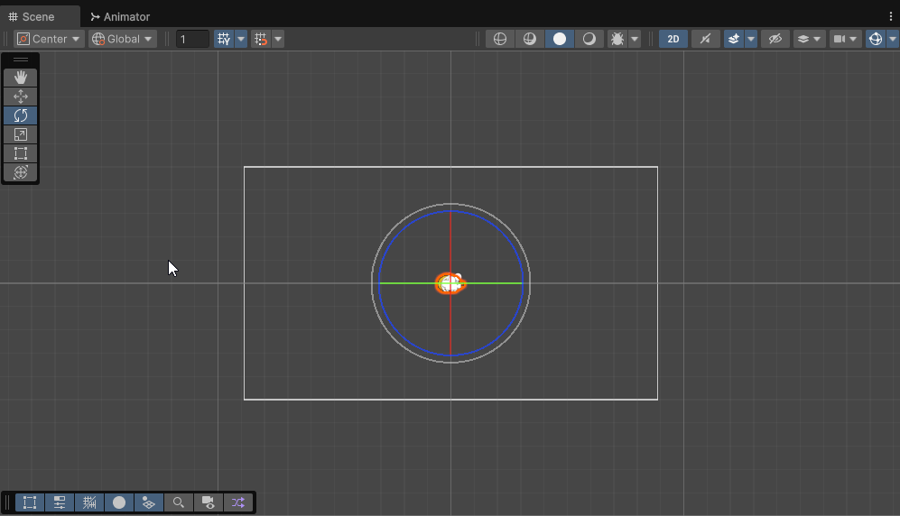
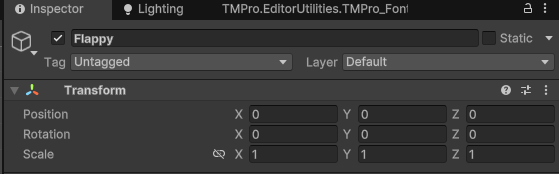
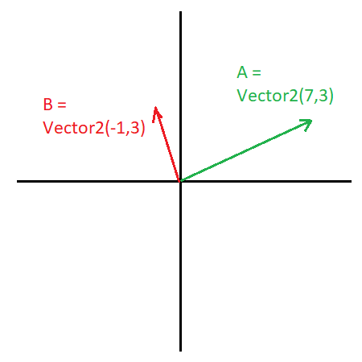

# Transformations géométriques (Translation, Rotation, Homothétie) dans Unity

Il est possible de combiner plusieurs transformations géométriques pour obtenir des effets plus complexes. Par exemple, on peut effectuer une rotation suivie d'une translation, ou une homothétie suivie d'une rotation. Depuis la barre d'outils d'Unity, on peut facilement appliquer ces transformations aux objets dans la scène. Il est également possible de modifier les valeurs des transformations directement dans l'inspecteur pour un contrôle plus précis ou par programmation via des scripts C#.

## Déplacer, faire pivoter et redimensionner des objets dans la scène

Pour déplacer, faire pivoter et redimensionner des objets dans la scène Unity, vous pouvez utiliser les outils de transformation situés dans la barre d'outils en haut de l'éditeur Unity.

;

-   **Outil de déplacement (W)** : Permet de déplacer un objet le long des axes X, Y et Z.
-   **Outil de rotation (E)** : Permet de faire pivoter un objet autour des axes X, Y et Z.
-   **Outil de redimensionnement (R)** : Permet de redimensionner un objet en modifiant son échelle le long des axes X, Y et Z.
-   **Outil de transformation rectangulaire (T)** : Permet de combiner les fonctions de déplacement, rotation et redimensionnement.
    Vous pouvez sélectionner un objet dans la hiérarchie ou dans la scène, puis cliquer sur l'outil souhaité pour effectuer la transformation. Vous pouvez également utiliser les raccourcis clavier (W, E, R, T) pour basculer rapidement entre les outils.

## Composant Transform

Chaque objet dans Unity possède un composant Transform qui stocke les informations de position, rotation et échelle de l'objet. Vous pouvez modifier ces valeurs directement dans l'inspecteur lorsque l'objet est sélectionné.



## Vector 2 et Vector 3

Unity utilise des structures de données appelées Vector2 et Vector3 pour représenter un point ou une direction dans l'espace 2D et 3D. Pour cette session, nous utiliserons principalement Vector2, mais il est important de comprendre les deux. Cela sert à représenter des points ou des directions dans l'espace.

-   **Vector2** : Représente un vecteur dans un espace 2D avec des composantes X et Y.
-   **Vector3** : Représente un vecteur dans un espace 3D avec des composantes X, Y et Z.



Exemple de création d'un Vector2 et d'un Vector3 :

```csharp
// Créer un Vector2
Vector2 pointA= new Vector2(7.0f, 3.0f); //Vecteur de 7 unités en X et 3 unités en Y
Vector2 pointB = new Vector2(-1.0f, 3.0f); //Vecteur de -1 unité en X et 3 unités en Y

Vector2 direction2D = Vector2.direction(pointA, pointB); //Crée un vecteur direction entre les deux points Dans ce cas, le vecteur sera (-8,0)
```

### Vecteurs pré-définis

Unity fournit également des vecteurs pré-définis pour faciliter certaines opérations courantes.

-   **Vector2.zero** : Représente le vecteur (0, 0). Donc aucun déplacement.
-   **Vector2.one** : Représente le vecteur (1, 1). Donc un déplacement uniforme de 1 unité sur les axes X et Y.
-   **Vector2.up** : Représente le vecteur (0, 1). Déplacement vers le haut.
-   **Vector2.down** : Représente le vecteur (0, -1). Déplacement vers le bas.
-   **Vector2.left** : Représente le vecteur (-1, 0). Déplacement vers la gauche.
-   **Vector2.right** : Représente le vecteur (1, 0). Déplacement vers la droite.
-   **Vector3.forward** : Représente le vecteur (0, 0, 1). Déplacement vers l'avant dans l'espace 3D. Utilisé pour la rotation autour de l'axe Z en 2D.

Exemple d'utilisation des vecteurs pré-définis :

```csharp
// Déplacer un objet vers le haut de 2 unités
transform.Translate(Vector2.up * 2.0f);

// Déplacer un objet vers la droite de 3 unités
transform.Translate(Vector2.right * 3.0f);
```

### Créer un Vector2 personnalisé

Parfois, vous devrez créer vos propres vecteurs pour des positions ou des directions spécifiques.

```csharp
// Créer un Vector2
Vector2 position2D = new Vector2(1.0f, 5.0f); //Vecteur de 1 unité en X et 5 unités en Y
```

### Accéder aux propriétés d'un Vector2 et d'un Vector3

```csharp
// Accéder aux composantes d'un Vector2
float x2D = position2D.x;
float y2D = position2D.y;

```

### Modifier les propriétés d'un Vector2 et d'un Vector3

```csharp
// Modifier les composantes d'un Vector2
position2D.x = 3.0f;
position2D.y = 4.0f;
```

## Position

La position d'un objet est définie par ses coordonnées X, Y et Z dans l'espace 3D. Comme nous n'utilisons qu'un plan 2D pour ce cours, la coordonnée Z restera toujours à 0.

### Récupérer et modifier la position par programmation

```csharp
// Récupérer la position actuelle
Vector2 currentPosition = transform.position;
// Modifier la position
transform.position = new Vector2(1.0f, 2.0f);
```

### Déplacer un objet

Pour déplacer un objet dans une direction spécifique, vous pouvez ajouter un vecteur à sa position actuelle ou utiliser la méthode `Translate` qui déplace l'objet en fonction de ses axes locaux.

**Attention** : Translate prends les trois composantes X, Y et Z même en 2D.

```csharp
// Modifier la position d'un objet
transform.position = new Vector2(3.0f, 4.0f);

// Déplacer un objet de (1, 0, 0) unités
transform.position += new Vector2(1.0f, 0.0f);
// OU utiliser Translate. Vous devez spécifier les 3 composantes X,Y et Z
transform.Translate(1.0f, 2.0f, 0.0f);
```

## Rotation

La rotation d'un objet est définie par ses angles de rotation autour des axes X, Y et Z. Dans un plan 2D, nous nous concentrerons principalement sur la rotation autour de l'axe Z.

Pour définir la rotation d'un objet, Unity utilise des quaternions en interne, mais il est souvent plus intuitif de travailler avec des angles d'Euler (en degrés) pour les transformations 2D.

### Récupérer et modifier la rotation par programmation

```csharp
// Récupérer la rotation actuelle en angles d'Euler
Vector3 currentRotation = transform.eulerAngles;

// Modifier la rotation
transform.eulerAngles = new Vector3(0.0f, 0.0f, 45.0f);

// Faire pivoter un objet de 45 degrés autour de l'axe Z
float vitesseRotation = 1f; // degrés
transform.Rotate(0.0f, 0.0f, vitesseRotation * Time.deltaTime);
```

### Faire pivoter un objet autour d'un point spécifique

```csharp
// Faire pivoter un objet de 45 degrés autour du point (1, 1, 0) dans le monde
Vector3 point = new Vector3(1.0f, 1.0f, 0.0f);
transform.RotateAround(point, Vector3.forward, 45.0f);//Vector3.forward est l'axe Z
```

## Échelle (Homothétie)

L'échelle d'un objet détermine sa taille relative le long des axes X, Y et Z. Une échelle de (1, 1, 1) signifie que l'objet est à sa taille originale, tandis qu'une échelle de (2, 2, 2) double la taille de l'objet.

### Récupérer et modifier l'échelle par programmation

```csharp
// Récupérer l'échelle actuelle
Vector3 taille = transform.localScale;

// Modifier l'échelle
transform.localScale = new Vector2(2.0f, 2.0f);
```
