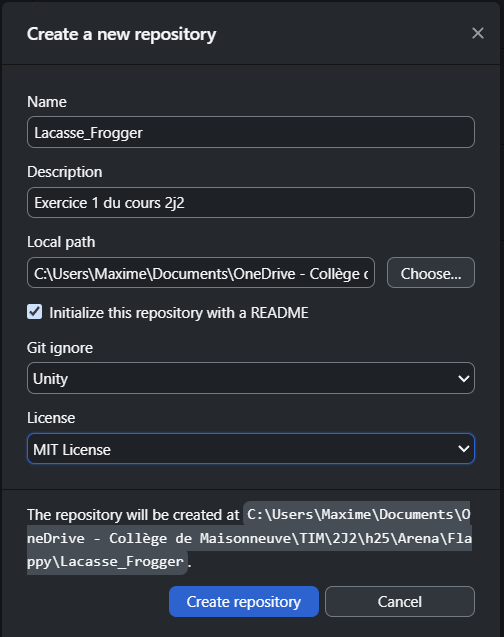
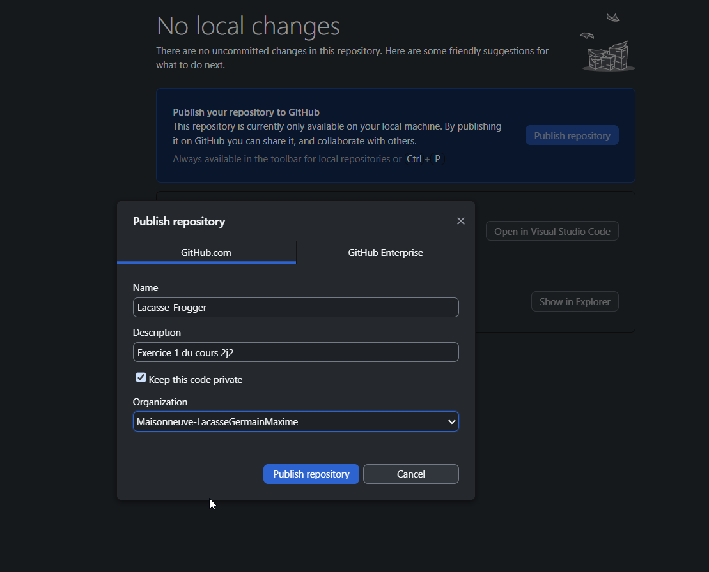
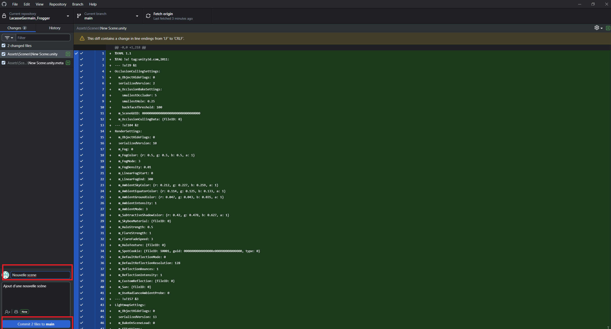
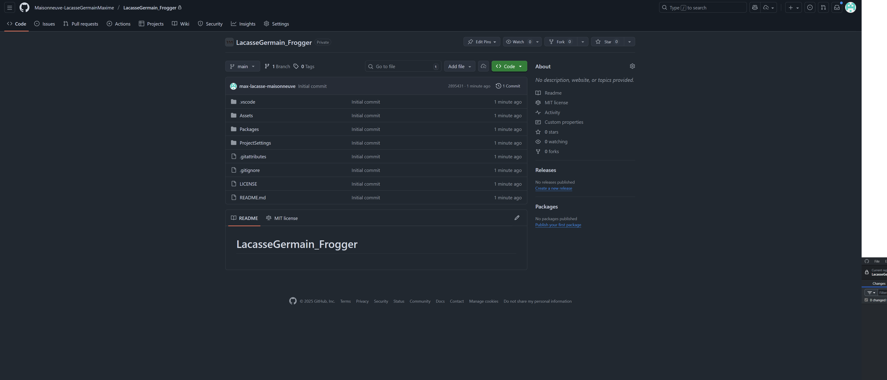
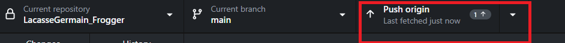
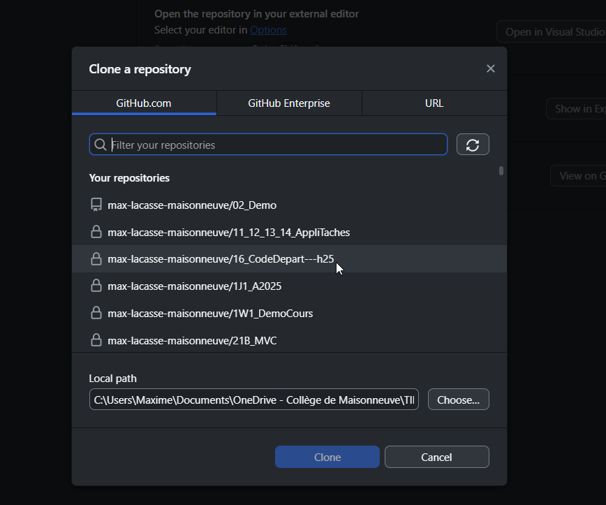
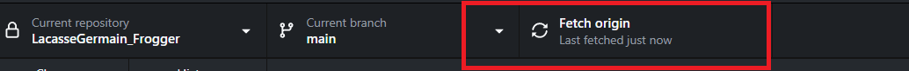

# Archiver un projet de jeu (ou Web) avec GitHub Desktop

Git est un système de contrôle de version très populaire parmi les développeurs. Cela permet d'archiver facilement les projets, de suivre les modifications et de collaborer avec d'autres personnes. Généralement, Git est utilisé via la ligne de commande, mais il existe des applications graphiques qui rendent son utilisation plus accessible. C'est ce que nous allons voir avec GitHub Desktop.

GitHub Desktop est une application qui facilite l'utilisation de Git pour ceux qui préfèrent une interface graphique plutôt que la ligne de commande. C'est plus facile à prendre en main, surtout pour les débutants. Normalement, il faut également installer le logiciel Git sur votre ordinateur, mais GitHub Desktop l'inclut déjà, donc vous n'avez pas à vous en soucier.

Vous aurez besoin d'un compte GitHub pour utiliser GitHub Desktop. Si vous n'en avez pas encore, vous pouvez en créer un gratuitement sur [https://github.com/](https://github.com/). C'est gratuit et rapide à faire.

**Assurez-vous de créer votre projet Unity2D avant de commencer cette procédure.**

## Installation de GitHub Desktop

1. Rendez-vous sur le site officiel de GitHub Desktop : [https://desktop.github.com/](https://desktop.github.com/)
2. Téléchargez l'application en fonction de votre système d'exploitation (Windows ou macOS).
3. Installez l'application en suivant les instructions à l'écran.
4. Une fois l'installation terminée, lancez GitHub Desktop.

## Configuration initiale

1. Lors du premier lancement, connectez-vous avec votre compte GitHub.
2. Configurez votre nom d'utilisateur et votre adresse e-mail, qui seront utilisés pour les commits (les enregistrements de modifications).
3. Vous pouvez laisser les autres paramètres par défaut pour le moment.

## Archiver un projet Unity2D avec GitHub Desktop

1. Ouvrez GitHub Desktop.
2. Cliquez sur "File" (Fichier) dans la barre de menu, puis sélectionnez "New Repository" (Nouveau dépôt).
3. Remplissez les informations du dépôt :
    - **Name** (Nom) : Donnez un nom à votre projet.
    - **Description** : Ajoutez une description si vous le souhaitez.
    - **Local Path** (Chemin local) : Choisissez l'emplacement où se trouve votre projet Unity2D sur votre ordinateur.
    - **Initialize this repository with a README** (Initialiser ce dépôt avec un README) : Cochez cette case si vous souhaitez ajouter un fichier README. Le README est utile pour décrire votre projet ou laisser des instructions avant une remise de projet.
    - **.gitignore** : Sélectionnez "Unity" dans le menu déroulant pour ignorer les fichiers spécifiques à Unity qui ne doivent pas être suivis par Git.
    - **License** (Licence) : Vous pouvez choisir une licence pour votre projet si vous le souhaitez. Mettez "None" si vous n'êtes pas sûr.
4. Cliquez sur "Create Repository" (Créer le dépôt).
5. Une fois le dépôt créé, vous verrez une liste des fichiers dans votre projet. Publiez votre projet sur GitHub en cliquant sur "Publish repository" (Publier le dépôt) dans le coin supérieur droit. Cela rendra accessible en ligne.

## Ajouter des changements à votre projet

Lorsque vous apportez des modifications à votre projet Unity2D, GitHub Desktop détectera automatiquement les changements. Pour enregistrer ces modifications :

1. Ouvrez GitHub Desktop.
2. Vous verrez une liste des fichiers modifiés dans l'onglet "Changes" (Modifications).
3. Ajoutez un message de commit décrivant les modifications apportées.
4. Cliquez sur "Commit to main" (ou "Commit to master") pour enregistrer les modifications localement.
5. Pour synchroniser vos modifications avec GitHub en ligne, cliquez sur "Push origin".

## Récupérer un projet depuis GitHub sur un autre ordinateur

Si vous souhaitez travailler sur votre projet depuis un autre ordinateur, vous pouvez cloner le dépôt GitHub :

1. Ouvrez GitHub Desktop sur l'autre ordinateur.
2. Cliquez sur "File" (Fichier) dans la barre de menu, puis sélectionnez "Clone repository" (Cloner le dépôt).
3. Sélectionnez le dépôt que vous souhaitez cloner depuis votre compte GitHub.
4. Choisissez un emplacement local pour cloner le dépôt.
5. Cliquez sur "Clone" (Cloner).

Vous pouvez maintenant travailler sur votre projet depuis cet autre ordinateur. N'oubliez pas de faire des commits et de pousser vos modifications régulièrement pour garder votre dépôt à jour.

## Récupérer les modifications d'un projet

Si vous travaillez à plusieurs sur un projet ou si vous avez apporté des modifications depuis un autre ordinateur, vous pouvez récupérer les dernières modifications en cliquant sur "Fetch origin" (Récupérer l'origine) dans GitHub Desktop. Cela mettra à jour votre copie locale avec les dernières modifications du dépôt en ligne.

## Méthode pour éviter les conflits lorsque vous travaillez sur plusieurs ordinateurs

Lorsque vous travaillez sur plusieurs ordinateurs, il est important de suivre une méthode pour éviter les conflits de modifications. Voici une méthode simple :

1. Avant de commencer à travailler sur un ordinateur, ouvrez GitHub Desktop et cliquez sur "Fetch origin" pour récupérer les dernières modifications.
2. Faites vos modifications et enregistrez-les avec un commit.
3. Poussez vos modifications en ligne en cliquant sur "Push origin".
4. Sur l'autre ordinateur, avant de commencer à travailler, cliquez à nouveau sur "Fetch origin" pour récupérer les dernières modifications et répétez le processus.

En suivant cette méthode, vous minimisez les risques de conflits et assurez-vous que toutes vos modifications sont synchronisées entre les ordinateurs.
