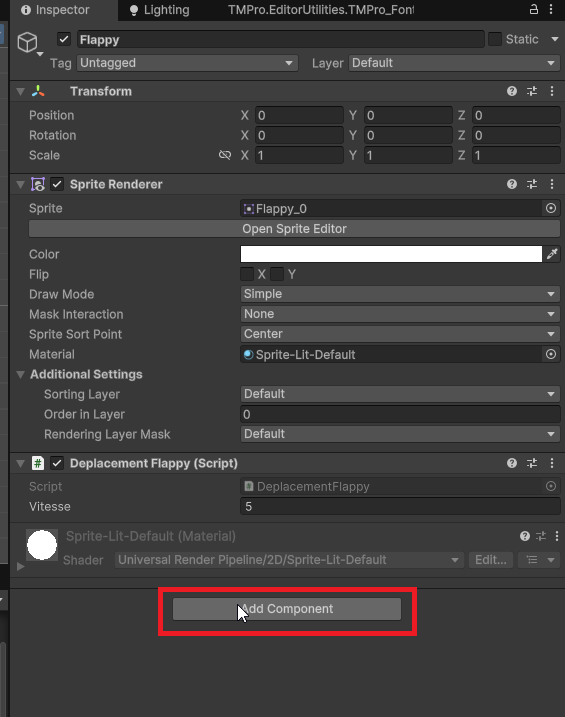
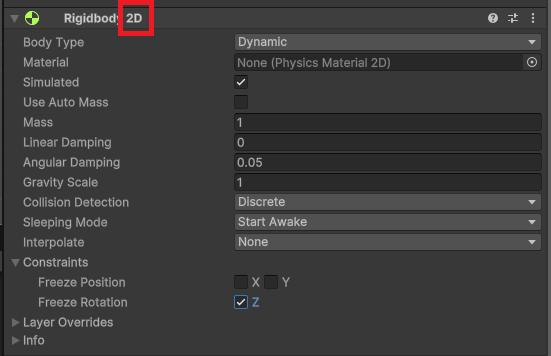

# Physique et Rigidbody

Dans Unity, la physique permet de simuler des interactions réalistes entre les objets dans un environnement 3D et 2D. Pour qu'un objet puisse interagir avec la physique, il doit posséder un composant appelé **Rigidbody**. Le Rigidbody permet à un objet d'être affecté par des forces telles que la gravité, les collisions, et d'autres interactions physiques. Il permet également de contrôler le mouvement de l'objet de manière réaliste et appliquer des forces.

Pour ajouter un composant Rigidbody à un objet, sélectionnez l'objet dans la hiérarchie, puis allez dans le menu **Component > Physics Rigidbody 2D**

**Attention, nous travaillez ici avec la physique 2D, donc il faut choisir Rigidbody 2D et non Rigidbody.**





## Propriétés principales du Rigidbody 2D

-   **Mass (Masse)** : La masse de l'objet, qui influence la façon dont il réagit aux forces. C'est-à-dire qu'un objet plus lourd nécessitera plus de force pour être déplacé. Imaginez pousser une voiture par rapport à une bicyclette.
-   **Gravity Scale (Échelle de gravité)** : Cette propriété détermine l'influence de la gravité sur l'objet. Une valeur de 1 signifie que l'objet est affecté par la gravité normale, tandis qu'une valeur de 0 signifie qu'il n'est pas affecté par la gravité du tout. -1 inversera la direction de la gravité.
-   **Drag (Traînée)** : La traînée est une force qui s'oppose au mouvement de l'objet à travers l'air ou un autre fluide. Une valeur plus élevée de traînée ralentira l'objet plus rapidement lorsqu'il se déplace.
-   **Angular Drag (Traînée angulaire)** : Similaire à la traînée, mais elle s'applique à la rotation de l'objet. Une valeur plus élevée ralentira la rotation de l'objet plus rapidement.
-   **Body Type (Type de corps)** : Il existe trois types de corps :
    -   **Dynamic (Dynamique)** : L'objet est affecté par la physique et peut se déplacer librement.
    -   **Kinematic (Cinématique)** : L'objet n'est pas affecté par la physique, mais peut être déplacé par des scripts. Utile pour les objets qui doivent suivre un chemin spécifique.
    -   **Static (Statique)** : L'objet ne bouge pas et n'est pas affecté par la physique. Utilisé pour les objets immobiles comme le sol ou les murs.
-   **Constraints (Contraintes)** : Permet de restreindre le mouvement ou la rotation de l'objet sur certains axes. Par exemple, vous pouvez empêcher un objet de tourner ou de se déplacer verticalement.

Toutes ces propriétés sont manipulables via des scripts pour créer des comportements dynamiques dans votre jeu. Par exemple, vous pouvez appliquer des forces, modifier la gravité, ou changer le type de corps en fonction des événements du jeu.

## Accéder au Rigidbody 2D via un script

Pour interagir avec le Rigidbody 2D d'un objet via un script, vous devez d'abord obtenir une référence au composant Rigidbody 2D. Commencez par créer une variable de type `Rigidbody2D` dans votre script, puis. dans la fonction `Start()` utilisez la méthode `GetComponent<Rigidbody2D>()` pour l'initialiser.

```csharp
using UnityEngine;
public class ExampleScript : MonoBehaviour
{
    private Rigidbody2D rb;

    void Start()
    {
        rb = GetComponent<Rigidbody2D>();
    }
}
```

Ensuite, vous pouvez utiliser cette référence pour manipuler les propriétés du Rigidbody 2D ou appliquer des forces.

## Appliquer une force au Rigidbody 2D

Pour appliquer une force à un Rigidbody 2D, vous pouvez utiliser la méthode `AddForce()`. Par exemple, pour appliquer une force vers le haut lorsque le joueur appuie sur la barre d'espace :

Vous pouvez aussi spécifier la direction et la magnitude de la force en utilisant un vecteur 2D

**Les actions liées à la physique doivent être placées dans la méthode `FixedUpdate()` de votre script.** La méthode `FixedUpdate()` est appelée à des intervalles fixes, ce qui est essentiel pour les calculs de physique afin d'assurer une simulation stable et cohérente.

```csharp

void FixedUpdate()
{
    if (Input.GetKeyDown(KeyCode.Space))
    {
        rb.AddForce(new Vector2(0, 500)); // Applique une force vers le haut
        //ou
        //rb.AddForce(Vector2.up * forceDesiree); // Applique une force vers le haut
    }
}
```

## Les types de forces

Il existe plusieurs types de forces que vous pouvez appliquer à un Rigidbody 2D. Vous spécifiez le type de force en utilisant le deuxième paramètre de la méthode `AddForce()` :

-   **Force** : Applique une force continue sur l'objet, affectant sa vitesse au fil du temps.Comme du vent qui pousse un objet.
-   **Impulse (Impulsion)** : Applique une force instantanée, modifiant immédiatement la vitesse de l'objet. Comme une fusée qui décolle.
-   **Velocity Change (Changement de vitesse)** : Modifie directement la vitesse de l'objet sans tenir compte de sa masse. Utile pour des changements rapides de vitesse.

```cs
rb.AddForce(new Vector2(0, 500), ForceMode2D.Impulse); // Applique une impulsion vers le haut
```
