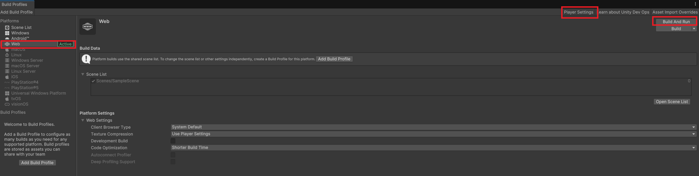
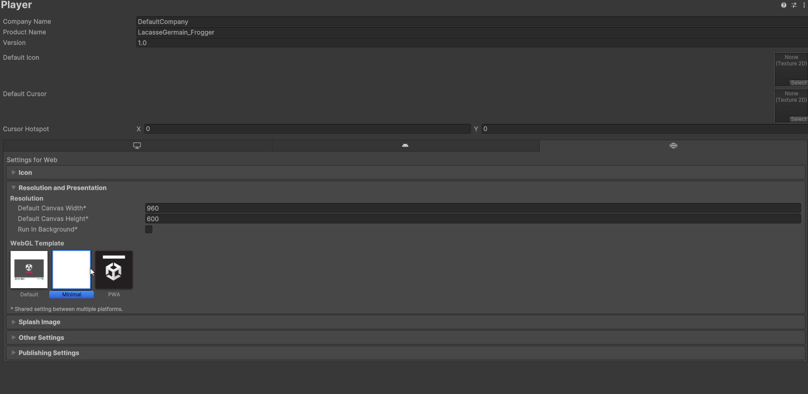
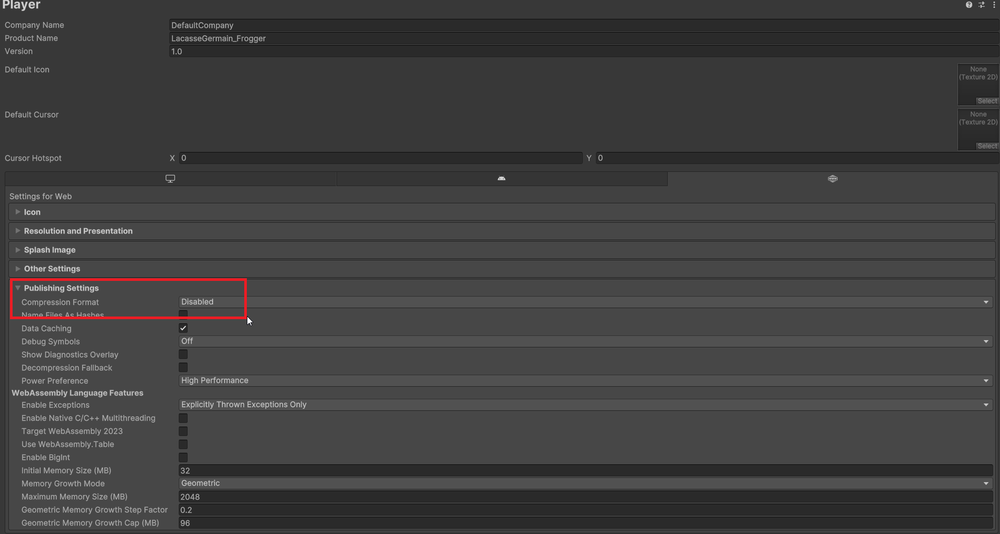

# Compiler un projet Unity

Une fois que vous avez terminé le développement de votre projet Unity, l'étape suivante consiste à le compiler et à le mettre en ligne pour que d'autres puissent y accéder. Voici un guide étape par étape pour compiler votre projet Unity et le publier en ligne avec GitHub Pages.

## Étape 1 : Préparer votre projet Unity

Avant de compiler votre projet, assurez-vous que tout fonctionne correctement dans l'éditeur Unity. Testez votre jeu ou application pour vous assurer qu'il n'y a pas de bugs majeurs. Il ne devrait pas y avoir de problèmes de performance ou d'erreurs critiques qui empêcheraient le bon fonctionnement de votre projet. Poussez également toutes les modifications finales dans votre dépôt GitHub.

## Étape 2 : Configurer les paramètres de build

1. Ouvrez votre projet Unity.
2. Allez dans le menu **File** > **Build Profiles**.
3. Sélectionnez **Web** comme plateforme de build.Si vous ne voyez pas cette option, vous devrez peut-être installer le module WebGL via le Unity Hub.
4. Cliquez sur **Switch Platform** pour basculer vers la plateforme WebGL si ce n'est pas déjà fait.
5. Configurez les paramètres de build selon vos besoins (résolution, qualité, etc.). Vous pouvez également ajuster les paramètres avancés dans **Edit** > **Project Settings** > **Player**.
6. Réglez la résolution de votre application WebGL en fonction de vos besoins. Vous pouvez choisir une résolution fixe ou permettre à l'application de s'adapter à la taille de la fenêtre du navigateur.
7. Dans le cas du WebGL, assurez-vous que l'option **Compression Format** est définie sur **Disabled** pour éviter les problèmes de chargement sur GitHub Pages et que le mode ce soit compatible avec Itch.io.

