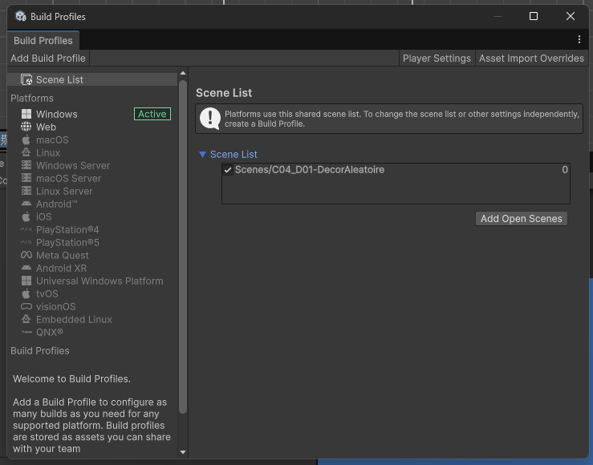
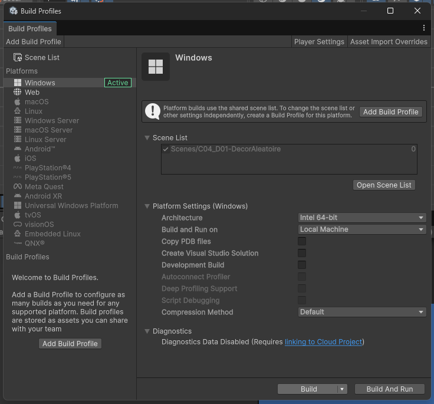
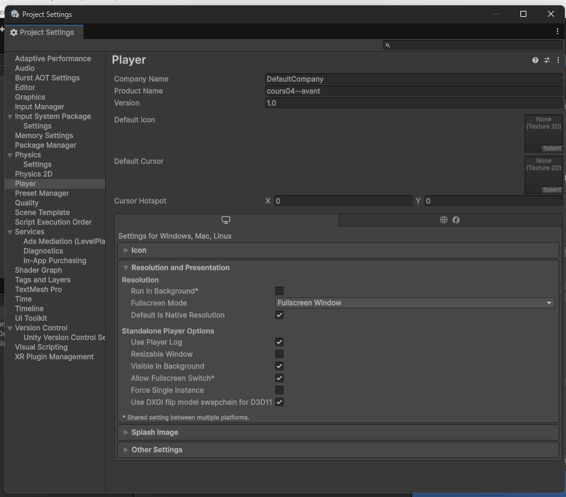
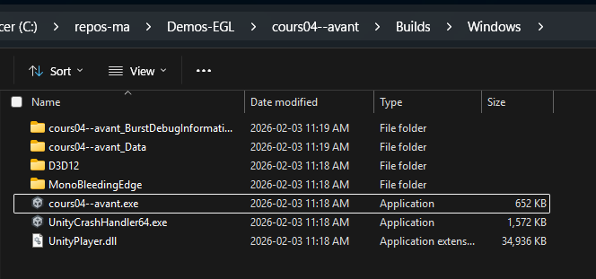

# Compiler un projet Unity

Une fois que vous avez terminé le développement de votre projet Unity, l'étape suivante consiste à le compiler et à le mettre en ligne pour que d'autres puissent y accéder. Voici un guide étape par étape pour compiler votre projet Unity et le publier en ligne avec GitHub Pages.

## Étape 1 : Préparer votre projet Unity et choisir les scènes

Avant de compiler votre projet, assurez-vous que tout fonctionne correctement dans l'éditeur Unity. Testez votre jeu ou application pour vous assurer qu'il n'y a pas de bugs majeurs. Il ne devrait pas y avoir de problèmes de performance ou d'erreurs critiques qui empêcheraient le bon fonctionnement de votre projet. Poussez également toutes les modifications finales dans votre dépôt GitHub.

Pour choisir quelles scènes seront incluses dans le build, il faut se rendre dans le menu **File > Build Profile > Scene List**. Là, vous verrez une liste des scènes dans le build. Pour choisir les scènes à inclure, cliquez sur le bouton**Add Open Scene** pour ajouter la scène actuelle à la liste ou glissez-déposez des fichiers de scène du panneau **Project**. Vous pouvez aussi modifier la séquence de scènes : **la scène numéro 0 servira de point de départ du jeu**.

## Étape 2A : Configurer les paramètres de build pour **web**

1. Ouvrez votre projet Unity.
2. Allez dans le menu **File** > **Build Profiles**.
3. Sélectionnez **Web** comme plateforme de build. Si vous ne voyez pas cette option, vous devrez peut-être installer le module **WebGL Build Support** via le Unity Hub.
4. Cliquez sur **Switch Platform** pour basculer vers la plateforme WebGL si ce n'est pas déjà fait.
5. Configurez les paramètres de build selon vos besoins (résolution, qualité, etc.). Vous pouvez également ajuster les paramètres avancés dans **Edit** > **Project Settings** > **Player**.
6. Réglez la résolution de votre application WebGL en fonction de vos besoins. Vous pouvez choisir une résolution fixe ou permettre à l'application de s'adapter à la taille de la fenêtre du navigateur.
7. Dans le cas du WebGL, assurez-vous que l'option **Compression Format** est définie sur **Disabled** pour éviter les problèmes de chargement sur GitHub Pages et que le mode ce soit compatible avec Itch.io.

## Étape 2B : Configurer les paramètres de build pour **Windows**

1. Ouvrez votre projet Unity.
2. Sélectionnez **Windows** comme plateforme de build. Si vous ne voyez pas cette option, vous devrez peut-être installer le module **Windows Build Support (IL2CPP)** via le Unity Hub.
3. Cliquez sur **Switch Platform** pour basculer vers la plateforme Windows si ce n'est pas déjà fait.
4. Configurer les paramètres du player dans **Edit > Project Settings > Player** ou en cliquant **Build Profiles > PlayerSettings**.
     - **Company Name** : Choisissez un nom de créateur / équipe.
     - **Product Name** : Nom du projet. Cette option change aussi le nom du fichier `.exe` (ex : `MonJeu.exe`).  
     - **Resolution and Presentation > Fullscreen Mode** pour configurer le comportement de l'écran du jeu. L'option **Windowed** permet de configurer une taille défaut, par exemple.
5. **Générer le build.** Dans les Build Profiles, cliquez sur **Build** pour choisir un emplacement pour le dossier de sortie et générer le build. L'option **Build and Run** utilise l'emplacement antérieur.
6. **Vérifier le build généré**. Ouvrez le dossier de sortie (ex : 📂`Builds/Windows`) et vérifiez que le fichier `.exe`  et les sous-dossier nécessaires ont été créés (ex `Data`). Pour tester dans un autre PC ou emplacement, copiez le dossier de sortie entier et cliquez sur le fichier `.exe` pour exécuter le jeu.  

