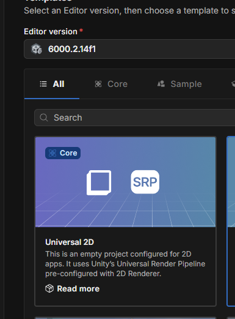
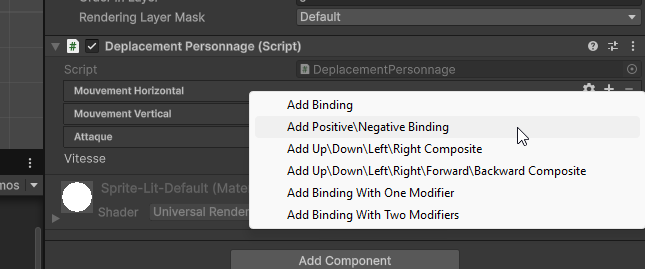
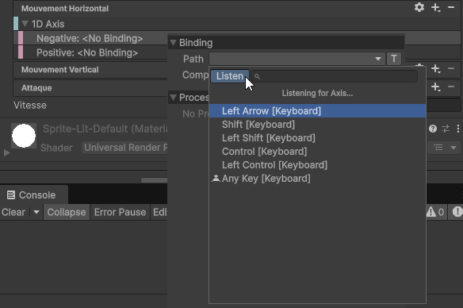

# Détection des touches du clavier et des clics de souris avec le nouveau système d'Input Unity

Unity a introduit un nouveau système d'Input qui offre une manière plus flexible et puissante de gérer les entrées utilisateur, y compris la détection des touches du clavier et des clics de souris. Voici comment vous pouvez utiliser ce nouveau système pour détecter ces entrées dans votre projet Unity.

Lorsque vous créez un projet avec le gabarit "Universal 2d", le nouveau système d'Input est déjà configuré par défaut. Si vous travaillez sur un projet existant, vous devrez peut-être installer et configurer le package "Input System" via le gestionnaire de packages Unity.



## Installer le package Input System (si nécessaire)

1. Dans Unity, allez dans **Window** > **Package Manager**.
2. Recherchez "Input System" dans la liste des packages disponibles.
3. Cliquez sur "Install" pour ajouter le package à votre projet.

## Importer l'espace de noms Input System

Au début de chaque script C# où vous souhaitez utiliser le nouveau système d'Input, ajoutez la ligne suivante pour importer l'espace de noms nécessaire :

```csharp
using UnityEngine.InputSystem;
```

## Détection des touches du clavier

Pour détecter les touches du clavier, vous pouvez utiliser la classe `Keyboard` fournie par le nouveau système d'Input.
Vous commencez par obtenir une référence au clavier actuel, puis vous accédez aux touches spécifiques que vous souhaitez surveiller, finalement, vous vérifiez si une touche a été pressée ou relâchée.

Ex: Keyboard.current.ArrowUpKey, Keyboard.current.spaceKey, etc.

### Touches courantes

-   `Keyboard.current.spaceKey` : Touche Espace
-   `Keyboard.current.enterKey` : Touche Entrée
-   `Keyboard.current.escapeKey` : Touche Échap
-   `Keyboard.current.arrowUpKey` : Flèche Haut
-   `Keyboard.current.arrowDownKey` : Flèche Bas
-   `Keyboard.current.arrowLeftKey` : Flèche Gauche
-   `Keyboard.current.arrowRightKey` : Flèche Droite
-   `Keyboard.current.aKey` à `Keyboard.current.zKey` : Touches alphabétiques
-   `Keyboard.current.digit0Key` à `Keyboard.current.digit9Key` : Touches numériques

### États des touches

-   `wasPressedThisFrame` : Vrai si la touche a été pressée pendant la frame actuelle.
-   `wasReleasedThisFrame` : Vrai si la touche a été relâchée pendant la frame actuelle.
-   `isPressed` : Vrai si la touche est actuellement enfoncée.
-   `isReleased` : Vrai si la touche est actuellement relâchée.
-   `ReadValue()` : Retourne un float représentant l'état de la touche (1.0 pour enfoncée, 0.0 pour relâchée) ou si c'est un contrôleur analogique, une valeur entre 0.0 et 1.0.

Voici un exemple de script qui détecte lorsque la touche "Espace" est pressée :

```csharp
using UnityEngine;
using UnityEngine.InputSystem;

public class KeyboardInputExample : MonoBehaviour
{
    void Update()
    {
        // Vérifie si la touche Espace est pressée
        if (Keyboard.current.spaceKey.wasPressedThisFrame)
        {
            Debug.Log("La touche Espace a été pressée !");
        }
    }
}
```

## Cartographier plusieurs touches à une même action

Ajouter un composant "InputAction" à un GameObject permet aussi de gérer les entrées de manière plus visuelle et basée sur des actions définies. Vous pouvez configurer des actions pour différentes touches du clavier et les lier à des fonctions spécifiques dans vos scripts. Vous pouvez utiliser la même approche que précédemment en utilisant les mêmes états des touches ( `wasPressedThisFrame`, `wasReleasedThisFrame`, `ReadValue()`,etc).

Par exemple, pour déplacer un objet en utilisant les touches fléchées ou les touches "WASD", vous pouvez suivre ces étapes :

1. Déclarez une variable publique de type `InputAction` dans votre script.
2. Dans l'éditeur Unity, ajoutez un composant "Input Action" à votre GameObject.
3. Configurez les actions et les bindings dans l'inspecteur.
4. Activez et désactivez les actions dans les méthodes `OnEnable()` et `OnDisable()`. Cela garantit que les actions sont prêtes à être utilisées lorsque le GameObject est actif.

```csharp
using UnityEngine;
using UnityEngine.InputSystem;
using UnityEngine.InputSystem.Utilities;

public class DeplacementJoueur : MonoBehaviour
{
    public InputAction mouvementHorizontal;
    public InputAction mouvementVertical;
    public float vitesse = 5f;

    private void OnEnable()
    {
        mouvementHorizontal.Enable();
        mouvementVertical.Enable();
    }

    private void OnDisable()
    {
        mouvementHorizontal.Disable();
        mouvementVertical.Disable();
    }

    void Update()
    {
        Vector2 movement = new Vector2(mouvementHorizontal.ReadValue<float>(), mouvementVertical.ReadValue<float>());
        transform.Translate(movement * Time.deltaTime * vitesse);
    }
}
```

### Configuration des actions dans l'inspecteur

1. Sélectionnez le GameObject avec le script `DeplacementJoueur`.
2. Dans l'inspecteur, vous verrez les champs `Mouvement Horizontal` et `Mouvement Vertical`.
3. Appuyez sur le + à côté de chaque champ pour lier des touches. Vous pourrez ajouter les touches fléchées et les touches "WASD" pour chaque action. Si l'action est une valeur unique, choisissez "Add Binding" et sélectionnez "1D Axis" pour les mouvements horizontaux et verticaux. Si l'action est une valeur vectorielle, choisissez "Add Positive/Negative Binding". Vous pourrez ainsi configurer plusieurs touches pour une même action comme un déplacement horizontal ou vertical.
   
4. Choisissez les touches souhaitées pour chaque action. (Un truc: Utilisez le bouton "Listen" pour détecter automatiquement la touche que vous appuyez.)
   

Avec cette configuration, votre personnage pourra se déplacer en utilisant à la fois les touches fléchées et les touches "WASD". Vous pouvez ajouter autant de bindings que nécessaire pour chaque action afin de personnaliser les contrôles selon vos besoins. Vous pourriez aussi utiliser cette méthode pour lier une manette de jeu ou d'autres périphériques d'entrée.
