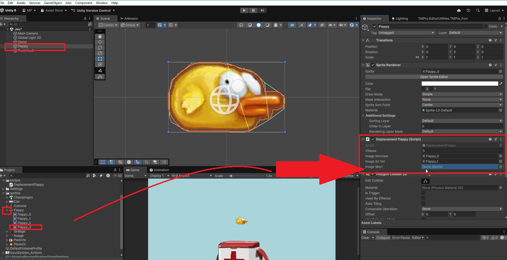
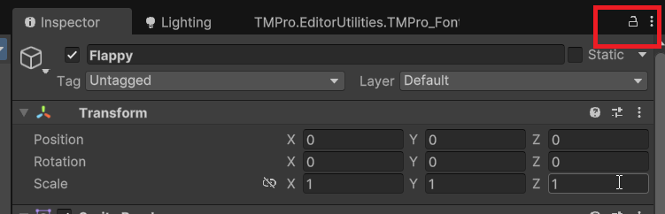

# SpriteRenderer

Nous avons vu au cours 2 que les sprites sont des images 2D utilisées pour représenter des objets dans un jeu. Pour afficher un sprite dans une scène Unity, nous utilisons le composant `Sprite Renderer`. Nous verrons comment manipuler ce composant pour afficher et configurer des sprites dans notre jeu par programmation.

## Récupérer le composant SpriteRenderer

Comme pour le composant Rigidbody2D vu précédemment, nous pouvons récupérer une référence au composant `Sprite Renderer` attaché à un GameObject en utilisant la méthode `GetComponent<SpriteRenderer>()` dans la fonction `Start()`(ou `Awake()` qui est plus appropriée).

Ensuite, nous stockons cette référence dans une variable de type `SpriteRenderer` pour pouvoir accéder à ses propriétés et méthodes plus tard dans le script.

```csharp
private SpriteRenderer spriteRenderer;
public Sprite persoNormal;
public Sprite persoBlesse;
public Sprite persoMort;

void Start() {
    spriteRenderer = GetComponent<SpriteRenderer>();
}

void Update() {
    // Nous pourrons utiliser spriteRenderer ici
}
```

## Changer le sprite affiché

Créez les sprites dans le dossier `Assets` de votre projet Unity. Si vous utilisez une feuille de sprites (sprite sheet), découpez-la en plusieurs sprites à l'aide de l'outil `Sprite Editor` comme expliqué dans le cours 1.

Dans le script, créez des variables publiques de type `Sprite` pour chaque sprite que vous souhaitez utiliser. Cela va vous permettre d'assigner les sprites directement depuis l'inspecteur Unity.

Glissez les sprites de la fenêtre `Assets` vers les variables publiques dans l'inspecteur. N'oubliez pas de mettre les variables en `public` pour qu'elles soient visibles dans l'inspecteur.



**Vous pouvez verrouiller l'inspecteur** en cliquant sur l'icône de cadenas en haut à droite de la fenêtre `Inspector`. Cela vous permettra de garder l'inspecteur affiché sur le GameObject même lorsque vous sélectionnez d'autres objets dans la hiérarchie.



Ensuite, dans la fonction `Update()`, vous pouvez changer le sprite affiché en modifiant la propriété `sprite` du composant `SpriteRenderer`. Par exemple, vous pouvez changer le sprite en fonction de l'état du personnage (normal, blessé, mort).

```csharp
void Update() {
    if (Input.GetKeyDown(KeyCode.Alpha1)) {
        spriteRenderer.sprite = persoNormal;
    } else if (Input.GetKeyDown(KeyCode.Alpha2)) {
        spriteRenderer.sprite = persoBlesse;
    } else if (Input.GetKeyDown(KeyCode.Alpha3)) {
        spriteRenderer.sprite = persoMort;
    }
}
```

Dans cet exemple, lorsque vous appuyez sur les touches `1`, `2` ou `3`, le sprite du personnage change en fonction de l'état sélectionné mais vous pouvez adapter cette logique pour qu'elle réponde aux événements de votre jeu, comme la santé du personnage ou d'autres conditions.

## Autres propriétés du SpriteRenderer

Le composant `SpriteRenderer` possède plusieurs autres propriétés utiles que vous pouvez manipuler par programmation :

-   **color** : Permet de changer la couleur du sprite. Vous pouvez l'utiliser pour créer des effets de flash ou de changement de couleur.

```csharp
spriteRenderer.color = Color.red; // Change la couleur du sprite en rouge
```

-   **flipX** et **flipY** : Permettent de retourner le sprite horizontalement ou verticalement.

```csharp
if (Input.GetAxis("Horizontal") < 0) {
    spriteRenderer.flipX = true; // Retourne le sprite horizontalement
} else if (Input.GetAxis("Horizontal") > 0) {
    spriteRenderer.flipX = false; // Remet le sprite à l'orientation normale
}

```

-   **sortingOrder** : Permet de définir l'ordre de rendu du sprite par rapport aux autres sprites. Un nombre plus élevé signifie que le sprite sera rendu au-dessus des autres. Il est rare d'avoir à modifier cette propriété par programmation, mais cela peut être utile dans certains cas. Par exemple, lorsque vous voulez afficher un objet temporairement au-dessus des autres.

```csharp
spriteRenderer.sortingOrder = 2; // Définit l'ordre de rendu du sprite
```
