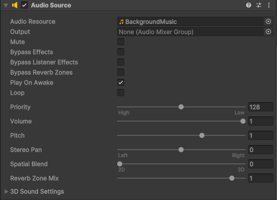

# Gestion de l'audio

Dans Unity, la gestion de l'audio est essentielle pour créer une expérience immersive dans vos jeux. Vous pouvez ajouter des effets sonores, de la musique de fond et d'autres éléments audio en utilisant les composants `AudioSource` et `AudioClip`. Voici comment vous pouvez gérer l'audio dans votre projet Unity.

## AudioListener, AudioSource et AudioClip

Pour entendre des sons dans votre scène Unity, vous avez besoin d'un composant `AudioListener`, qui est généralement attaché à la caméra principale. Il ne peut y avoir qu'un seul `AudioListener` actif à la fois dans une scène. Si aucun n'est présent, Unity en ajoutera un automatiquement à la caméra principale ou vous aurez un avertissement dans la console. Ce composant agit comme les oreilles du joueur, captant tous les sons émis par les `AudioSource` dans la scène.

Chaque objet qui émet un son doit avoir un composant `AudioSource`. Ce composant permet de lire des fichiers audio `AudioClips` et de contrôler divers aspects du son, tels que le volume, la boucle, et la spatialisation.

Un `AudioClip` est un fichier audio que vous importez dans votre projet Unity. Il peut s'agir de fichiers au format WAV, MP3, OGG, etc. Vous pouvez assigner ces clips aux `AudioSource` pour les lire dans votre jeu.

## Ajouter un son à un GameObject

Pour ajouter un son à un GameObject dans votre scène Unity, suivez ces étapes :

1. Sélectionnez le GameObject auquel vous souhaitez ajouter un son.
2. Dans l'inspecteur, cliquez sur "Add Component" et recherchez "Audio Source". Ajoutez-le au GameObject.
3. Dans le composant `AudioSource`, vous verrez un champ appelé "AudioClip". Cliquez sur le petit cercle à droite de ce champ pour ouvrir la fenêtre de sélection des assets, puis choisissez l'`AudioClip` que vous avez importé dans votre projet.
4. Vous pouvez ajuster les paramètres du `AudioSource`, tels que le volume, la boucle (Loop), et d'autres options selon vos besoins.



## Paramètres importants de l'AudioSource

-   **clip** : Le fichier audio (AudioClip) qui sera joué par cette source audio.
-   **Volume** : Contrôle le volume du son émis par l'`AudioSource`. La valeur va de 0 (silence) à 1 (volume maximum).
-   **Loop** : Si cette option est cochée, le son se répétera en boucle lorsqu'il atteindra la fin.
-   **Play On Awake** : Si cette option est cochée, le son commencera à jouer automatiquement lorsque la scène démarre.
-   **Spatial Blend** : Permet de définir si le son est en 2D (0) ou en 3D (1). Un son en 3D sera affecté par la position du `AudioListener` et l'`AudioSource` dans la scène. Vous verrez cette option la session prochaine.
-   **Pitch** : Permet de modifier la hauteur du son. Une valeur supérieure à 1 rendra le son plus aigu, tandis qu'une valeur inférieure à 1 le rendra plus grave.
-   **Stereo Pan** : Permet de contrôler la position du son dans le champ stéréo, allant de -1 (gauche) à 1 (droite). Pour un jeu plus immersif, vous pouvez utiliser cette option pour simuler la direction d'où provient le son.

## Jouer un son par script

Comme pour le SpriteRenderer et le Rigidbody2D, vous pouvez contrôler les sons par programmation en utilisant des scripts C#. Voici comment jouer un son lorsqu'un événement spécifique se produit, comme lorsqu'un joueur appuie sur une touche.

Comme pour les sprites, créez une variable publique de type `AudioClip` pour assigner le son depuis l'inspecteur Unity.

Ensuite, dans le script, récupérez une référence au composant `AudioSource` dans la fonction `Start()`. Vous pouvez utiliser la méthode `GetComponent<AudioSource>()` pour cela.

```csharp
AudioSource audioSource;
public AudioClip sonSaut;

void Start() {
    audioSource = GetComponent<AudioSource>();
}

void Update() {
    if (Input.GetKeyDown(KeyCode.Space)) {
        audioSource.PlayOneShot(sonSaut);
    }
}
```

Dans cet exemple, lorsque le joueur appuie sur la barre d'espace, le son de saut (`sonSaut`) est joué une seule fois grâce à la méthode `PlayOneShot()`. Cette méthode est utile pour jouer des sons courts sans interrompre un son déjà en cours de lecture par l'`AudioSource`.

Vous pouvez également utiliser la méthode `audioSource.Play()` pour jouer le clip assigné directement dans le composant `AudioSource`. Si vous voulez arrêter le son, vous pouvez utiliser `audioSource.Stop()`.

## Autres méthodes utiles de l'AudioSource

-   **Pause()** : Met en pause la lecture du son en cours.
-   **UnPause()** : Reprend la lecture du son après une pause.
-   **isPlaying** : Propriété booléenne qui indique si l'`AudioSource` est en train de jouer un son.
-   **volume** : Permet de modifier le volume de l'`AudioSource` par programmation.

```csharp
audioSource.volume = 0.5f; // Régle le volume à 50%

if (audioSource.isPlaying==false) {
    audioSource.PlayOneShot(sonSaut); // Joue le son si aucun son n'est en cours. Éviter de superposer les sons.
}
```
