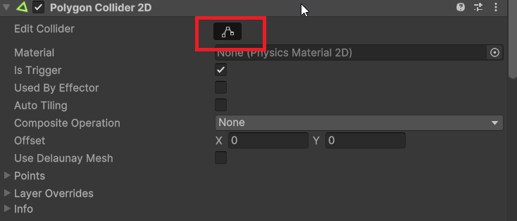
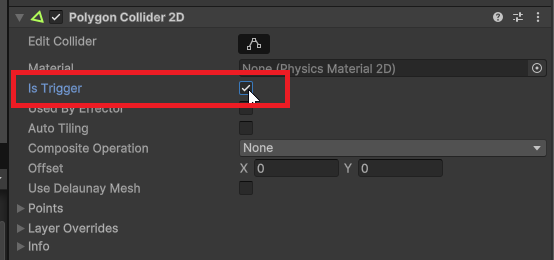

# Gestion des collisions

En 2D, la gestion des collisions est essentielle pour créer des interactions réalistes entre les objets. Voici quelques concepts clés et techniques pour gérer les collisions dans un environnement 2D. Unity gère automatiquement les collisions à l'aide de composants physiques, mais il est important de comprendre comment cela fonctionne.

## Composants de collision

Tous les objets qui doivent participer aux collisions doivent avoir des composants de collision attachés. Choisissez le type de collider en fonction de la forme de l'objet, idéalement en utilisant le collider le plus simple possible pour optimiser les performances.

-   **BoxCollider2D** : Un collider rectangulaire.Le plus optimisé pour les objets carrés ou rectangulaires.
-   **CircleCollider2D** : Un collider circulaire.
-   **PolygonCollider2D** : Un collider avec une forme personnalisée.
-   **EdgeCollider2D** : Un collider en forme de ligne.

Pour que les objets réagissent aux collisions, **un des deux objets doit avoir un composant Rigidbody2D attaché**. Le Rigidbody2D permet à l'objet de réagir aux forces physiques, y compris les collisions. Généralement, il s'agit du personnage ou des objets mobiles. Vous pouvez réajuster la zone de collision en appuyant sur "Edit Collider" dans l'inspecteur.


## Modifier un collider

Pour modifier la forme d'un collider, sélectionnez l'objet dans la scène, puis cliquez sur l'icône d'édition du collider dans l'inspecteur (un petit carré avec des points aux coins). Vous pouvez ensuite faire glisser les points pour ajuster la forme du collider selon vos besoins.



## Détecter les collisions solides

Unity possède plusieurs méthodes pour détecter les collisions entre objets 2D. Vous pouvez utiliser des fonctions prédéfinies dans vos scripts pour réagir aux événements de collision. Les fonctions OnCollision2D sont appelées automatiquement par Unity lorsque des collisions se produisent, les objets ne passent pas à travers les uns les autres.

**Le paramètre est de type Collision2D**, qui contient des informations sur la collision, comme l'objet avec lequel la collision s'est produite.

-   **OnCollisionEnter2D(Collision2D collision)** : Appelé lorsqu'une collision commence entre deux objets avec des colliders et au moins un Rigidbody2D. Se déclenche une seule fois au début de la collision.
-   **OnCollisionStay2D(Collision2D collision)** : Appelé à chaque frame tant que les deux objets restent en collision. Se déclenche continuellement pendant la durée de la collision.
-   **OnCollisionExit2D(Collision2D collision)** : Appelé lorsqu'une collision se termine. Se déclenche une seule fois à la fin de la collision.

## Détecter les collisions traversables

Pour les collisions traversables, où les objets peuvent passer à travers les uns les autres mais détecter la présence, vous pouvez utiliser des colliders configurés en tant que "Trigger". Pour cela, cochez la case "Is Trigger" dans l'inspecteur du collider. Par exemple, pour un objet collectible comme une pièce ou un power-up.



**Le paramètre est de type Collider2D**, qui représente le collider de l'autre objet impliqué dans le déclencheur.

-   **OnTriggerEnter2D(Collider2D collision)** : Appelé lorsqu'un objet entre dans le collider déclencheur.
-   **OnTriggerStay2D(Collider2D collision)** : Appelé à chaque frame tant que l'objet reste dans le collider déclencheur.
-   **OnTriggerExit2D(Collider2D collision)** : Appelé lorsqu'un objet quitte le collider déclencheur.

### L'objet Collision2D ou Collider2D

La différence principale entre les deux types de détection de collision est que les méthodes OnCollision2D sont utilisées pour les collisions solides, tandis que les méthodes OnTrigger2D sont utilisées pour les collisions traversables. La collision solide empêche les objets de se chevaucher, tandis que le déclencheur permet aux objets de passer à travers tout en détectant leur présence. La première possède plus d'informations sur la collision, comme les points de contact et les forces impliquées.

L'objet `Collision2D` ou `Collider2D` passé en paramètre contient des informations sur la collision, telles que :

-   `collision.gameObject` : L'autre objet impliqué dans la collision.

```csharp
void OnCollisionEnter2D(Collision2D collision) {
   collision.gameObject.SetActive(false); // Désactive l'autre objet lors de la collision, il n'est plus visible ni actif dans la scène. Tous les scripts attachés à cet objet sont également désactivés.
}

void OnTriggerEnter2D(Collider2D collision) {
   collision.gameObject.SetActive(false); // Désactive l'autre objet lors de la collision, il n'est plus visible ni actif dans la scène. Tous les scripts attachés à cet objet sont également désactivés.
}
```

## Gérer les collisions avec des tags

Les tags sont des étiquettes que vous pouvez attribuer aux objets dans Unity pour les identifier facilement. Vous pouvez utiliser des tags pour différencier les types d'objets lors des collisions. On peut vérifier le tag de l'objet avec lequel on entre en collision pour exécuter des actions spécifiques.

```csharp
void OnCollisionEnter2D(Collision2D collision) {
   if (collision.gameObject.tag == "ennemi") {
       // Code à exécuter lors de la collision avec un ennemi
       Debug.Log("Collision avec un ennemi !");
   }else if (collision.gameObject.tag == "mur") {
         // Code à exécuter lors de la collision avec un mur
         Debug.Log("Collision avec un mur !");
   }
}

void OnTriggerEnter2D(Collider2D collision) {
   if (collision.gameObject.tag == "powerup") {
       // Code à exécuter lors de l'entrée dans un trigger power-up
       Debug.Log("Power-up activé !");
   }else if (collision.gameObject.tag == "zoneDanger") {
         // Code à exécuter lors de l'entrée dans une zone dangereuse
         Debug.Log("Attention, zone dangereuse !");
   }else if (collision.gameObject.tag == "piece") {
       // Code à exécuter lors de la collecte d'un objet
       Debug.Log("Pièce ramassée !");
   }
}

void OnTriggerExit2D(Collider2D collision) {
   if (collision.gameObject.tag == "zoneDanger") {
       // Code à exécuter lors de la sortie d'une zone dangereuse
       Debug.Log("Sortie de la zone dangereuse !");
   }
}
```
