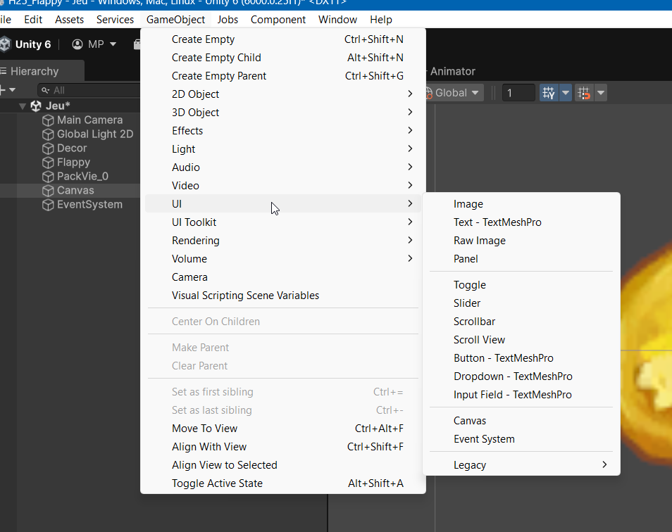
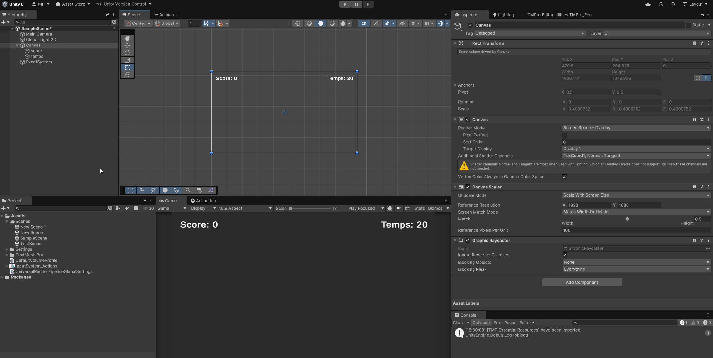
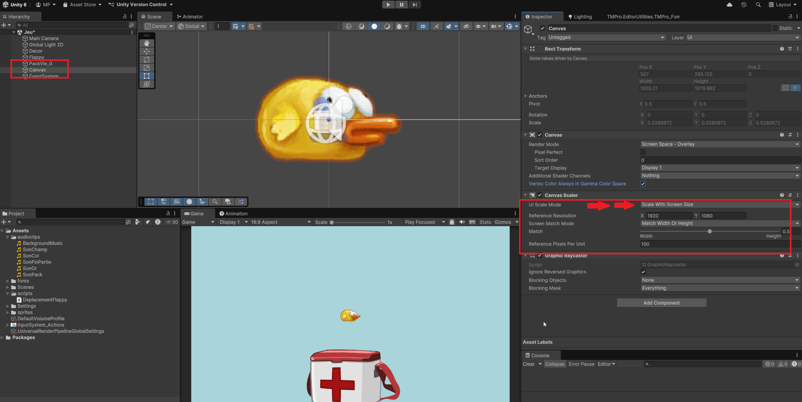
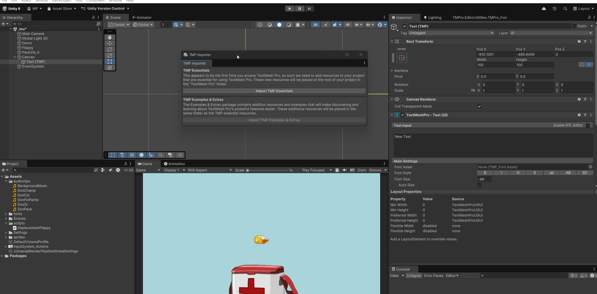
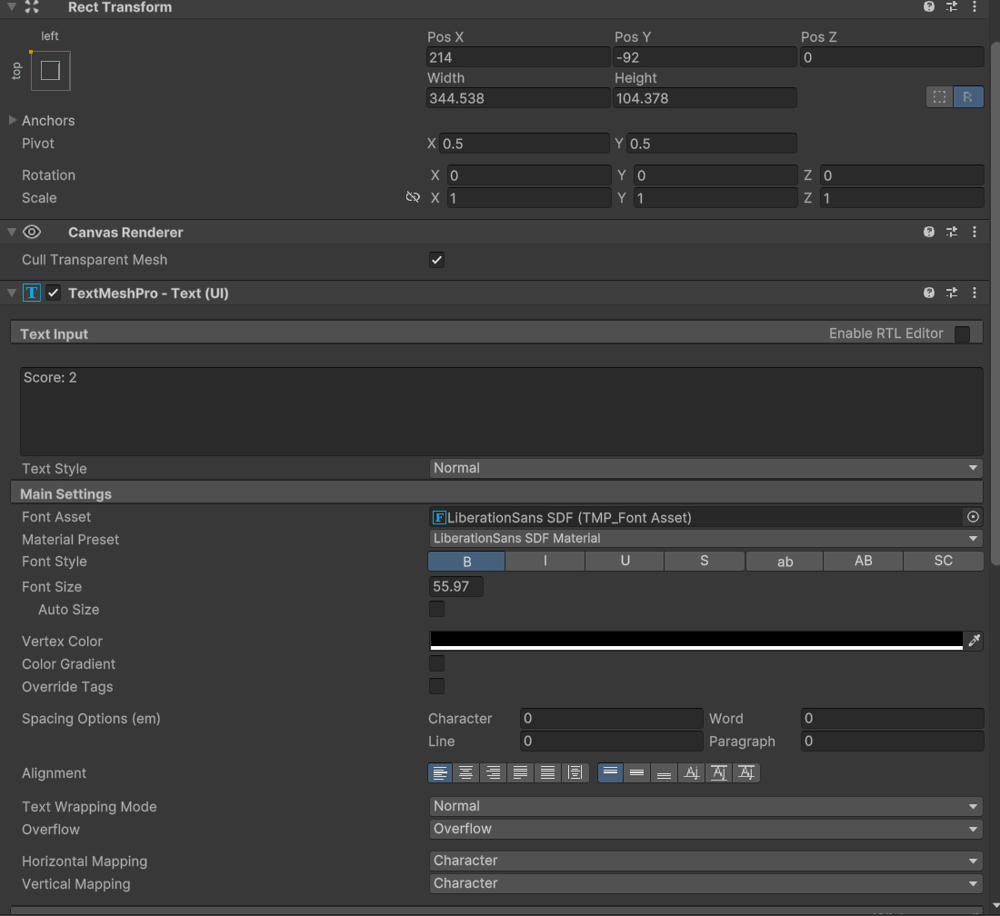
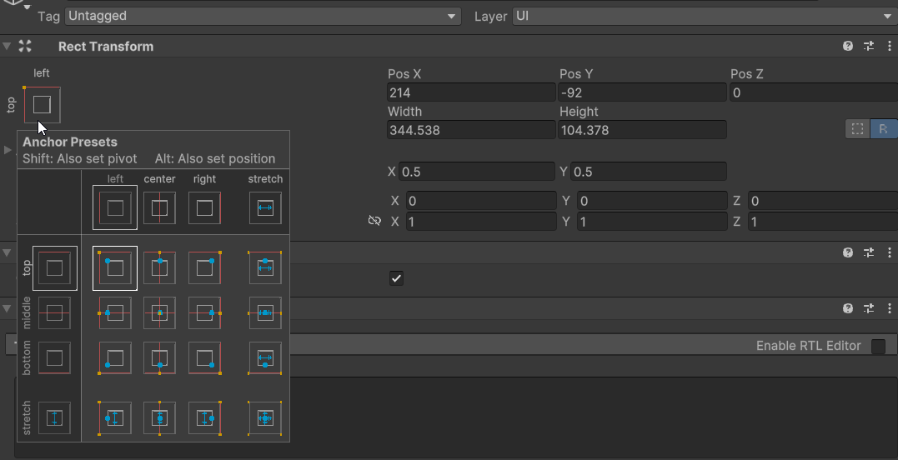
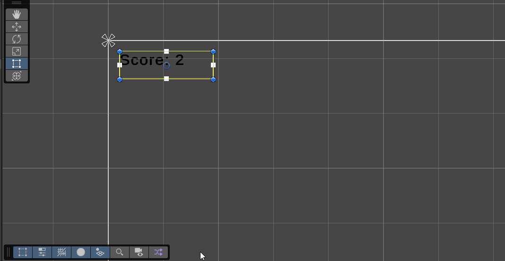
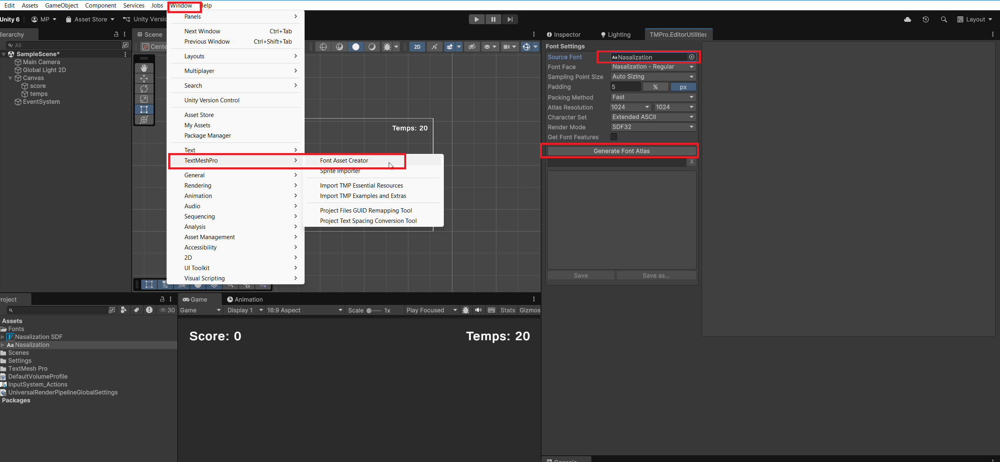

# Gestion du texte et du HUD (head-up display) dans Unity

Unity vient avec plusieurs outils intégrés pour gérer le texte et les interfaces utilisateur (UI). Voici un aperçu des principales fonctionnalités et composants disponibles pour la gestion du texte et du UI dans Unity.

En jeu, on parle de HUD (head-up display) pour désigner les éléments d'interface utilisateur qui sont affichés à l'écran, tels que les barres de santé, les scores, les mini-cartes, etc.

Pour afficher du texte et des éléments de HUD dans Unity, on utilise principalement le système UI d'Unity, qui inclut des composants comme Text, TextMeshPro, Canvas, et d'autres.

Tous les éléments de UI sont disponibles dans le menu `GameObject > UI`.



## Canvas

Le Canvas est l'élément de base pour créer des interfaces utilisateur dans Unity. Tous les éléments UI doivent être enfants d'un Canvas pour être affichés à l'écran. Ils seront automatiquement redimensionnés et positionnés en fonction de la taille de l'écran. Pour visualiser l'ensemble du canvas, double-cliquez sur l'élément Canvas dans la hiérarchie.

{width=100%}

Pour ajuster le Canvas à différentes résolutions d'écran, vous pouvez modifier le `UI Scale Mode` dans le composant `Canvas Scaler`.

-   Choisissez `Scale With Screen Size` pour que le Canvas s'adapte automatiquement à la taille de l'écran et conserve les proportions.
-   Définissez une `Reference Resolution` pour indiquer la résolution de base à laquelle vous concevez votre UI. (1920 x 1 080 est une résolution courante pour les écrans Full HD).
-   Sélectionnez un `Screen Match Mode` pour contrôler comment le Canvas s'adapte aux différentes tailles d'écran (par exemple, en fonction de la largeur, de la hauteur ou d'une combinaison des deux). Mettez 50% pour Width et 50% pour Height afin d'équilibrer les deux.



## Ajouter du texte

Pour ajouter un élément de texte à votre HUD, suivez ces étapes :

1.  Ajoutez un élément de texte en sélectionnant `GameObject > UI > Text - TextMeshPro` et placez-le sous le Canvas dans la hiérarchie.
2.  Si vous avez ajouté un élément TextMeshPro pour la première fois, Unity vous demandera d'importer les ressources nécessaires. Cliquez sur "Import TMP Essentials".
3.  Sélectionnez l'élément de texte dans la hiérarchie et utilisez l'inspecteur pour modifier ses propriétés, telles que le contenu du texte, la police, la taille, la couleur, l'alignement, etc.



### Options de formatage

-   **Text Input** : Modifiez le contenu du texte ici.
-   **Font Asset** : Choisissez la police de caractères à utiliser.
-   **Font Size** : Ajustez la taille du texte.
-   **Color** : Changez la couleur du texte.
-   **Alignment** : Alignez le texte à gauche, au centre, à droite, etc.

Vous pouvez également ajouter des effets supplémentaires au texte, tels que des ombres, des contours, et plus encore, en utilisant les options disponibles dans l'inspecteur.



## Positionnement et ancrage

Dans Unity, les éléments de UI utilisent un système d'ancrage pour déterminer leur position par rapport au Canvas. Vous pouvez ajuster les ancres et les pivots des éléments de UI pour contrôler comment ils se comportent lors du redimensionnement de l'écran. Dans le coin supérieur gauche de l'inspecteur, vous trouverez un outil d'ancrage qui vous permet de définir rapidement les ancres et les pivots. Un pivot placé par rapport au coin supérieur gauche de l'élément signifie que les coordonnées de position seront calculées à partir de ce coin et si l'écran change de taille, l'élément restera aligné par rapport à ce coin.

En appuyant sur alt (option sur Mac) tout en cliquant sur une option d'ancrage, vous pouvez également positionner l'élément à cet endroit. Si l'écran change de taille, les éléments de UI s'ajusteront en fonction de leurs ancres et pivots définis.



Dans la scène, vous pouvez également utiliser l'outil de déplacement pour positionner les éléments de UI directement à l'écran. Assurez-vous que le mode de déplacement est réglé sur "Rect Tool" (raccourci clavier T) pour manipuler correctement les éléments de UI.



## Modifier le texte par script

Vous pouvez également modifier le texte d'un élément TextMeshPro par script. Commencez par importer le namespace TextMeshPro en haut de votre script :

```csharp
using TMPro;
```

Ensuite, créez une référence à votre composant TextMeshPro dans votre script :

```csharp
public class ExampleScript : MonoBehaviour
{
    public TMP_Text texteScore; // Référence à l'élément TextMeshPro
    public int score = 0;

    void Start()
    {
        texteScore.text = $"Score: {score}"; // Initialisation du texte
    }
}
```

## Autres éléments de UI utiles

-   **Image** : Utilisé pour afficher des images ou des icônes dans le HUD.
-   **Button** : Permet de créer des boutons interactifs.
-   **Slider** : Utilisé pour créer des barres de progression ou des curseurs
-   **Panel** : Un conteneur pour regrouper plusieurs éléments de UI.
-   **Canvas Group** : Permet de contrôler la visibilité et l'interactivité d'un groupe d'éléments de UI.

Ces éléments peuvent être combinés pour créer des interfaces utilisateur complexes et interactives dans vos jeux Unity. N'hésitez pas à explorer les différentes options et fonctionnalités offertes par le système UI d'Unity pour personnaliser votre HUD selon vos besoins.

## Types des éléments de UI dans le script

Pour créer des références aux éléments de UI dans vos scripts, vous utiliserez différents types en fonction de l'élément que vous souhaitez manipuler. Voici quelques-uns des types les plus couramment utilisés pour les éléments de UI dans Unity :

-   **TMP_Text** : Utilisé pour les éléments de texte TextMeshPro. Permet de modifier le contenu, la couleur, la taille, etc.
-   **Image** : Utilisé pour les éléments d'image. Permet de changer la source de l'image, la couleur, la transparence, etc.
-   **Button** : Utilisé pour les boutons interactifs. Permet de gérer les événements de clic et de modifier l'apparence du bouton.
-   **Slider** : Utilisé pour les curseurs. Permet de lire et de modifier la valeur du curseur.
-   **InputField** : Utilisé pour les champs de saisie de texte. Permet de lire et de modifier le texte saisi par l'utilisateur.

## Importer des polices personnalisées

Pour utiliser des polices personnalisées avec TextMeshPro, vous devez d'abord importer la police dans votre projet Unity. Voici comment faire :

1.  Téléchargez la police que vous souhaitez utiliser (format .ttf ou .otf).
2.  Faites glisser le fichier de police dans le dossier `Assets` de votre projet Unity.
3.  Ouvrez le menu de création de fichiers de TextMeshPro `Window > TextMeshPro > Font Asset Creator`
4.  Sélectionnez la police importée dans le champ `Source Font File`.
5.  Cliquez sur le bouton `Generate Font Atlas` pour créer l'atlas de la police.
6.  Si certaines lettres ou caractères sont manquants, vous pouvez ajuster les paramètres de génération pour inclure plus de glyphes en modifiant le champ `Character Set` (par exemple, en choisissant `ASCII` ou `Extended ASCII`).
7.  Cliquez sur le bouton `Save` pour enregistrer le nouvel asset de police dans votre projet. Vous pouvez maintenant l'utiliser dans vos éléments TextMeshPro en le sélectionnant dans le champ `Font Asset`.


