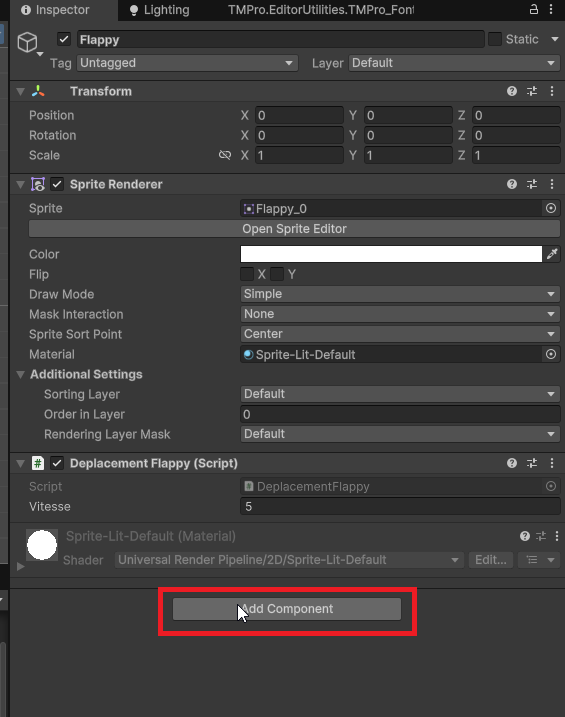
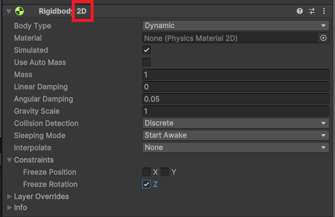

# Physique et Rigidbody

Dans Unity, la physique permet de simuler des interactions réalistes entre les objets dans un environnement 3D et 2D. Pour qu'un objet puisse interagir avec la physique en entrer en collision, il doit posséder un composant appelé **Rigidbody**.

Le Rigidbody permet à un objet d'être affecté par des forces telles que la gravité, les collisions, et d'autres interactions physiques. Il permet également de contrôler le mouvement de l'objet de manière réaliste et appliquer des forces.

Pour ajouter un composant Rigidbody à un objet, sélectionnez l'objet dans la hiérarchie, puis allez dans le menu **Component > Physics Rigidbody2D**

**Attention, nous travaillez ici avec la physique 2D, donc il faut choisir Rigidbody2D et non Rigidbody qui sert pour la physique 3D.**





## Propriétés principales du Rigidbody 2D

-   **Body Type (Type de corps)** : Il existe trois types de corps :

    -   **Dynamic (Dynamique)** : L'objet est affecté par la physique et peut se déplacer librement.
    -   **Kinematic (Cinématique)** : L'objet n'est pas affecté par la physique, mais peut être déplacé par des scripts. Utile pour les objets qui doivent suivre un chemin spécifique.
    -   **Static (Statique)** : L'objet ne bouge pas et n'est pas affecté par la physique. Utilisé pour les objets immobiles comme le sol ou les murs.

-   **Mass (Masse)** : La masse de l'objet, qui influence la façon dont il réagit aux forces. C'est-à-dire qu'un objet plus lourd nécessitera plus de force pour être déplacé. Imaginez pousser une voiture par rapport à une bicyclette.

-   **Gravity Scale (Échelle de gravité)** : Cette propriété détermine l'influence de la gravité sur l'objet.

    -   Une valeur de 1 signifie que l'objet est affecté par la gravité normale
    -   Une valeur de 0 signifie qu'il n'est pas affecté par la gravité du tout.
    -   Une valeur de -1 inversera la direction de la gravité.

-   **Drag (Traînée)** : La traînée est une force de résistance qui s'oppose au mouvement de l'objet à travers l'air ou un autre fluide. Une valeur plus élevée de traînée ralentira l'objet plus rapidement lorsqu'il se déplace un peu comme de la friction.

-   **Angular Drag (Traînée angulaire)** : Similaire à la traînée, mais elle s'applique à la rotation de l'objet. Une valeur plus élevée ralentira la rotation de l'objet plus rapidement. Une valeur de 0 signifie qu'il n'y a pas de résistance à la rotation donc l'objet continuera à tourner indéfiniment une fois mis en rotation.

-   **Constraints (Contraintes)** : Permet de restreindre le mouvement ou la rotation de l'objet sur certains axes.
    -   Pour empêcher un objet de tourner, cochez la case "Freeze Rotation" (Geler la rotation). **Important pour les jeux 2D, où vous ne voulez pas que les objets tournent sur eux-mêmes.**
    -   Pour empêcher un objet de se déplacer sur un axe spécifique, cochez la case correspondante sous "Freeze Position" (Geler la position).

Toutes ces propriétés sont manipulables via des scripts pour créer des comportements dynamiques dans votre jeu. Par exemple, vous pouvez appliquer des forces, modifier la gravité, ou changer le type de corps en fonction des événements du jeu.

## Accéder au Rigidbody 2D via un script

Pour interagir avec le Rigidbody 2D d'un objet via un script, vous devez d'abord obtenir une référence au composant Rigidbody 2D. Commencez par créer une variable de type `Rigidbody2D` dans votre script, puis. dans la fonction `Start()` utilisez la méthode `GetComponent<Rigidbody2D>()` pour l'initialiser.

On évite d'utiliser `GetComponent` dans la fonction `Update` car elle est appelée à chaque frame, ce qui peut ralentir les performances du jeu.

```csharp
using UnityEngine;
using UnityEngine.InputSystem;
public class ExampleScript : MonoBehaviour
{
    private Rigidbody2D rb;

    void Start()
    {
        rb = GetComponent<Rigidbody2D>();
    }
}
```

Ensuite, vous pouvez utiliser cette référence pour manipuler les propriétés du Rigidbody 2D pour enlever les contraintes ou modifier la gravité.

```csharp
    void Update()
    {
        // Exemple : Enlever les contraintes de position et de rotation
        rb.constraints = RigidbodyConstraints2D.None;

        // Exemple : Modifier l'échelle de gravité
        rb.gravityScale = 2.0f; // Double la gravité
    }
```

Nous verrons comment appliquer des forces et déplacer des objets avec le Rigidbody 2D au cours 15. Si cela vous intéresse, les notes sont déjà disponibles.

[Documents Unity sur le Rigidbody 2D](https://docs.unity3d.com/ScriptReference/Rigidbody2D.html)
