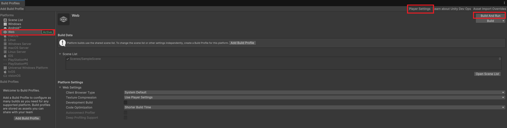
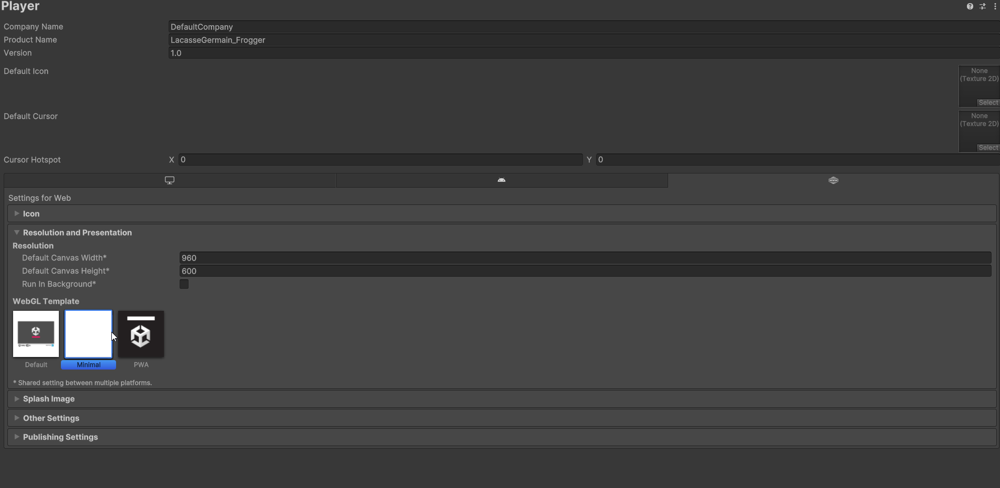
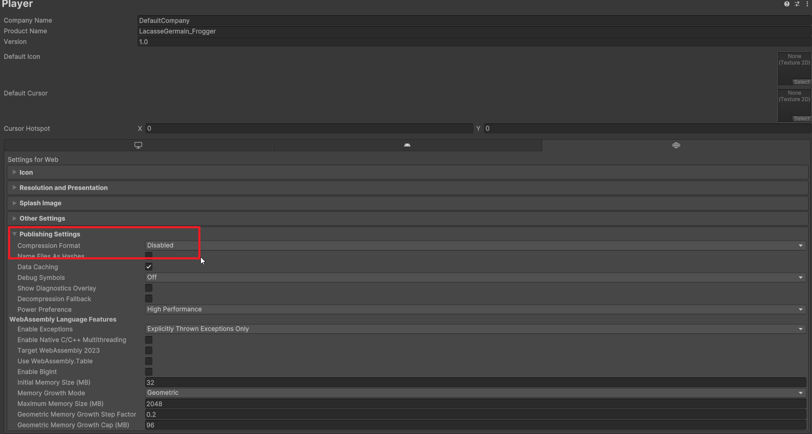

# Compiler un projet Unity et le mettre en ligne

Une fois que vous avez terminé le développement de votre projet Unity, l'étape suivante consiste à le compiler et à le mettre en ligne pour que d'autres puissent y accéder. Voici un guide étape par étape pour compiler votre projet Unity et le publier en ligne avec GitHub Pages.

## Étape 1 : Préparer votre projet Unity

Avant de compiler votre projet, assurez-vous que tout fonctionne correctement dans l'éditeur Unity. Testez votre jeu ou application pour vous assurer qu'il n'y a pas de bugs majeurs. Il ne devrait pas y avoir de problèmes de performance ou d'erreurs critiques qui empêcheraient le bon fonctionnement de votre projet. Poussez également toutes les modifications finales dans votre dépôt GitHub.

## Étape 2 : Configurer les paramètres de build

1. Ouvrez votre projet Unity.
2. Allez dans le menu **File** > **Build Profiles**.
3. Sélectionnez **Web** comme plateforme de build.Si vous ne voyez pas cette option, vous devrez peut-être installer le module WebGL via le Unity Hub.
4. Cliquez sur **Switch Platform** pour basculer vers la plateforme WebGL si ce n'est pas déjà fait.
5. Configurez les paramètres de build selon vos besoins (résolution, qualité, etc.). Vous pouvez également ajuster les paramètres avancés dans **Edit** > **Project Settings** > **Player**.
6. Réglez la résolution de votre application WebGL en fonction de vos besoins. Vous pouvez choisir une résolution fixe ou permettre à l'application de s'adapter à la taille de la fenêtre du navigateur.
7. Dans le cas du WebGL, assurez-vous que l'option **Compression Format** est définie sur **Disabled** pour éviter les problèmes de chargement sur GitHub Pages et que le mode ce soit compatible avec Itch.io.

## Étape 3 : Compiler le projet

1. Créez un dossier `docs` à la racine de votre dépôt GitHub si ce n'est pas déjà fait. Ce dossier sera utilisé pour héberger les fichiers compilés.
2. Allez dans le menu **File** > **Build Profiles** > **Build**
3. Cliquez sur **Build** dans la fenêtre de build.
4. Choisissez un dossier de destination pour les fichiers compilés.
5. Attendez que Unity termine le processus de compilation. Cela peut prendre quelques minutes en fonction de la taille de votre projet.

## Étape 4 : Préparer les fichiers pour GitHub Pages

1. Une fois la compilation terminée, accédez au dossier de destination que vous avez choisi.
2. Vous verrez plusieurs fichiers et dossiers, y compris un dossier `Build`, un dossier `TemplateData`, et un fichier `index.html`.
3. Poussez les changements dans le dossier `docs` sur votre dépôt GitHub.

## Étape 5 : Mettre en ligne sur GitHub Pages

1. Ouvrez votre dépôt GitHub dans votre navigateur.
2. Allez dans les **Settings** (Paramètres) de votre dépôt.
3. Dans le menu de gauche, cliquez sur **Pages**.
4. Sous **Source**, sélectionnez la branche `main` (ou la branche que vous utilisez) et le dossier `/docs`.
5. Cliquez sur **Save**.
6. Attendez quelques minutes que GitHub génère votre site. Vous verrez une URL où votre projet est hébergé, généralement sous la forme `https://votre-nom-utilisateur.github.io/votre-repo/`.

## Étape 6 : Accéder à votre projet en ligne

1. Ouvrez un navigateur web et accédez à l'URL fournie par GitHub Pages.
2. Votre projet Unity compilé devrait se charger et être prêt à être utilisé en ligne.
