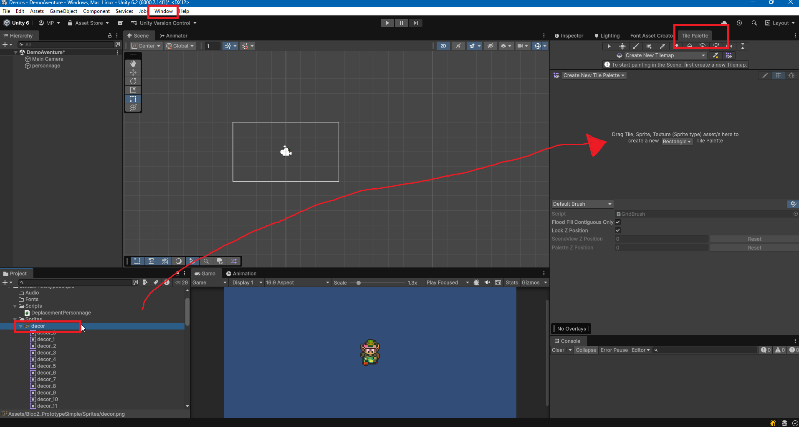
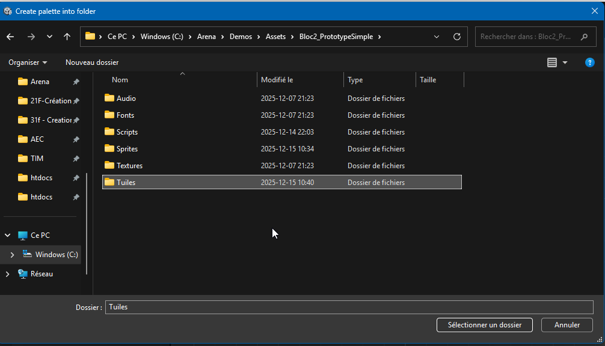

# Design de niveau : Utilisation de tuiles (Tilesets et Tilemaps)

Unity offre une fonctionnalité puissante pour créer des environnements 2D en utilisant des tuiles (tilesets) et des cartes de tuiles (tilemaps). Cette approche est particulièrement utile pour les jeux de plateforme, les RPG et autres genres nécessitant des environnements répétitifs ou modulaires. Il est possible de créer des niveaux complexes rapidement en assemblant des tuiles préconçues et même d'appliquer des colliders à un ensemble de tuiles pour gérer les interactions physiques.

Pour peindre des niveaux avec des tuiles dans Unity, vous devez d'abord créer un tileset à partir de vos sprites. Le tileset est une collection de sprites organisés en une grille, où chaque sprite représente une tuile individuelle. Le tileset est créé dans le dossier Assets de votre projet Unity.

Ensuite, dans la scène, vous pouvez créer une Tilemap en ajoutant un GameObject de type Tilemap à votre scène. La Tilemap est un composant qui vous permet de peindre des tuiles sur une grille dans la scène. Il optimise le rendu et la gestion des tuiles, ce qui facilite la création de niveaux complexes. Il est possible d'ajouter plusieurs Tilemaps à une scène pour gérer différents calques (par exemple, un calque pour le sol, un autre pour les objets décoratifs, etc.) et d'ajouter un Tilemap Collider 2D pour gérer les collisions avec les tuiles peintes de manière efficace.

## Préparation des images avant de les utiliser dans un ensemble de tuiles

Avant d'utiliser des images dans un tileset, assurez-vous que chaque tuile a la même taille.

1. **Taille uniforme** : Assurez-vous que toutes les tuiles ont la même taille (par exemple, 32x32 pixels ou 64x64 pixels). Cela garantit que les tuiles s'alignent correctement sur la grille de la Tilemap. Modifiez la résolution **Pixels Per Unit**, choisissez une taille appropriée pour vos tuiles (par exemple, 32x32 pixels) sinon vous aurez de la transparence indésirable entre les tuiles ou elle seront trop petites/grandes par rapport à la grille.

2. Dans l'Inspector, définissez le **Sprite Mode** sur **Multiple** si les images contiennent plusieurs tuiles et utilisez le sprite editor pour découper les tuiles individuellement.

## Création d'un ensemble de tuiles (Tileset)

Commencez par créer un ensemble de tuile (tileset) à partir de vos sprites :

1. Ouvrez Unity et allez dans le menu **Window > 2D > Tile Palette** pour ouvrir la fenêtre de palette de tuiles.
2. Faites glisser les tuiles découpées depuis le dossier `Assets` vers la palette de tuiles.
3. Enregistrez la palette de tuiles dans un dossier approprié dans votre projet.

## Peindre des tuiles dans la Tilemap

1. Dans la scène, faites un clic droit dans la hiérarchie et sélectionnez **2D Object > Tilemap** pour créer une nouvelle Tilemap.
2. Sélectionnez la Tilemap dans la hiérarchie et ouvrez la palette de tuiles.
3. Sélectionnez la tuile que vous souhaitez peindre dans la palette de tuiles.
4. Utilisez l'outil de peinture pour peindre les tuiles sur la Tilemap dans la scène.

## Effacer des tuiles

Pour effacer des tuiles, sélectionnez l'outil de gomme dans la palette de tuiles et cliquez sur les tuiles que vous souhaitez supprimer sur la scène.

## Organisation des tuiles

Utilisez les tilemaps comme des calques séparés pour organiser les différents éléments de votre niveau (sol, décorations, objets interactifs, etc.).

Cela permet de gérer plus facilement les interactions et les collisions entre les différents éléments du jeu.

## Ordre d'affichage des Tilemaps

Chaque Tilemap a une propriété appelée **Order in Layer** dans le composant **Tilemap Renderer**. Cette propriété détermine l'ordre d'affichage des Tilemaps les unes par rapport aux autres. Les Tilemaps avec un ordre plus élevé seront rendues devant de celles avec un ordre plus bas. Utilisez cette propriété pour organiser visuellement vos calques de tuiles.

Dans un tileset, les images devraient toujours être de la même taille (par exemple, 32x32 pixels ou 64x64 pixels) pour assurer une cohérence lors de la peinture des tuiles dans la Tilemap. Assurez-vous que les tuiles s'alignent correctement sur la grille.

## Ajout de colliders aux tuiles

Pour gérer les collisions avec les tuiles peintes, vous pouvez ajouter un composant **Tilemap Collider 2D** à votre Tilemap :

1. Sélectionnez la Tilemap dans la hiérarchie.
2. Cliquez sur **Add Component** dans l'Inspector.
3. Recherchez et ajoutez le composant **Tilemap Collider 2D**.
4. Si vous souhaitez que les tuiles aient des propriétés physiques (comme la gravité ou les rebonds), ajoutez également un composant **Rigidbody 2D** à la Tilemap et configurez-le selon vos besoins.
