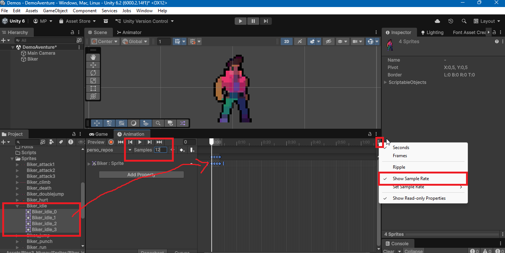
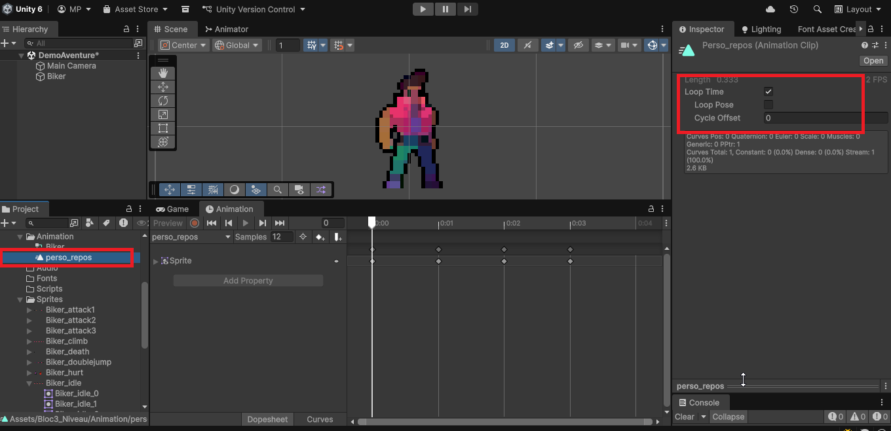

# Créer des animation images par image (Frame-by-Frame Animation)

Les animations images par image (frame-by-frame) sont une technique couramment utilisée dans les jeux 2D pour créer des animations fluides en affichant une séquence d'images (sprites) rapidement les unes après les autres. Unity facilite la création de ce type d'animation grâce à son système d'animation intégré.

## Préparation des images pour l'animation

Avant de créer une animation images par image, assurez-vous que vous avez une série d'images (sprites) prêtes à être utilisées. Chaque image doit représenter une étape différente de l'animation.

Placez le pivot de chaque sprite au même endroit pour assurer une transition fluide entre les images lors de l'animation.

### Modifier le pivot d'un sprite

1. Sélectionnez le sprite dans le dossier `Assets`.
2. Dans l'Inspector, cliquez sur le bouton **Sprite Editor**.
3. Dans le Sprite Editor, sélectionnez l'outil **Pivot** et ajustez la position du pivot selon vos besoins (par exemple, au centre ou en bas du sprite).
4. Cliquez sur **Apply** pour enregistrer les modifications.

## Création de l'animation images par image

1. Ouvrez la fenêtre **Animation** en allant dans le menu **Window > Animation > Animation**.
2. Sélectionnez le GameObject auquel vous souhaitez ajouter l'animation (par exemple, un personnage ou un objet).
3. Dans la fenêtre Animation, cliquez sur le bouton **Create** pour créer une nouvelle animation. Cela va ajouter un composant **Animator** au GameObject si ce n'est pas déjà fait et créer un fichier d'animation dans le dossier `Assets/animations`.
4. Enregistrez le fichier d'animation avec un nom approprié au format suivant `objet_nomDeLanimation` (par exemple, "perso_repos", "ennemi_marche").

5. Faites glisser les images (sprites) de l'animation depuis le dossier `Assets` vers la fenêtre Animation. Placez-les dans l'ordre souhaité pour l'animation.
6. Ajustez le framerate (images par seconde) de l'animation en modifiant la valeur **Samples** dans la fenêtre Animation. Une valeur courante est 12 ou 24 images par seconde, selon la fluidité souhaitée. (si vous ne vous voyez pas cette option, cliquez sur les 3 petits points en haut à droite de la fenêtre Animation et sélectionnez **Show Samples**).

7. Si vous voulez que l'animation se répète en boucle, assurez-vous que l'option **Loop Time** est cochée dans l'Inspector lorsque vous sélectionnez le fichier d'animation.

8. Testez l'animation en appuyant sur le bouton **Play** dans la fenêtre Animation.

### Déplacement par programmation et animation

Si vous souhaitez déplacer un GameObject par programmation ET en utilisant aussi une animation par interpolation, vous pouvez le faire en combinant les deux approches.

Cependant, il est important de noter que les animations peuvent écraser les modifications par programmation si elles affectent les mêmes propriétés. Il n'y a pas de problème avec les animations images par image, car elles ne modifient généralement pas les propriétés de position, rotation ou échelle du GameObject mais si vous animez aussi ces propriétés par interpolation en plus des images par image, cela peut poser problème.

Pour éviter cela, **placez l'élément animé dans un GameObject parent et appliquez les scripts de déplacement par programmation au parent.**

[Documentation officielle Unity sur l'animation de sprites 2D](https://learn.unity.com/tutorial/introduction-to-sprite-animations)
