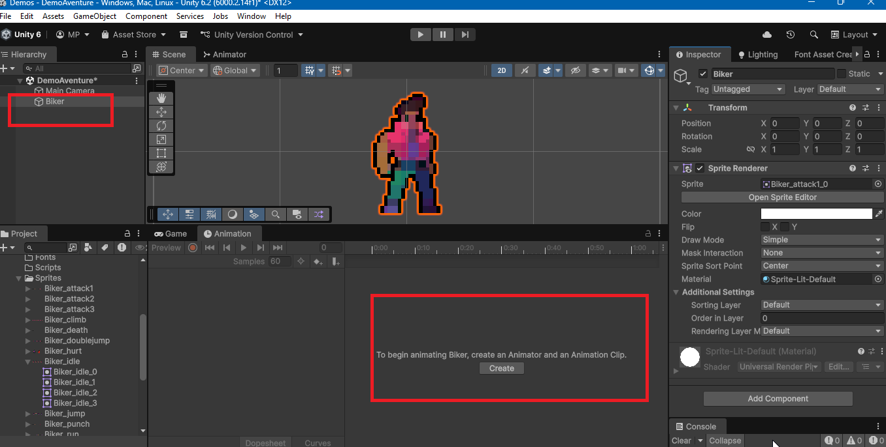
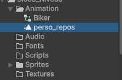
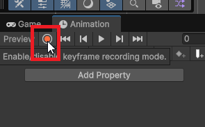
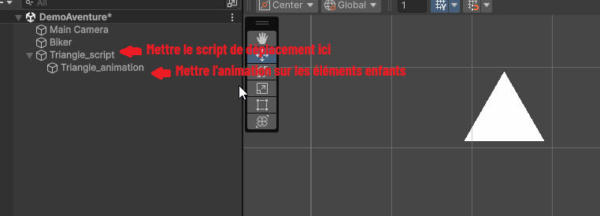
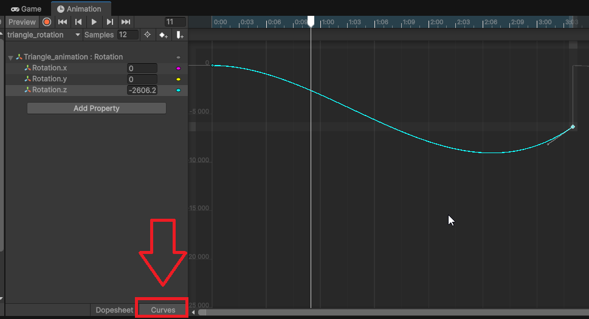
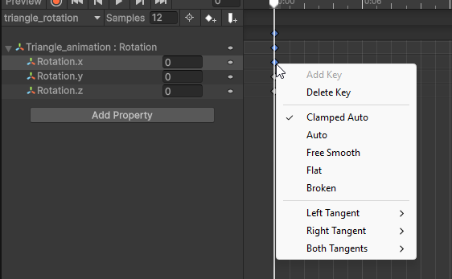
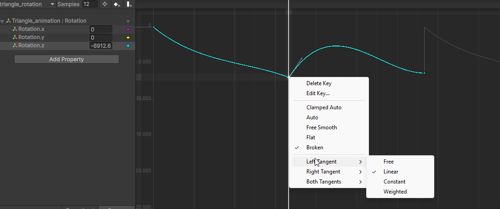

# Animation par interpolation avec la fenêtre Animation

L'animation par interpolation est une technique qui permet de créer des animations fluides en définissant des points clés (keyframes) pour les propriétés d'un objet, telles que la position, la rotation ou l'échelle. Unity offre un système puissant pour créer ce type d'animation à l'aide de la fenêtre Animation.

La fenêtre Animation permet de définir des keyframes pour différentes propriétés d'un GameObject, et Unity interpole automatiquement les valeurs entre ces keyframes pour créer une transition fluide.Il est possible d'enregistrer les changements des propriétés d'un GameObject au fil du temps, et Unity génère les frames intermédiaires.

## Propriétés animables

Dans Unity, la majorité des propriétés des composants peuvent être animées, y compris :

-   Position, rotation et échelle d'un GameObject (Transform)
-   Couleur et transparence (Renderer, Light, UI)
-   Paramètres des composants (volume de l'AudioSource, intensité de la lumière, etc.)
-   Propriétés des éléments UI (couleur de texte, taille, position)

## Création d'une animation par interpolation

1. Ouvrez la fenêtre **Animation** en allant dans le menu **Window > Animation > Animation**.
2. Sélectionnez le GameObject auquel vous souhaitez ajouter l'animation (par exemple, un personnage ou un objet).
3. Dans la fenêtre Animation, cliquez sur le bouton **Create** pour créer une nouvelle animation. Cela va ajouter un composant **Animator** au GameObject si ce n'est pas déjà fait et créer un fichier d'animation dans le dossier `Assets/animations`.
4. Enregistrez le fichier d'animation avec un nom approprié au format suivant `objet_nomDeLanimation` (par exemple, "porte_ouverture", "lumiere_clignotante").

{width="100%"}

5. Dans la fenêtre Animation, assurez-vous que le mode d'enregistrement est activé en cliquant sur le bouton rouge **Record** (si ce n'est pas déjà fait).

6. Déplacez la tête de lecture (le curseur vertical rouge) à l'endroit où vous souhaitez définir un keyframe (par exemple, à 1 seconde).
7. Modifiez la propriété du GameObject que vous souhaitez animer (par exemple, la position, la rotation ou l'échelle). Unity ajoutera automatiquement un keyframe pour cette propriété à la position actuelle de la tête de lecture.
8. Répétez les étapes 6 et 7 pour définir d'autres keyframes à différents moments dans le temps.
9. Une fois que vous avez défini tous les keyframes nécessaires, désactivez le mode d'enregistrement en cliquant à nouveau sur le bouton **Record**. **N'oubliez pas cette étape, sinon vous continuerez à ajouter des keyframes involontairement.**

### Déplacement par programmation et animation par interpolation

Si vous souhaitez déplacer un GameObject par programmation ET en utilisant aussi une animation par interpolation, vous pouvez le faire en combinant les deux approches.

Cependant, il est important de noter que les animations peuvent écraser les modifications par programmation si elles affectent les mêmes propriétés.

Pour éviter cela, **placez l'élément animé dans un GameObject parent et appliquez les scripts de déplacement par programmation au parent.**

## Créer une animation qui joue en boucle correctement

Pour qu'une animation joue en boucle, assurez-vous que la dernière image-clé de l'animation correspond à la première frame.

1. Dans la fenêtre Animation, sélectionnez les images-clés sur la première frame de l'animation.
2. Copiez les valeurs des propriétés de la première frame (par exemple, position, rotation, échelle).
3. Déplacez la tête de lecture à la dernière frame de l'animation et collez ces valeurs.

## Types d'interpolation

Unity utilise les courbes de Bezier comme dans Illustrator pour interpoler entre les images-clés. Vous pouvez voir ces courbes en appuyant sur le bouton **Curves** dans la fenêtre Animation et en sélectionnant une propriété animée.Il faut parfois déplier une propriété animée pour voir la courbe.

Vous pouvez modifier la manière dont les poignées des courbes réagissent en cliquant avec le bouton droit sur une image-clé dans la fenêtre Animation. Vous pouvez choisir parmi plusieurs types d'interpolation, tels que :

-   Clamped Auto : Les poignées sont automatiquement ajustées, mais restent dans les limites des keyframes adjacentes
-   Auto : Les poignées sont automatiquement ajustées pour une transition fluide
-   Free Smooth : Les poignées sont libres et lisses pour un contrôle manuel
-   Flat : Les poignées sont horizontales, créant une transition douce
-   Broken : Chaque poignée peut être ajustée indépendamment, ce qui permet des transitions plus complexes

Vous pouvez également choisir comment la courbe se comporte entre à chaque poignée:

-   Free : La courbe d'animation est librement ajustable entre les keyframes
-   Linear : La courbe d'animation est une ligne droite entre les keyframes. Donne une animation à vitesse constante
-   Constant : La valeur reste constante jusqu'à la prochaine keyframe. Il n'y a pas de transition entre les keyframes. Utile pour des changements brusques
-   Stepped : La valeur change brusquement à la keyframe suivante. Utilisé pour des animations en "sauts" comme des animations de sprites

Pour visualiser les différentes courbes d'interpolation, vous pouvez visiter les sites suivants :

[SVGator - Easing Functions](https://www.svgator.com/blog/easing-functions/)
[Documentation Unity - Animation Curves ](https://docs.unity3d.com/2019.1/Documentation/Manual/animeditor-AnimationCurves.html)

## Conseils pour une animation réussie

-   **Utilisez des courbes d'animation** : Dans la fenêtre Animation, vous pouvez ajuster les courbes d'animation pour contrôler la vitesse et l'accélération des transitions entre les keyframes.
-   **Organisez vos animations** : Utilisez des dossiers dans le panneau Project pour organiser vos fichiers d'animation et gardez une structure claire.
-   **Nommez vos animations de manière descriptive** : Utilisez des noms clairs et descriptifs pour vos animations afin de faciliter leur identification et commençant par le nom de l'objet animé et le type d'animation (ex : "porte_ouverture", "lumiere_clignotante").
-   **Testez régulièrement** : Jouez l'animation dans la fenêtre Animation pour voir comment elle se déroule et apportez des ajustements si nécessaire.
