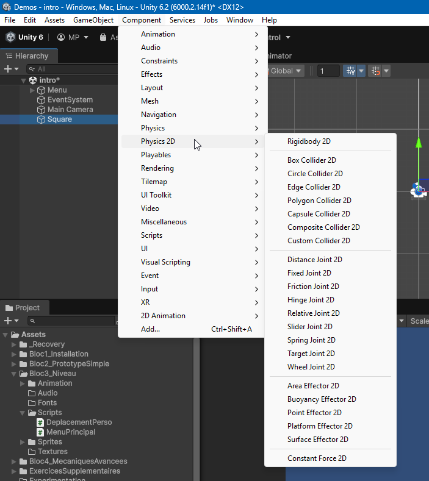

# Design de niveau : Joints 2D

Dans cette section, nous allons explorer comment ajouter de la variété dans le design de vos niveaux en utilisant les joints 2D dans Unity. Les joints 2D permettent de connecter des objets entre eux pour créer des mécanismes complexes et interactifs dans vos jeux 2D. Les joints permettent de simuler des chaines, des ressorts, des charnières, et bien plus encore.

## Ajout d'un Joint 2D à un GameObject

-   Les joints 2D sont situés dans le menu **Component > Physics 2D**, tout en bas de la liste.
-   Pour qu'un joint 2D fonctionne, le GameObject doit avoir un collider 2D (Box Collider 2D, Circle Collider 2D,TilemapCollider2D, etc.) et un Rigidbody 2D attaché.

## Types de Joints 2D

Voici quelques types courants de joints 2D que vous pouvez utiliser dans Unity :

-   **Hinge Joint 2D** : Permet de faire pivoter un objet autour d'un point fixe, comme une porte ou une roue. Vous pouvez définir des limites de rotation et ajouter un moteur pour contrôler la vitesse de rotation.
-   **Spring Joint 2D** : Connecte deux objets avec une force de ressort, permettant des mouvements élastiques entre eux. Utile pour simuler des cordes ou des ressorts.
-   **Distance Joint 2D** : Maintient une distance fixe entre deux objets, utile pour créer des effets de corde ou de barre rigide.
-   **Slider Joint 2D** : Permet à un objet de se déplacer le long d'un axe défini, comme un tiroir ou une plateforme coulissante.
-   **Fixed Joint 2D** : Connecte deux objets de manière rigide, les empêchant de se déplacer l'un par rapport à l'autre.

## Configurer un Joint 2D

Sélectionnez le joint 2D dans l'inspecteur pour afficher ses propriétés. Vous pouvez ajuster les paramètres suivants en fonction du type de joint que vous utilisez :

-   **Connected Body** : Spécifie l'autre Rigidbody 2D auquel le joint est attaché.
-   **Anchor** : Définit le point d'attache du joint sur l'objet.
-   **Auto Configure Connected Anchor** : Si activé, Unity configure automatiquement le point d'attache sur l'objet connecté.
-   **Limits** : Pour les joints comme le Hinge Joint 2D, vous pouvez définir des limites de rotation.
-   **Motor** : Pour les joints comme le Hinge Joint 2D, vous pouvez ajouter un moteur pour contrôler la vitesse de rotation.Une vitesse de rotation positive fait tourner dans le sens horaire, tandis qu'une vitesse négative fait tourner dans le sens antihoraire. Vous pouvez accéder à ces options en cochant la case "Use Motor".
-   **Damping Ratio et Frequency** : Pour les joints comme le Spring Joint 2D, vous pouvez ajuster la rigidité et l'amortissement du ressort.
-   **Distance** : Pour les joints comme le Distance Joint 2D, vous pouvez définir la distance fixe entre les deux objets.
-   **Break Force et Break Torque** : Vous pouvez définir une force ou un couple maximum que le joint peut supporter avant de se casser, ajoutant ainsi une dynamique supplémentaire à vos mécanismes.

## Utilisation créative des Joints 2D

-   **Ponts suspendus** : Utilisez des Spring Joints 2D pour créer des ponts suspendus qui se balancent lorsque les personnages marchent dessus.
-   **Mécanismes de levier** : Combinez des Hinge Joints 2D pour créer des leviers et des bascules interactives dans vos niveaux.
-   **Portes et trappes** : Utilisez des Hinge Joints 2D pour créer des portes ou des trappes qui s'ouvrent et se ferment Lorsque le joueur passe d'un côté et se referment derrière lui et bloquent l'accès depuis l'autre côté.
-   **Objets pendants** : Attachez des objets à des points fixes avec des Spring Joints 2D pour simuler des objets pendants qui réagissent au mouvement.
-   **Machines complexes** : Combinez plusieurs types de joints 2D pour créer des machines complexes et interactives, comme des grues, des ascenseurs, ou des puzzles mécaniques.
-   **Personnages articulés** : Utilisez des Hinge Joints 2D pour créer des personnages ou des ennemis avec des membres articulés qui bougent de manière réaliste.
-   **Plateformes mobiles** : Utilisez des Slider Joints 2D pour créer des plateformes qui se déplacent horizontalement ou verticalement, ajoutant du dynamisme à vos niveaux.
-   **Systèmes de catapultes** : Combinez des Hinge Joints 2D et des Spring Joints 2D pour créer des catapultes ou des lanceurs qui propulsent les personnages ou les objets à travers le niveau.
-   **Plateformes qui se cassent** : Utilisez les options de Break Force et Break Torque pour créer des plateformes ou des ponts qui se cassent sous le poids du joueur ou par programmation après un certain temps, ajoutant un élément de défi à vos niveaux.

[Documentation officielle Unity sur les joints 2D](https://docs.unity3d.com/Manual/2d-physics/joints/2d-joints-landing.html)
