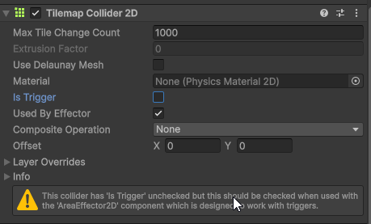
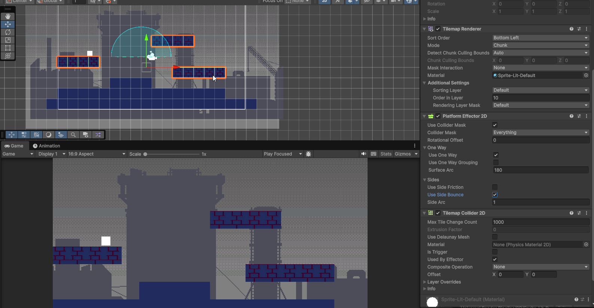

# Design de niveau : Plateformes, Effectors

Dans cette section, nous allons explorer comment créer des plateformes interactives dans Unity en utilisant les effector 2D. Ces outils exploitent les capacités physiques de Unity pour offrir des interactions dynamiques dans vos jeux 2D. En plus, nous verrons dans un autre document les joints 2D qui permettent de connecter des objets entre eux pour créer des mécanismes complexes.

## Ajout d'un Effector 2D à un GameObject

-   Les effectors 2D sont situés dans le menu **Component > Physics 2D**, tout en bas de la liste.
-   Pour qu'un effector 2D fonctionne, le GameObject doit avoir un collider 2D (Box Collider 2D, Circle Collider 2D,TilemapCollider2D, etc.) avec l'option **Used by Effector** cochée dans l'inspecteur.
-   Certains effectors nécessitent que le collider soit défini en tant que trigger (case **Is Trigger** cochée).

## Création de plateformes avec Platform Effector 2D

Le Platform Effector 2D est un composant qui permet de créer des plateformes sur lesquelles les personnages peuvent sauter à travers et atterrir dessus.

### Options du Platform Effector 2D

-   **Rotation Offset** : Permet de faire pivoter la plateforme.
-   **Surface Arc** : Définit l'angle de la surface de la plateforme.
-   **Use One Way** : Permet aux objets de passer à travers la plateforme dans une seule direction.
-   **Use One Way Grouping** : Permet de regrouper plusieurs plateformes pour qu'elles partagent le même comportement de passage.
-   **Use Side Friction** : Applique de la friction sur les côtés de la plateforme. Ex: si un personnage glisse contre le côté de la plateforme.
-   **Use Side Bounce** : Applique un effet de rebond sur les côtés de la plateforme. Ex: si un personnage heurte le côté de la plateforme.
-   **Collider Mask** : Permet de définir quels layers peuvent interagir avec la plateforme.La plateforme n'affectera que les objets appartenant aux layers sélectionnés. Ex: la plateforme pourrait affecter uniquement le joueur et les ennemis, mais pas les projectiles.

{width="100%"}

### Utilisation créative des plateformes effectors

-   **Plateformes mobiles** : Combinez les plateformes effectors avec des scripts de mouvement pour créer des plateformes qui se déplacent horizontalement ou verticalement.
-   **Jeu Top-down** : Utilisez la propriété "Use One Way" avec "Rotation Offset" pour créer des portes où les personnages peuvent entrer mais ne pas sortir.
-   **Zones restrictives** : Créez des plateformes qui n'autorisent le passage que pour certains types d'objets en utilisant le Collider Mask.
-   **Plateformes à rebond** : Utilisez les options de friction et de rebond pour créer des plateformes qui modifient la vitesse ou la direction des personnages lorsqu'ils interagissent avec elles. Ajoutez un matériel physique 2D avec des propriétés de rebond pour renforcer cet effet. (voir plus bas dans la section sur les matériaux physiques 2D).

## Surface Effector 2D

Le Surface Effector 2D est un composant qui applique une force continue sur les objets en contact avec une surface, ce qui est utile pour créer des tapis roulants ou des surfaces glissantes.

### Options du Surface Effector 2D

-   **Speed** : Définit la vitesse à laquelle les objets sont déplacés le long de la surface.
-   **Force Scale** : Multiplie la force appliquée aux objets.

### Utilisation créative du Surface Effector 2D

-   **Tapis roulants** : Créez des plateformes qui déplacent automatiquement les personnages lorsqu'ils marchent dessus.
-   **Zones de vent** : Utilisez le Surface Effector 2D pour sim

## Area Effector 2D

L'Area Effector 2D applique des forces directionnelles aux objets qui entrent dans une zone définie par un collider de type trigger. Cela peut être utilisé pour simuler des courants d'eau, des zones de gravité modifiée, ou des champs de force.

### Options de l'Area Effector 2D

-   **Force Magnitude** : Définit la force appliquée aux objets dans la zone.
-   **Force Angle** : Définit la direction de la force appliquée.
-   **Global Angle** : Si activé, la force est appliquée dans une direction globale plutôt que relative à l'orientation de l'Area Effector.

### Utilisation créative de l'Area Effector 2D

-   **Courants d'eau** : Créez des zones dans lesquelles les personnages sont poussés dans une direction spécifique, simulant un courant.
-   **Champs de gravité** : Utilisez l'Area Effector pour créer des zones où la gravité est modifiée, attirant ou repoussant les objets.
-   **Zones de vent** : Simulez des rafales de vent qui affectent le mouvement des personnages ou des objets volants.
-   **Avec une animation**: Activez et désactivez l'Area Effector 2D à l'aide d'une animation pour créer des zones de force temporaires comme des rafales de vent ou des champs de force intermittents.

## Buoyancy Effector 2D

Le Buoyancy Effector 2D simule la flottabilité des objets dans un liquide, permettant de créer des effets réalistes d'objets flottants ou coulants.

### Options du Buoyancy Effector 2D

-   **Density** : Définit la densité du liquide, affectant la flottabilité des objets. Plus la densité est élevée, plus les objets auront tendance à flotter.
-   **Surface Level** : Définit le niveau de la surface du liquide.
-   **Flow Angle** : Définit la direction du flux du liquide.
-   **Flow Magnitude** : Définit la vitesse du flux du liquide pour créer des courants.

### Utilisation créative du Buoyancy Effector 2D

-   **Zones aquatiques** : Créez des zones dans lesquelles les personnages ou objets flottent ou coulent, simulant des environnements aquatiques.
-   **Courants sous-marins** : Utilisez les options de flux pour créer des courants sous-marins qui affectent le mouvement des objets flottants.
-   **Plateformes flottantes** : Concevez des objets interactifs qui réagissent à la flottabilité, comme des bateaux ou des bouées.

## PointEffector 2D

Le Point Effector 2D applique une force radiale aux objets dans son rayon d'action, attirant ou repoussant les objets en fonction des paramètres définis un peu comme un aimant ou une explosion.

### Options du Point Effector 2D

-   **Force Magnitude** : Définit la force appliquée aux objets dans le rayon d'action.
-   **Force Variation** : Ajoute une variation aléatoire à la force appliquée
-   **Distance Scale** : Modifie la façon dont la force diminue avec la distance.
