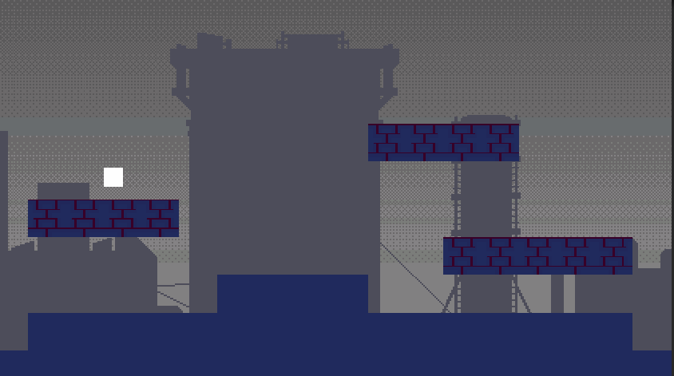
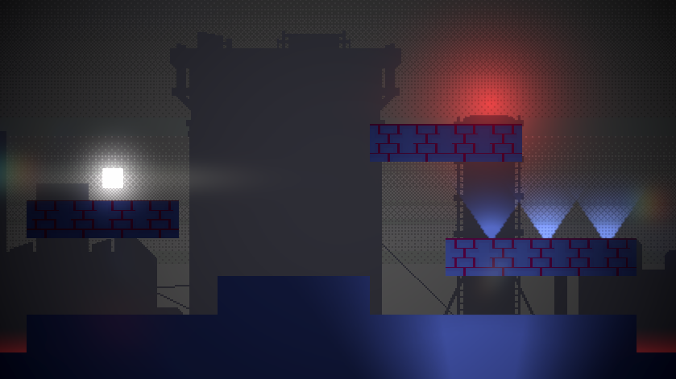
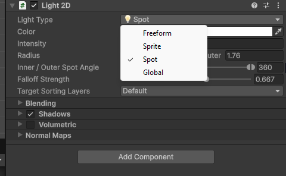

# Ajout de lumières 2D

Les lumières peuvent ajouterz une dimension supplémentaire à vos scènes 2D en créant des effets d'éclairage réalistes. Unity offre plusieurs types de lumières 2D que vous pouvez utiliser pour améliorer l'apparence de vos jeux.

## Ajouter une lumière 2D

Dans le menu principal, allez dans **GameObject > Light > 2D** et choisissez le type de lumière que vous souhaitez ajouter (Freeform Light 2D, Spot Light 2D, Global Light 2D, etc.). Une nouvelle lumière sera ajoutée à votre scène.

### Types de lumières 2D

-   **Freeform Light 2D** : Permet de créer des formes de lumière personnalisées en dessinant directement dans la scène. Vous pouvez contrôler la forme de la lumière en ajustant les points de contrôle.
-   **Spot Light 2D** : Émet de la lumière dans un cône à partir d'un point spécifique. Parfait pour simuler des projecteurs ou des lampes de poche. Vous pouvez ajuster l'angle et la portée du cône.
-   **Global Light 2D** : Émet une lumière uniforme sur toute la scène uniformément. Utile pour simuler la lumière ambiante ou la lumière du jour.
-   **Sprite Light 2D** : Utilise une texture de sprite pour définir la forme et l'apparence de la lumière. Idéal pour des effets de lumière stylisés ou spécifiques avec une forme particulière.

## Configurer une lumière 2D

Sélectionnez la lumière 2D dans la hiérarchie pour afficher ses propriétés dans l'inspecteur. Vous pouvez ajuster les paramètres suivants :

-   **Color** : Changez la couleur de la lumière.
-   **Intensity** : Ajustez la luminosité de la lumière.
-   **Falloff** : Contrôlez la distance à laquelle la lumière affecte les objets.
-   **Shadow Type** : Choisissez le type d'ombre (None, Hard, Soft).
-   **Sorting Layer** : Définissez la couche de tri pour la lumière afin de contrôler son ordre de rendu par rapport aux autres objets. Vous pourriez ainsi appliquer des effets d'éclairage sur le personnage sans affecter l'arrière-plan.

## Trucs et astuces

-   Utilisez des lumières Global Light 2D pour éclairer toute la scène de manière uniforme en premier et diminuer l'intensité pour créer une ambiance.
-   Combinez plusieurs types de lumières 2D pour obtenir des effets d'éclairage plus complexes.
-   Combinez les lumières 2D avec des effets de post-traitement (bloom et screen space lens flare) pour améliorer l'apparence visuelle de votre scène.
