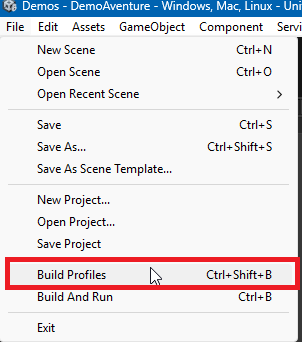
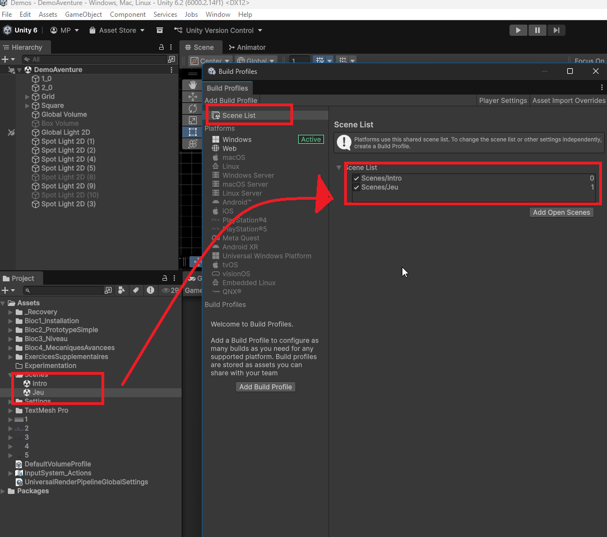

# Gestion des scènes multiples et écrans d'introduction

Dans ce chapitre, nous allons explorer comment gérer plusieurs scènes dans Unity en utilisant le `SceneManager`. Nous verrons également comment créer un écran d'introduction (splash screen) pour notre jeu.

Une scène dans Unity est un conteneur pour les objets de jeu, les lumières, les caméras et d'autres éléments qui composent une partie de votre jeu. Gérer plusieurs scènes permet de structurer votre jeu en différentes parties, comme des niveaux, des menus ou des écrans d'introduction.

Voyez la scène comme un "niveau" ou une "page" dans votre jeu.

Cela permet de modulariser votre jeu, de charger et décharger des parties spécifiques selon les besoins, et d'améliorer les performances en ne chargeant que ce qui est nécessaire à un moment donné.

## Changer de scène

Pour accéder aux méthodes de gestion des scènes, vous devez inclure le namespace `UnityEngine.SceneManagement` en haut de votre script C# :

```csharp
using UnityEngine;
using UnityEngine.SceneManagement;
```

Pour changer de scène, vous pouvez utiliser la méthode `SceneManager.LoadScene("nom_de_la_scène")`.

**Attention** : Assurez-vous que la scène que vous souhaitez charger est ajoutée à la liste des scènes dans les paramètres de construction (Build Settings) de votre projet Unity (voir plus bas) ET que le nom de la scène est correctement orthographié.

Par exemple, pour charger une scène nommée "introduction", vous pouvez écrire :

```csharp
SceneManager.LoadScene("introduction");
```

Vous pouvez également charger une scène en utilisant son indice dans la liste des scènes de compilation (Voir plus bas) :

```csharp
SceneManager.LoadScene(1); // Charge la scène à l'indice 1
```

### Nommenclature des scènes

Pour éviter les erreurs en nommant vos scènes, utilisez des noms simples, sans majuscules, espaces ou caractères spéciaux. Par exemple, privilégiez "niveau1" au lieu de "Niveau 1" ou "Niveau@1".

## Ajouter des scènes aux paramètres de compilation

Pour ajouter des scènes aux paramètres de compilation, allez dans le menu **File > Build Profile**.



Dans la fenêtre qui s'ouvre, vous verrez une section intitulée "Scene List". Cliquez sur le bouton "Add Open Scenes" pour ajouter la scène actuellement ouverte à la liste. Vous pouvez également faire glisser et déposer des fichiers de scène depuis l'explorateur de projet vers cette liste.

L'ordre des scènes dans cette liste est important, car la première scène sera celle qui sera chargée au démarrage du jeu (celle en position 0).



## Recharger la scène actuelle

Pour recharger la scène actuelle :

```csharp
Scene sceneActuelle = SceneManager.GetActiveScene();
SceneManager.LoadScene(sceneActuelle.name);
```

## Passer à la scène suivante

Pour passer à la scène suivante dans la liste des scènes de compilation, il est possible d'utiliser les indices des scènes qui sont à droite dans le profil de compilation. Il faut cependant vérifier que l'indice de la scène suivante n'excède pas le nombre total de scènes disponibles sinon une erreur se produira.

```csharp
int indexSceneActuelle = SceneManager.GetActiveScene().buildIndex;
int indexSceneSuivante = indexSceneActuelle + 1;
if (indexSceneSuivante < SceneManager.sceneCountInBuildSettings)
{
    SceneManager.LoadScene(indexSceneSuivante);
}
```

## Garder des éléments persistants entre les scènes

Lorsque vous changez de scène, tous les objets de la scène actuelle sont détruits par défaut. Cependant, il est possible de conserver certains objets entre les scènes en utilisant la méthode `DontDestroyOnLoad`. Cela est utile pour des objets comme les gestionnaires de jeu, les musiques de fond ou les paramètres utilisateur.

Par exemple si vous avez un objet "GestionnaireDeJeu" qui doit rester actif tout au long du jeu, vous pouvez ajouter ce code dans son script :

```csharp
void Awake()
{
    DontDestroyOnLoad(gameObject);
}
```

## Écrans communs dans les jeux

Dans de nombreux jeux, il est courant d'avoir des écrans d'introduction ou des menus avant de commencer à jouer. Voici deux exemples courants : l'écran de titre et l'écran d'instructions.

**Assurez-vous que les éléments de l'écran d'instructions sont bien positionnés et visibles dans la scène et qu'ils ne comportent pas de fautes d'orthographe et dans la bonne langue.**

**Si vous utilisez un canvas, n'oubliez pas de mettre le scale mode sur "Scale With Screen Size" pour que l'interface s'adapte correctement à différentes résolutions.**

### Écran de titre

Un jeu bénéficie souvent d'un écran de titre avant de commencer. Cette scène donne le style et l'ambiance du jeu, et permet au joueur de se préparer avant de commencer à jouer. Vous pouvez créer une scène dédiée pour l'écran de titre, avec des options comme "Démarrer le jeu", "Options" et "Quitter". Lorsque le joueur sélectionne "Démarrer le jeu", vous pouvez charger la scène principale du jeu.

### Écran d'instructions

Votre jeu peut également bénéficier d'un écran d'instructions avant de commencer. Vous pouvez créer une scène dédiée pour cela, avec des instructions sur la façon de jouer. Lorsque le joueur appuie sur une touche, vous pouvez charger la scène principale du jeu. Ajoutez des captures d'écran ou des illustrations pour rendre les instructions plus claires.

### Écran de fin

Enfin, un écran de fin peut être utile pour féliciter le joueur après avoir terminé le jeu. Vous pouvez créer une scène dédiée pour cela, avec un message de félicitations et des options pour rejouer ou quitter le jeu. Vous pouvez également avoir un écran de fin différent pour les joueurs qui n'ont pas réussi à terminer le jeu, avec des encouragements à réessayer.

[Documentation officielle Unity sur le SceneManager](https://docs.unity3d.com/ScriptReference/SceneManagement.SceneManager.LoadScene.html)
