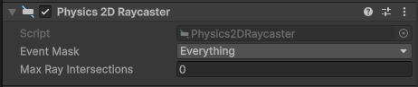

# Interactions avec Pointeur - EventTrigger

## Détection des clics de souris

Pour détecter les clics de souris, vous pouvez utiliser la classe `Mouse` du nouveau système d'Input. Vous pouvez vérifier l'état des boutons de la souris de manière similaire à celle des touches du clavier.

### Boutons de souris courants

-   `Mouse.current.leftButton` : Bouton gauche de la souris
-   `Mouse.current.rightButton` : Bouton droit de la souris
-   `Mouse.current.middleButton` : Bouton du milieu de la souris (molette)

### États des boutons de souris

-   `wasPressedThisFrame` : Vrai si le bouton a été pressé pendant la frame actuelle.
-   `wasReleasedThisFrame` : Vrai si le bouton a été relâché pendant la frame actuelle.

## Position du pointeur de la souris

Vous pouvez également obtenir la position actuelle du pointeur de la souris à l'aide de la propriété `Mouse.current.position.ReadValue()`. Cela retourne un `Vector2` représentant les coordonnées X et Y du pointeur de la souris dans la fenêtre du jeu. À noter que ce ne sont pas des coordonnées du monde, mais des coordonnées d'écran.

Voici un exemple de script qui détecte lorsque le bouton gauche de la souris est cliqué et affiche la position du pointeur de la souris :

```csharp
using UnityEngine;
using UnityEngine.InputSystem;

public class MouseInputExample : MonoBehaviour
{
    void Update()
    {
        // Vérifie si le bouton gauche de la souris est cliqué
        if (Mouse.current.leftButton.wasPressedThisFrame)
        {
            Vector2 mousePosition = Mouse.current.position.ReadValue();
            Debug.Log("Clic gauche de la souris à la position : " + mousePosition);
        }
    }
}
```

## Utilisation d'EventTrigger pour les interactions avec le pointeur

Unity fournit également le composant `EventTrigger` qui permet de gérer les interactions avec le pointeur de manière plus visuelle et basée sur des événements. Vous pouvez utiliser `EventTrigger` pour associer des fonctions publiques aux événements de pointeur tels que les clics, les survols, et à un objet en particulier.

Pour utiliser `EventTrigger`, assurez-vous que votre scène contient un composant `EventSystem` (il est généralement ajouté automatiquement lorsque vous ajoutez un composant UI). Vous devrez également ajouter un composant `Physics Raycaster` ou `Physics 2D Raycaster` à votre caméra principale pour détecter les interactions avec les objets 3D ou 2D respectivement.

Pour les éléments UI, un `Graphic Raycaster` est généralement déjà présent sur le Canvas.




### Ajouter un EventTrigger à un GameObject

1. Sélectionnez le GameObject auquel vous souhaitez ajouter des interactions avec le pointeur.
2. Cliquez sur **Add Component** dans l'Inspector.
3. Recherchez et ajoutez le composant **EventTrigger**.

### Configurer les événements dans EventTrigger

1. Dans le composant `EventTrigger`, cliquez sur **Add New Event Type**.
2. Sélectionnez l'événement que vous souhaitez gérer, par exemple **Pointer Click**
3. Cliquez sur le signe **+** pour ajouter une nouvelle entrée.
4. Faites glisser le GameObject contenant le script avec la fonction publique que vous souhaitez appeler dans le champ **None (Object)**.
5. Dans le menu déroulant à droite, sélectionnez la fonction publique que vous souhaitez exécuter lorsque l'événement se produit.


Exemple de code pour une fonction publique qui sera appelée lors d'un clic de pointeur :

```csharp
using UnityEngine;
using UnityEngine.SceneManagement;

public class MenuPrincipal : MonoBehaviour
{
    public void DemarrerJeu()
    {
        //Code à exécuter lors du clic (Changer de scene, détruire un élément, etc)
        SceneManager.LoadScene("jeu");
    }
}

```

### Accéder aux informations en lien avec l'événement

Pour accéder aux informations spécifiques à l'événement, vous pouvez définir votre fonction publique pour qu'elle prenne un paramètre de type `BaseEventData`. Vous pouvez ensuite convertir ce paramètre en `PointerEventData` pour obtenir des informations supplémentaires sur l'événement, telles que la position du pointeur.

En C#, pour convertir un type en un sous-type, vous pouvez utiliser le mot-clé `as`. Si la conversion échoue, la variable résultante sera `null`. C'est pour cela qu'il est important de vérifier que la conversion a réussi avant d'accéder aux propriétés spécifiques du sous-type.

Voici un exemple de script utilisant `EventTrigger` pour gérer un clic de pointeur et afficher la position du pointeur :

```csharp
using UnityEngine;
using UnityEngine.EventSystems;

public class EventTriggerExample : MonoBehaviour
{
    public void DemarrerJeu(BaseEventData eventData)
    {
        PointerEventData pointerData = eventData as PointerEventData;
        if (pointerData != null)
        {
            Vector2 clickPosition = pointerData.position;
            Debug.Log("Clic de pointeur à la position : " + clickPosition);
        }
    }
}
```

### Propriétés utiles de PointerEventData

-   `position` : La position du pointeur au moment de l'événement par rapport à l'écran (utile pour placer les éléments UI).
-   `pointerCurrentRaycast.worldPosition` : La position dans le monde où le raycast a touché un objet (pratique pour placer des objets dans le monde).
-   `delta` : Le changement de position du pointeur depuis le dernier événement.
-   `button` : Le bouton de la souris qui a déclenché l'événement (gauche, droit, milieu).
-   `clickCount` : Le nombre de clics effectués (utile pour détecter les double-clics).

### Méthodes utiles de PointerEventData

-   `isPointerMoving()` : Retourne vrai si le pointeur est en mouvement.
-   `isScrolling()` : Retourne vrai si le pointeur est en train de défiler (utile pour les interactions avec la molette de la souris).

### Références supplémentaires

-   [Unity - Scripting API: EventTrigger](https://docs.unity3d.com/Manual/script-EventTrigger.html)
-   [Unity - Scripting API: BaseEventData](https://docs.unity3d.com/ScriptReference/EventSystems.BaseEventData.html)
-   [Unity - Scripting API: PointerEventData](https://docs.unity3d.com/ScriptReference/EventSystems.PointerEventData.html)

## Détecter les survols de pointeur

-   Choisir l'événement "Pointer Enter" ou "Pointer Exit" dans le composant EventTrigger pour détecter lorsque le pointeur entre ou sort de la zone d'un GameObject.
-   Définir des fonctions publiques dans un script attaché au GameObject pour gérer ces événements.

```csharp
using UnityEngine;
using UnityEngine.EventSystems;

public class PointerHoverExample : MonoBehaviour
{
    SpriteRenderer spriteRenderer;
    public void Start(){
        spriteRenderer = GetComponent<SpriteRenderer>();
    }

    public void OnSurvol(BaseEventData eventData)
    {
        Debug.Log("Le pointeur est entré dans la zone de l'objet.");
        spriteRenderer.color = Color.red; // Teinte la couleur du sprite lors du survol
    }

    public void OnSortie(BaseEventData eventData)
    {
        Debug.Log("Le pointeur est sorti de la zone de l'objet.");
        spriteRenderer.color = Color.white; // Réinitialise la couleur du sprite
    }
}
```

## Détruire un GameObject lors d'un clic de pointeur

Pour détruire un GameObject lorsqu'il est cliqué avec le pointeur, vous pouvez utiliser le composant `EventTrigger` pour détecter l'événement de clic et appeler une fonction publique qui détruit l'objet.

-   Choisir l'événement "Pointer Click" dans le composant EventTrigger.
-   Définir une fonction publique dans un script attaché au GameObject pour détruire l'objet.

```csharp
using UnityEngine;
using UnityEngine.EventSystems;

public class DestroyOnClick : MonoBehaviour
{
    public void OnPointerClick(BaseEventData eventData)
    {
        Destroy(gameObject);
    }
}
```

## Désactiver un GameObject temporairement lors d'un clic de pointeur et le faire réapparaître après un délai

-   Choisir l'événement "Pointer Click" dans le composant EventTrigger.
-   Définir une fonction publique dans un script attaché au GameObject pour désactiver l'objet et le réactiver après un délai.

```csharp
using UnityEngine;
using UnityEngine.EventSystems;
using System.Collections;

public class DisableOnClick : MonoBehaviour
{
    public float delai = 2f; // Délai avant de réactiver l'objet
    public SpriteRenderer spriteRenderer;
    public EventTrigger eventTrigger;

    void Start()
    {
        spriteRenderer = GetComponent<SpriteRenderer>();
        eventTrigger = GetComponent<EventTrigger>();
    }

    public void OnClic(BaseEventData eventData)
    {
       spriteRenderer.enabled = false; // Rend le sprite invisible
       eventTrigger.enabled = false; // Désactive les interactions
       Invoke("Reactiver", delai); // Appelle la méthode Reactiver après le délai
    }

    private void Reactiver()
    {
       transform.position = new Vector3(Random.Range(-8f, 8f), Random.Range(-4f, 4f), 0f); // Change la position de l'objet
       spriteRenderer.enabled = true; // Rend le sprite visible
       eventTrigger.enabled = true; // Réactive les interactions
    }
}
```
