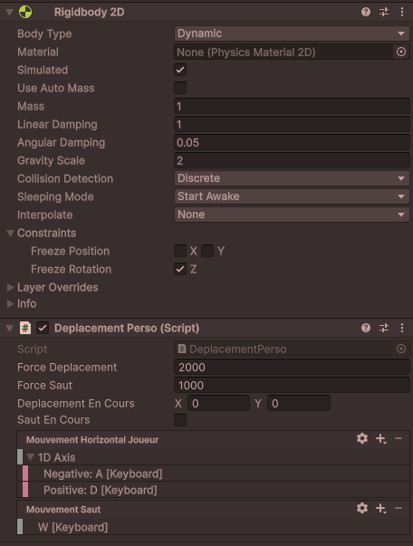
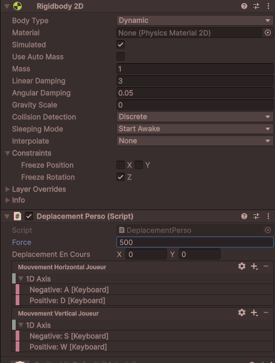

# Déplacer un objet grâce à la physique et la gravité

Nous avons utilisé le rigidbody 2D pour permettre à nos objets d'entrer en collision les uns avec les autres. Cependant, le rigidbody 2D permet aussi de simuler la gravité et d'autres forces physiques sur nos objets.

## Optimisations des performances

Lorsqu'on utilise des forces pour gérer le mouvement d'élément:

1. La **détection des touches ou de la souris** est effectuée dans la méthode `Update()`
2. **L'application des forces physiques** est placée dans la méthode `FixedUpdate()`. Cela garantit que les calculs de physique sont effectués à des intervalles réguliers, assurant une simulation stable et cohérente.

**Si vous ne respectez pas cette règle, vous risquez d'obtenir des comportements imprévisibles dans votre jeu ou des mouvements saccadés des objets.**

## Types de forces

Vous pouvez appliquer plusieurs types de forces à un Rigidbody 2D en utilisant la méthode `AddForce()`. Vous spécifiez le type de force en utilisant le deuxième paramètre de la méthode `AddForce()` en utilisant l'énumération `ForceMode2D` :

-   **ForceMode2D.Force** : Applique une force continue sur l'objet, affectant sa vitesse au fil du temps. Comme du vent qui pousse un objet. C'est le mode par défaut, vous n'avez pas besoin de le spécifier.
-   **ForceMode2D.Impulse** : Applique une force instantanée, modifiant immédiatement la vitesse de l'objet. Comme une fusée qui décolle.

## Déplacer un objet dans une direction avec la physique

Le composant Rigidbody 2D permet de d.éplacer un objet en lui appliquant des forces physiques grâce à la méthode `AddForce()`. Cela permet de simuler des mouvements réalistes influencés par la gravité, les collisions et d'autres forces.

On choisit une direction multipliée par la force que l'on souhaite appliquer à l'objet. Nous utilisons un vecteur 2D pour spécifier cette direction. Ex: Vector2.up pour une force vers le haut, Vector2.right pour une force vers la droite ou encore Vector2(1,1) pour une force diagonale.



```csharp
using UnityEngine;
using UnityEngine.InputSystem;

public class DeplacementPersonnage : MonoBehaviour
{

    private Rigidbody2D rb;
    public InputAction mouvementHorizontalJoueur;
    public InputAction mouvementSautJoueur;

    public float forceDeplacement = 500f;
    public float forceSaut = 1000f;

    Vector2 deplacementEnCours;
    bool sautEnCours = false;

    void Start()
    {
        rb = GetComponent<Rigidbody2D>();
    }

    // Active les actions d'entrée
    void OnEnable()
    {
        mouvementHorizontalJoueur.Enable();
        mouvementSautJoueur.Enable();
    }

    // Désactive les actions d'entrée
    void OnDisable()
    {
        mouvementHorizontalJoueur.Disable();
        mouvementSautJoueur.Disable();
    }

    void Update()
    {
        // On détecte le mouvement du joueur avec les touches directionnelles ou une manette
        float deplacementHorizontal = mouvementHorizontalJoueur.ReadValue<float>();

        deplacementEnCours = new Vector2(deplacementHorizontal, 0f);
        if (mouvementSautJoueur.WasPressedThisFrame())
        {
            sautEnCours = true;
        }
    }

    void FixedUpdate()
    {
        // Applique la force de déplacement seulement si le joueur appuie sur une touche (magnitude veut dire que le mouvement en plus grand que 0)
        if (deplacementEnCours.magnitude > 0)
        {
            //Applique une force dans la direction du déplacement
            rb.AddForce(deplacementEnCours * forceDeplacement * Time.fixedDeltaTime);
        }

        // Applique la force de saut si le joueur a appuyé sur la touche de saut
        if (sautEnCours == true)
        {
            //On applique une force avec impulsion vers le haut pour simuler un saut
            rb.AddForce(Vector2.up * forceSaut * Time.fixedDeltaTime, ForceMode2D.Impulse);
            sautEnCours = false;
        }
    }
}
```

## Appliquer une vitesse constante

Les objets avec un Rigidbody 2D ont une propriété appelée `linearVelocity` (vélocité) qui représente la vitesse actuelle de l'objet en unités par seconde. La vélocité est la vitesse dans une direction donnée donc une fois les forces appliquées, l'objet continuera de se déplacer à cette vitesse jusqu'à ce qu'une autre force soit appliquée (comme la friction ou une collision).

Si vous modifiez cette propriété dans la fonction `FixedUpdate()`, vous pouvez appliquer une vitesse constante à l'objet ou forcer un arrêt immédiat.

```csharp
float vitesseDeplacement = 2000f;

void FixedUpdate()
{
    if(estMort == true)
    {
        // Arrêter l'objet immédiatement si le personnage est mort
        //Vector2.zero signifie une vitesse nulle
        rb.linearVelocity = Vector2.zero;
    }else{
        // Définir une vitesse constante précise
        rb.linearVelocity = new Vector2(1f, 0f) * vitesseDeplacement * Time.fixedDeltaTime; // Vitesse de 1 unités par seconde vers la droite multipliée par une vitesse
    }


}
```

## Utiliser les forces mais sans gravité comme dans un jeu top-down

Si vous souhaitez que votre objet soit affecté par des forces mais pas par la gravité, vous pouvez désactiver la gravité dans les propriétés du Rigidbody 2D en réglant le paramètre "Gravity Scale" (Échelle de gravité) à 0. Vous devez alors ajouter les réglages pour les déplacements verticaux.



```csharp
using UnityEngine;
using UnityEngine.InputSystem;

public class DeplacementPerso : MonoBehaviour
{
    private Rigidbody2D rb;
    public float force = 10f;
    public Vector2 deplacementEnCours;
    public InputAction mouvementHorizontalJoueur;
    public InputAction mouvementVerticalJoueur;

    void Start()
    {
        rb = GetComponent<Rigidbody2D>();
    }

    // Active les actions d'entrée
    void OnEnable()
    {
        mouvementHorizontalJoueur.Enable();
        mouvementVerticalJoueur.Enable();
    }

    // Désactive les actions d'entrée
    void OnDisable()
    {
        mouvementHorizontalJoueur.Disable();
        mouvementVerticalJoueur.Disable();
    }

    void Update()
    {
        // On détecte le mouvement du joueur avec les touches directionnelles ou une manette
        float deplacementHorizontal = mouvementHorizontalJoueur.ReadValue<float>();
        float deplacementVertical = mouvementVerticalJoueur.ReadValue<float>();

        deplacementEnCours = new Vector2(deplacementHorizontal, deplacementVertical);
    }

    void FixedUpdate()
    {
        if (deplacementEnCours.magnitude > 0)
        {
            rb.AddForce(deplacementEnCours * force * Time.fixedDeltaTime);
        }
    }
}
```

[Documentation Unity sur Rigidbody 2D](https://docs.unity3d.com/ScriptReference/Rigidbody2D.html)
