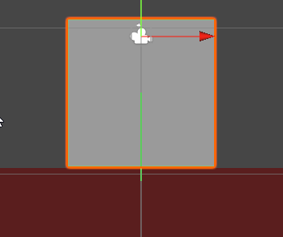
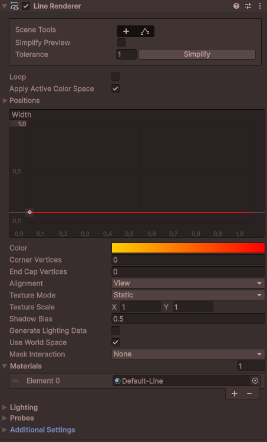

# Detection de proximité

La détection de proximité est une technique couramment utilisée dans le développement de jeux vidéo pour déterminer si un objet ou un personnage est proche d'un autre objet ou personnage. Cela est utile pour éviter le double saut ou pour déclencher des événements lorsque le joueur s'approche d'un objet interactif.

La méthode la plus simple pour détecter la proximité est d'utiliser des raycasts. Un raycast est une ligne invisible projetée dans une direction spécifique à partir d'un point donné. Vous pouvez savoir si cette ligne entre en collision avec un autre objet dans la scène.

## Lancer un rayon 2d (Raycast2D)

Pour lancer un rayon 2D dans Unity, vous pouvez utiliser la fonction `Physics2D.Raycast()`.

### Fonctionnement de base

Vous devez spécifier le point de départ du rayon, la direction dans laquelle il est lancé, et la distance maximale qu'il peut parcourir.
Le résultat de la fonction est un objet `RaycastHit2D` qui contient des informations sur la collision, si une collision a eu lieu.

```csharp
Vector2 depart = transform.position; // Point de départ du rayon, généralement la position de l'objet
Vector2 direction = Vector2.down; // Direction du rayon (vers le bas)
float distance = 10f; // Distance maximale du rayon
RaycastHit2D hit = Physics2D.Raycast(depart, direction, distance);

if (hit.collider != null && hit.collider.tag == "sol")
{
    Debug.Log("Collision détectée avec : le sol");
}
```

### Visualisation du rayon

Pour visualiser le rayon dans l'éditeur Unity, vous pouvez utiliser la fonction `Debug.DrawRay()`. Cela vous permet de voir où le rayon est projeté dans la scène.


```csharp
Vector2 depart = transform.position;
Vector2 direction = Vector2.down;
float distance = 1f; // Ajuster la distance selon vos besoins

Debug.DrawRay(depart, direction * distance, Color.green);
```

### Cibler des couches spécifiques

Vous pouvez également spécifier des couches spécifiques à cibler lors du lancement du rayon en utilisant un masque de couche (LayerMask) si vous voulez ignorer certains objets.

```csharp
Vector2 depart = transform.position; // Point de départ du rayon, généralement la position de l'objet
Vector2 direction = Vector2.down; // Direction du rayon (vers le bas)
float distance = 10f; // Distance maximale du rayon
public LayerMask masque; // Cible uniquement la couche "sol"
RaycastHit2D hit = Physics2D.Raycast(depart, direction, distance, masque);
```

## Bloquer le double saut

Pour empêcher le double saut, vous pouvez utiliser un raycast pour vérifier si le personnage est au sol avant de lui permettre de sauter à nouveau.

```csharp
using UnityEngine;
using UnityEngine.InputSystem;
public class DeplacementJoueur : MonoBehaviour
{
    public InputAction sautJoueur;
    public float forceSaut = 10f;
    public LayerMask masqueSol;
    public bool estAuSol = false;
    public bool sautEnCours = false;

    private Rigidbody2D rb;

    void Start()
    {
        rb = GetComponent<Rigidbody2D>();
    }

    void OnEnable()
    {
        sautJoueur.Enable();
    }

    void OnDisable()
    {
        sautJoueur.Disable();
    }

    void Update()
    {
        estAuSol = VerifierSol();

        if (estAuSol && sautJoueur.WasPressedThisFrame())
        {
            sautEnCours = true;
        }
    }

    void FixedUpdate()
    {
        if (sautEnCours)
        {
            rb.AddForce(Vector2.up * forceSaut * Time.fixedDeltaTime, ForceMode2D.Impulse);
            sautEnCours = false;
        }
    }

    bool VerifierSol()
    {
        Vector2 depart = transform.position;
        Vector2 direction = Vector2.down;
        float distance = 0.6f; // Distance pour vérifier le sol

        RaycastHit2D hit = Physics2D.Raycast(depart, direction, distance, masqueSol);
        Debug.DrawRay(depart, direction * distance, Color.green);

        if (hit.collider != null)
        {
            return true;
        }
        else
        {
            return false;
        }
    }


}
```

### Coyote Time (délai de saut)

Pour améliorer la jouabilité du saut, vous pouvez implémenter le "Coyote Time", inspiré du Coyote et du Road runner dans le dessin animé Bugs Bunny, qui permet au joueur de sauter pendant une courte période après avoir quitté le sol. Cela peut être fait en ajoutant un délai après que le joueur n'est plus au sol au bout d'une plateforme.

```csharp
public float delaiSaut = 0.2f; // Durée du coyote time en secondes
private float compteurDelaiSaut;

void Update()
{
    estAuSol = VerifierSol();

    if (estAuSol)
    {
        compteurDelaiSaut = delaiSaut; // Réinitialiser le compteur tant que le joueur est au sol
    }
    else
    {
        compteurDelaiSaut -= Time.deltaTime; // Décrémenter le compteur lorsqu'il n'est pas au sol
    }

    if (compteurDelaiSaut > 0f && sautJoueur.WasPressedThisFrame())
    {
        sautEnCours = true;
    }
}
```

## Détecter des objets interactifs devant le joueur

Vous pouvez également utiliser des raycasts pour détecter des objets interactifs lorsque le joueur s'en approche. Par exemple, vous pouvez lancer un rayon devant le joueur pour vérifier s'il y a un objet interactif à proximité. Utilisez la même logique que précédemment pour la détection des touches. Il s'agit d'une alternative à l'utilisation de colliders de type trigger qui serait utile par exemple pour interagir avec des objets à distance.

Assurez-vous de définir un layer sur les objets interactifs afin de ne détecter que ceux-ci.

```csharp
public LayerMask masqueInteractif;
public InputAction interactionJoueur;

void Update()
{
    if (interactionJoueur.WasPressedThisFrame())
    {
        Vector2 depart = transform.position;
        Vector2 direction = transform.right; // Direction vers l'avant du joueur
        float distance = 10f; // Distance pour vérifier les objets interactifs

        RaycastHit2D hit = Physics2D.Raycast(depart, direction, distance, masqueInteractif);
        Debug.DrawRay(depart, direction * distance, Color.blue);

        if (hit.collider != null)
        {
           GameObject objetInteractif = hit.collider.gameObject;
           //Reste du code pour interagir avec l'objet
        }
    }
}
```

## Attaque ennemi

Un autre cas d'utilisation des raycasts est pour les attaques à distance des ennemis vers le joueur. Par exemple, un ennemi peut avancer et lancer un rayon pour vérifier si le joueur est dans sa ligne de mire avant d'attaquer.

```csharp
public LayerMask masqueJoueur;
public GameObject projetilePrefab;
float forceProjectile = 5f;

void Update()
{
        Vector2 depart = transform.position;
        Vector2 direction = transform.left; // Direction vers l'avant du joueur
        float distance = 5f; // Distance pour vérifier les ennemis

        RaycastHit2D hit = Physics2D.Raycast(depart, direction, distance, masqueJoueur);
        Debug.DrawRay(depart, direction * distance, Color.red);

        if (hit.collider != null)
        {
            Vector2 directionProjectile = hit.collider.gameObject.transform.position - transform.position;
            GameObject projectile = Instantiate(projetilePrefab, transform.position, Quaternion.identity);
            projectile.GetComponent<Rigidbody2D>().AddForce(directionProjectile.normalized * forceProjectile, ForceMode2D.Impulse);

        }

}
```

## Afficher une ligne au joueur

Pour améliorer l'expérience utilisateur, vous pouvez afficher une ligne indiquant la direction dans laquelle le joueur va interagir ou attaquer. Cela peut être fait en utilisant un `LineRenderer`. Cela permet au joueur de visualiser clairement la portée et la direction de son interaction ou attaque.

On commence par ajouter un composant `LineRenderer` à l'objet joueur dans l'éditeur Unity. Ensuite, on met à jour les positions du `LineRenderer` dans la méthode `Update()` pour qu'il suive le rayon lancé en mettant à jour ses points de départ et d'arrivée.

Assurez-vous de configurer correctement le `LineRenderer` dans l'éditeur Unity, en ajustant les matériaux (Vous pouvez choisir Default-Line), les couleurs et les largeurs selon vos préférences.



```csharp
LineRenderer lineRenderer;

void Start()
{
    lineRenderer = GetComponent<LineRenderer>();
    lineRenderer.positionCount = 2; // Indique que la ligne a deux points
}

void Update()
{
    Vector2 depart = transform.position;
    Vector2 direction = transform.right; // Direction vers l'avant du joueur
    float distance = 10f; // Distance pour vérifier les objets interactifs

    RaycastHit2D hit = Physics2D.Raycast(depart, direction, distance, masqueInteractif);
    Debug.DrawRay(depart, direction * distance, Color.blue);

    // Au point 0, on place le départ du rayon
    lineRenderer.SetPosition(0, depart);

    // Au point 1, on place le point d'impact ou la fin du rayon
    // Le reste de la ligne est dessiné jusqu'au point d'impact s'il y en a un, sinon jusqu'à la distance maximale
    if (hit.collider != null)
    {
        lineRenderer.SetPosition(1, hit.point);
    }
    else
    {
        lineRenderer.SetPosition(1, depart + direction * distance);
    }
}
```
