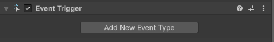
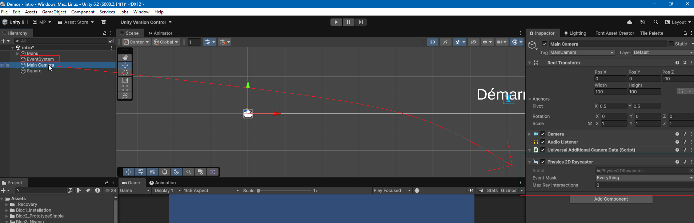
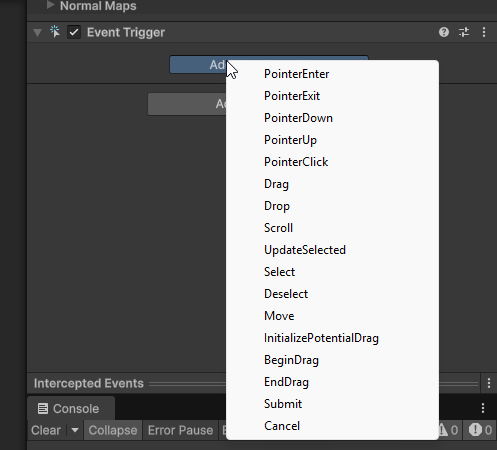
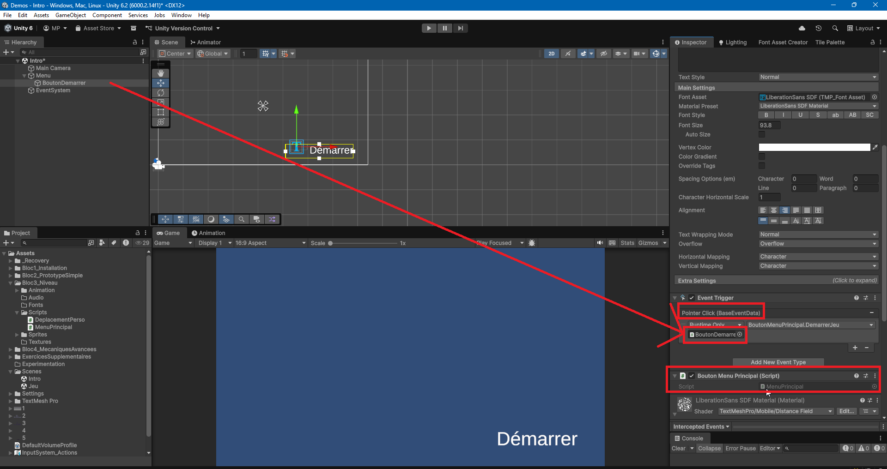

# Interactions avec Pointeur - EventTrigger

## Détection des clics de souris

Pour détecter les clics de souris, vous pouvez utiliser la classe `Mouse` du nouveau système d'Input. Vous pouvez vérifier l'état des boutons de la souris de manière similaire à celle des touches du clavier.

### Boutons de souris courants

- `Mouse.current.leftButton` : Bouton gauche de la souris
- `Mouse.current.rightButton` : Bouton droit de la souris
- `Mouse.current.middleButton` : Bouton du milieu de la souris (molette)

### États des boutons de souris

- `wasPressedThisFrame` : Vrai si le bouton a été pressé pendant la frame actuelle.
- `wasReleasedThisFrame` : Vrai si le bouton a été relâché pendant la frame actuelle.

## Position du pointeur de la souris

Vous pouvez également obtenir la position actuelle du pointeur de la souris à l'aide de la propriété `Mouse.current.position.ReadValue()`. Cela retourne un `Vector2` représentant les coordonnées X et Y du pointeur de la souris dans la fenêtre du jeu. À noter que ce ne sont pas des coordonnées du monde, mais des coordonnées d'écran.

Voici un exemple de script qui détecte lorsque le bouton gauche de la souris est cliqué et affiche la position du pointeur de la souris :

```csharp
using UnityEngine;
using UnityEngine.InputSystem;

public class MouseInputExample : MonoBehaviour
{
    void Update()
    {
        // Vérifie si le bouton gauche de la souris est cliqué
        if (Mouse.current.leftButton.wasPressedThisFrame)
        {
            Vector2 mousePosition = Mouse.current.position.ReadValue();
            Debug.Log("Clic gauche de la souris à la position : " + mousePosition);
        }
    }
}
```

## Utilisation d'EventTrigger pour les interactions avec le pointeur

Unity fournit également le composant `EventTrigger` qui permet de gérer les interactions avec le pointeur de manière plus visuelle et basée sur des événements. Vous pouvez utiliser `EventTrigger` pour associer des fonctions publiques aux événements de pointeur tels que les clics, les survols, et à un objet en particulier.

Pour utiliser `EventTrigger`, assurez-vous que votre scène contient un composant `EventSystem` (il est généralement ajouté automatiquement lorsque vous ajoutez un composant UI). Vous devrez également ajouter un composant `Physics Raycaster` ou `Physics 2D Raycaster` à votre caméra principale pour détecter les interactions avec les objets 3D ou 2D respectivement.

Pour les éléments UI, un `Graphic Raycaster` est généralement déjà présent sur le Canvas.



{width=100%}

### Ajouter un EventTrigger à un GameObject

1. Sélectionnez le GameObject auquel vous souhaitez ajouter des interactions avec le pointeur.
2. Cliquez sur **Add Component** dans l'Inspector.
3. Recherchez et ajoutez le composant **EventTrigger**.

### Configurer les événements dans EventTrigger

1. Dans le composant `EventTrigger`, cliquez sur **Add New Event Type**.
2. Sélectionnez l'événement que vous souhaitez gérer, par exemple **Pointer Click**
3. Cliquez sur le signe **+** pour ajouter une nouvelle entrée.
4. Faites glisser le GameObject contenant le script avec la fonction publique que vous souhaitez appeler dans le champ **None (Object)**.
5. Dans le menu déroulant à droite, sélectionnez la fonction publique que vous souhaitez exécuter lorsque l'événement se produit.





Exemple de code pour une fonction publique qui sera appelée lors d'un clic de pointeur :

```csharp
using UnityEngine;
using UnityEngine.SceneManagement;

public class MenuPrincipal : MonoBehaviour
{
    public void DemarrerJeu()
    {
        //Code à exécuter lors du clic (Changer de scene, détruire un élément, etc)
        SceneManager.LoadScene("jeu");
    }
}

```

### Accéder aux informations en lien avec l'événement

Pour accéder aux informations spécifiques à l'événement, vous pouvez définir votre fonction publique pour qu'elle prenne un paramètre de type `BaseEventData`. Vous pouvez ensuite convertir ce paramètre en `PointerEventData` pour obtenir des informations supplémentaires sur l'événement, telles que la position du pointeur.

En C#, pour convertir un type en un sous-type, vous pouvez utiliser le mot-clé `as`. Si la conversion échoue, la variable résultante sera `null`. C'est pour cela qu'il est important de vérifier que la conversion a réussi avant d'accéder aux propriétés spécifiques du sous-type.

Voici un exemple de script utilisant `EventTrigger` pour gérer un clic de pointeur et afficher la position du pointeur :

```csharp
using UnityEngine;
using UnityEngine.EventSystems;

public class EventTriggerExample : MonoBehaviour
{
    public void DemarrerJeu(BaseEventData eventData)
    {
        PointerEventData pointerData = eventData as PointerEventData;
        if (pointerData != null)
        {
            Vector2 clickPosition = pointerData.position;
            Debug.Log("Clic de pointeur à la position : " + clickPosition);
        }
    }
}
```

### Propriétés utiles de PointerEventData

- `position` : La position du pointeur au moment de l'événement par rapport à l'écran (utile pour placer les éléments UI).
- `pointerCurrentRaycast.worldPosition` : La position dans le monde où le raycast a touché un objet (pratique pour placer des objets dans le monde).
- `delta` : Le changement de position du pointeur depuis le dernier événement.
- `button` : Le bouton de la souris qui a déclenché l'événement (gauche, droit, milieu).
- `clickCount` : Le nombre de clics effectués (utile pour détecter les double-clics).
- `pointerDrag` : Le GameObject actuellement en train d'être déplacé par le pointeur (utile pour les interactions de glisser-déposer).
- `pointerPress` : Le GameObject qui a été pressé par le pointeur (utile pour les interactions de clic).
- `pointerEnter` : Le GameObject actuellement survolé par le pointeur (utile pour les interactions de survol).
- `pointerClick` : Le GameObject qui a été cliqué par le pointeur (utile pour les interactions de clic).

### Méthodes utiles de PointerEventData

- `isPointerMoving()` : Retourne vrai si le pointeur est en mouvement.
- `isScrolling()` : Retourne vrai si le pointeur est en train de défiler (utile pour les interactions avec la molette de la souris).

### Références supplémentaires

- [Unity - Scripting API: EventTrigger](https://docs.unity3d.com/Manual/script-EventTrigger.html)
- [Unity - Scripting API: BaseEventData](https://docs.unity3d.com/ScriptReference/EventSystems.BaseEventData.html)
- [Unity - Scripting API: PointerEventData](https://docs.unity3d.com/ScriptReference/EventSystems.PointerEventData.html)

## Détecter les survols de pointeur

- Choisir l'événement "Pointer Enter" ou "Pointer Exit" dans le composant EventTrigger pour détecter lorsque le pointeur entre ou sort de la zone d'un GameObject.
- Définir des fonctions publiques dans un script attaché au GameObject pour gérer ces événements.

```csharp
using UnityEngine;
using UnityEngine.EventSystems;

public class SurvolObjet : MonoBehaviour
{
    SpriteRenderer spriteRenderer;

    public void Start(){
        spriteRenderer = GetComponent<SpriteRenderer>();
    }

    public void AuDebutSurvol(BaseEventData eventData)
    {
        Debug.Log("Le pointeur est entré dans la zone de l'objet.");
        spriteRenderer.color = Color.red; // Teinte la couleur du sprite lors du survol
    }

    public void AuFinSurvol(BaseEventData eventData)
    {
        Debug.Log("Le pointeur est sorti de la zone de l'objet.");
        spriteRenderer.color = Color.white; // Réinitialise la couleur du sprite
    }
}
```

## Détruire un GameObject lors d'un clic de pointeur

Pour détruire un GameObject lorsqu'il est cliqué avec le pointeur, vous pouvez utiliser le composant `EventTrigger` pour détecter l'événement de clic et appeler une fonction publique qui détruit l'objet.

- Choisir l'événement "Pointer Click" dans le composant EventTrigger.
- Définir une fonction publique dans un script attaché au GameObject pour détruire l'objet.

```csharp
using UnityEngine;
using UnityEngine.EventSystems;

public class DetruireAuClic : MonoBehaviour
{
    public void AuClic(BaseEventData eventData)
    {
        //Optionnel, jouer une animation de destruction ou un son avant de détruire l'objet, dans ce cas, ajouter un délai avant de détruire l'objet pour laisser le temps à l'animation ou au son de se jouer
        Destroy(gameObject);
    }
}
```

## Désactiver un GameObject temporairement lors d'un clic de pointeur et le faire réapparaître après un délai

- Choisir l'événement "Pointer Click" dans le composant EventTrigger.
- Définir une fonction publique dans un script attaché au GameObject pour désactiver l'objet et le réactiver après un délai.

```csharp
using UnityEngine;
using UnityEngine.EventSystems;
using System.Collections;

public class DesactiverAuClic : MonoBehaviour
{
    public float delai = 2f; // Délai avant de réactiver l'objet

    SpriteRenderer spriteRenderer;
    Collider2D collider2D;

    void Start()
    {
        spriteRenderer = GetComponent<SpriteRenderer>();
        collider2D = GetComponent<Collider2D>();
    }

    public void OnClic(BaseEventData eventData)
    {
       spriteRenderer.enabled = false; // Rend le sprite invisible
       collider2D.enabled = false; // Désactive les interactions
       Invoke("Reactiver", delai); // Appelle la méthode Reactiver après le délai
    }

    private void Reactiver()
    {
       transform.position = new Vector3(Random.Range(-8f, 8f), Random.Range(-4f, 4f), 0f); // Change la position de l'objet
       spriteRenderer.enabled = true; // Rend le sprite visible
       collider2D.enabled = true; // Réactive les interactions
    }
}
```

## Glisser-déposer un GameObject avec le pointeur

L'événement de glisser-déposer peut être géré en utilisant, dans cet ordre, les événements `Begin Drag`, `Drag`, `Drop` et `End Drag` dans le composant `EventTrigger`d'un GameObject et/ou d'une zone de dépôt.

1. Sur l'élément que vous souhaitez faire glisser, vous pouvez gérer les événements `Begin Drag` et `Drag` pour suivre la position du pointeur et déplacer l'objet en conséquence.
2. Sur la zone de dépôt, vous pouvez gérer l'événement `Drop` pour effectuer une action lorsque l'objet est déposé.

3. Enfin, vous pouvez gérer l'événement `End Drag` pour réinitialiser l'état de l'objet déplacé si nécessaire.

À noter:

- Les événements `Begin Drag`, `Drag` et `End Drag` doivent être gérés sur l'objet que vous souhaitez faire glisser.
- L'événement `Drop` doit être géré sur la zone de dépôt.
- Chaque événement doit être configuré dans le composant `EventTrigger` de l'objet concerné, et les fonctions publiques correspondantes doivent être définies dans un script attaché à cet objet.
- Pour que l'événement `Drop` fonctionne correctement, désactivez le composant `Collider` de l'objet que vous souhaitez faire glisser pendant le glisser-déposer, sinon il pourrait interférer avec les raycasts utilisés pour détecter la zone de dépôt.
- La position du pointeur peut être obtenue à partir de `PointerEventData.position` mais correspond à des coordonnées de l'écran, et doit être convertie en coordonnées du monde si nécessaire pour déplacer l'objet dans la scène. Utilisez `Camera.main.ScreenToWorldPoint()` pour cette conversion qui accède à la caméra principale de la scène et convertit les coordonnées d'écran en coordonnées du monde.

### Déplacer un GameObject avec le pointeur

```csharp
using UnityEngine;
using UnityEngine.EventSystems;

public class DragObject : MonoBehaviour
{
    private Vector3 positionInitiale;
    Collider2D collider2D;
    public int id = 0; // Identifiant de l'objet (Permet d'associer un objet à une zone de dépôt spécifique si nécessaire)
    public bool estAuBonEndroit = false; // Indique si l'objet est déposé au bon endroit

    void Start(){
        positionInitiale = transform.position; // Enregistre la position initiale de l'objet
        collider2D = GetComponent<Collider2D>();//On doit désactiver le collider de l'objet pendant le glisser-déposer pour que le raycast puisse détecter la zone de dépôt
    }

    public void AuDebutDeplacer(BaseEventData eventData)
    {
        PointerEventData pointerData = eventData as PointerEventData;
        if (pointerData != null)
        {
            Vector3 positionCurseur = Camera.main.ScreenToWorldPoint(pointerData.position);
            transform.position = positionCurseur; // Place l'objet à la position du curseur au début du glisser
            collider2D.enabled = false; // Désactive le collider pour permettre la détection de la zone de dépôt
        }

    }

    public void AuDeplacer(BaseEventData eventData)
    {
         PointerEventData pointerData = eventData as PointerEventData;
        if (pointerData != null)
        {
            Vector3 positionCurseur = Camera.main.ScreenToWorldPoint(pointerData.position);
            transform.position = positionCurseur; // Place l'objet à la position du curseur au début du glisser
        }
    }

    public void AuFinDeplacer(BaseEventData eventData)
    {
        // Optionnel : Ajouter une logique pour réinitialiser la position ou effectuer d'autres actions
        if (estAuBonEndroit== false)
        {
            transform.position = positionInitiale; // Réinitialise la position si l'objet n'est pas déposé au bon endroit
            collider2D.enabled = true; // Réactive le collider une fois le glisser-déposer terminé pour permettre les interactions à nouveau
        }else{
            // Logique pour gérer le cas où l'objet est déposé au bon endroit (par exemple, désactiver l'objet ou le rendre non interactif)
            //collider2D.enabled = false; // Désactive le collider pour éviter les interactions supplémentaires
            //gameObject.SetActive(false); // Désactive l'objet une fois qu'il est déposé au bon endroit
        }
    }
}
```

### Pour gérer la zone de dépôt

```csharp
using UnityEngine;
using UnityEngine.EventSystems;

public class DropZone : MonoBehaviour
{
    public bool accepteObjet = true; // Indique si la zone de dépôt accepte les objets
    public int id = 0; // Identifiant de la zone de dépôt (Permet d'associer une zone de dépôt à un objet spécifique si nécessaire)

    public void AuDeposer(BaseEventData eventData)
    {
        PointerEventData pointerData = eventData as PointerEventData;
        if (pointerData != null)
        {
            GameObject objetGlisse = pointerData.pointerDrag; // Récupère l'objet en train d'être glissé
            if (objetGlisse != null)
            {
                // Logique pour gérer le dépôt de l'objet (par exemple, vérifier si c'est le bon objet, le placer dans la zone, etc.)
                Debug.Log("Objet déposé : " + objetGlisse.name);

                // Récupère le script DragObject attaché à l'objet glissé pour accéder à ses propriétés et méthodes pour être plus optimisé que de faire plusieurs GetComponent<DragObject>() dans le code
                DragObject dragObject = objetGlisse.GetComponent<DragObject>();

                // Si la zone de dépôt accepte les objets et que l'objet glissé a le même identifiant que la zone de dépôt,
                // alors on considère que l'objet est déposé au bon endroit
                if (accepteObjet && dragObject != null && dragObject.id == id)
                {
                    // Logique pour gérer le dépôt de l'objet (par exemple, vérifier si c'est le bon objet, le placer dans la zone, etc.)
                    Debug.Log("Objet déposé : " + objetGlisse.name);

                    // La zone de dépôt n'accepte plus d'objets après le dépôt réussi. Cela empêche de déposer plusieurs objets dans la même zone.
                    accepteObjet = false;

                    // Logique pour gérer le cas où l'objet est déposé au bon endroit
                    Debug.Log("L'objet a été déposé au bon endroit !");
                    dragObject.estAuBonEndroit = true; // Indique que l'objet est déposé au bon endroit (donc ne sera pas réinitialisé à sa position initiale dans la méthode OnEndDrag du script DragObject)

                    // Place l'objet à la position de la zone de dépôt (optionnel, dépend du comportement souhaité)
                    objetGlisse.transform.position = transform.position;

                    // Fait de l'objet glissé un enfant de la zone de dépôt pour qu'il suive les mouvements de la zone de dépôt si elle se déplace
                    // (optionnel, dépend du comportement souhaité)
                    objetGlisse.transform.SetParent(this.transform);
                }
            }
        }
    }
}
```

[Documentation Unity - EventTrigger](https://docs.unity3d.com/Manual/script-EventTrigger.html)
