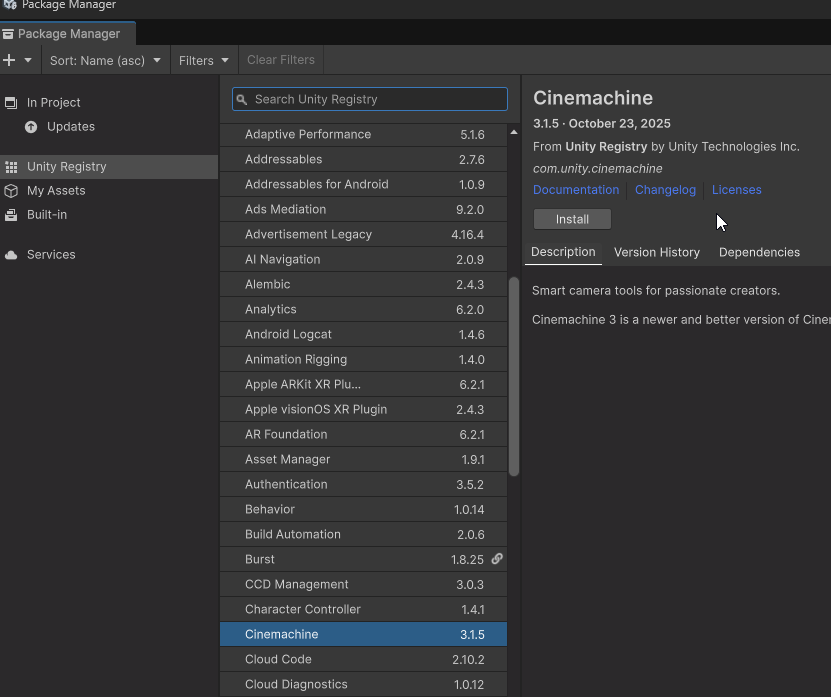
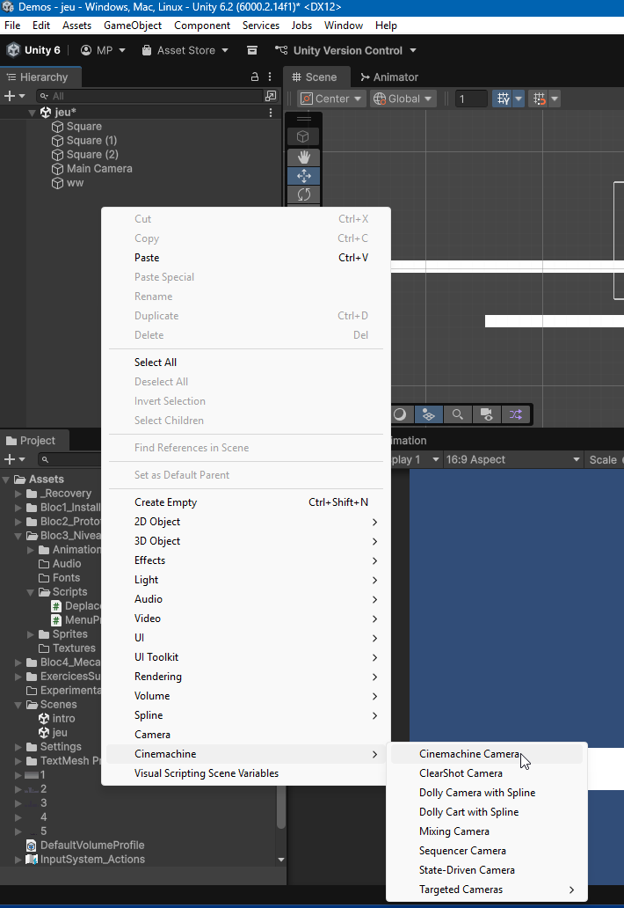
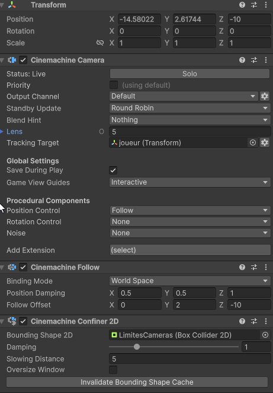
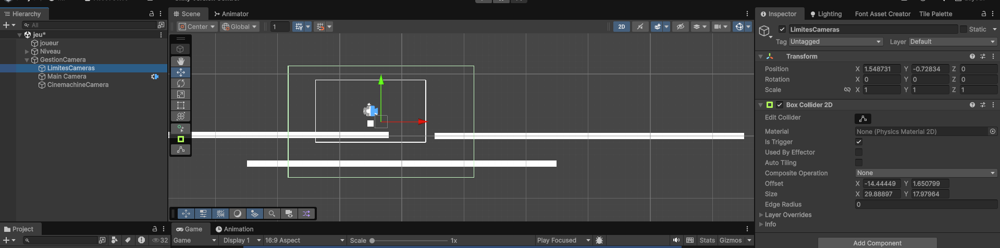

# Ajustement de la caméra du joueur avec Cinemachine

La manière la plus simple de suivre un joueur avec une caméra est de parenter la caméra au joueur. Cependant, cela peut sembler rigide et peu naturel. Une meilleure approche consiste programmer les comportements de la caméra pour qu'elle suive le joueur de manière fluide et dynamique, s'arrête aux limites du jeu et permette au joueur de se déplacer dans une zone sans que la caméra ne le suive pas immédiatement.

Heureusement, Unity propose un outil appelé Cinemachine qui facilite grandement cette tâche.

## Qu'est-ce que Cinemachine ?

Cinemachine est un puissant outil de gestion de caméra dans Unity autant en 2d qu'en 3d qui permet de créer des comportements de caméra dynamiques et fluides. C'est simple à mettre en place et offre une grande flexibilité pour suivre le joueur dans un jeu.

## Étapes pour configurer Cinemachine pour suivre le joueur

1. **Installer Cinemachine** :

    - Ouvrez Unity et allez dans le menu `Window` > `Package Manager`.
    - Recherchez `Cinemachine` dans la liste des packages disponibles.
    - Cliquez sur `Install` pour ajouter Cinemachine à votre projet.

2. **Ajouter une Virtual Camera** :

    - Dans la hiérarchie, faites un clic droit et sélectionnez `Cinemachine` > `Cinemachine Camera`.
    - Une nouvelle caméra virtuelle sera ajoutée à votre scène.

3. **Configurer la Virtual Camera** :

    - Sélectionnez la caméra virtuelle dans la hiérarchie.
    - Dans l'inspecteur, trouvez le composant `CinemachineCamera`.
    - Dans le champ `Lens`, vous pouvez ajuster les paramètres de la caméra selon vos besoins.
    - Dans le champ `Tracking Target`, faites glisser et déposez l'objet joueur ( ou le GameObject que vous souhaitez suivre).
    - Dans le champ `Position Control`, choisissez `follow` pour que la caméra suive le joueur.

4. **Ajuster les paramètres de la caméra** :

    - Après avoir choisi `follow`, vous pouvez ajuster les paramètres de suivi tels que la `Damping` pour rendre le mouvement de la caméra plus fluide. Cela créé un delai entre le mouvement du joueur et celui de la caméra.
    - Vous pouvez également ajuster le décalage de la caméra pour qu'elle ne soit pas centrée exactement sur le joueur, mais légèrement en avant ou en hauteur selon vos préférences. **Laissez -10 sur l'axe Z pour une vue 2D classique.**

5. **Limiter le mouvement de la caméra dans une zone** :

-   Dans le champ `Add Extension`, vous pouvez ajouter des extensions comme `Cinemachine Confiner 2D` pour que la caméra reste dans des limites définies du niveau. (voir plus bas)
-   Ajouter un objet vide dans la scène et nommez-le `LimitesCamera`.
-   Ajoutez un composant `Box Collider 2D` ou `Polygon Collider 2D` selon la forme de votre niveau.
-   Cochez la case `Is Trigger` pour que le collider ne bloque pas les objets.(important!!)
-   Ajustez la taille et la position du collider pour qu'il englobe toute la zone
-   Dans la caméra virtuelle, ajoutez l'extension `Cinemachine Confiner 2D`.
-   Faites glisser l'objet `LimitesCamera` dans le champ `Bounding Shape 2D` de l'extension.

