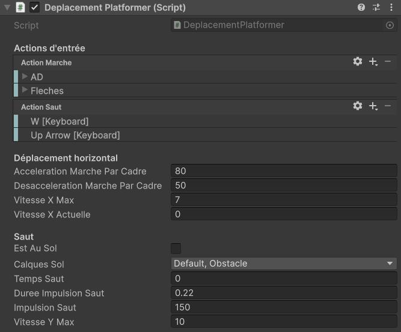

# Projet en classe : La caverne de la mort

Dans les prochains cours (16 à 23), nous allons réaliser un jeu de type "platformer" où le joueur contrôle un personnage qui doit traverser un niveau et éviter des ennemis et des obstacles dangereux. Voici un [exemple jouable](https://h26-2j2.github.io/projet-caverne/) de ça qu'on va créer en classe.

{ width: 80%; }

## Cours 17 - Déplacer le jouer avec la physique

On va implémenter ce déplacement en deux étapes : déplacement simple et avec des fonctionnalités extras.

### Étape 1 - Déplacement de base

1. Ajouter un **Rigidbody2D** et un **BoxCollider2D** a l'objet Personnage.
2. Dans `Start()`, on récupère une référence `rb` au **Rigidbody2D** avec `GetComponent<>()`.
3. Créer un nouveau script `DeplacementPlatformer.cs`.

#### Configuration de contrôle

1. Importer la bibliothèque `UnityEngine.InputSystem`.
2. Définir deux variables publiques `InputAction` nommées `entreeMarche` et `entreeSaut`.
3. On prépare les InputActions dans `OnEnable()` et `OnDisable()`.
4. Dans l'**Inspector**, on ajoute des bindings : un positif/négatif pour `actionMarche` et un simple pour `actionSaut`.
5. Pour le mouvement et l'input, on va synchroniser les inputs avec la physique. Pour faire ça, on va dans **Edit > ProjectSettings > Input System Package > Settings** et on change **Update Mode > Process Events in Fixed Update**. Pour plus de détails, voir [la documentation](https://docs.unity3d.com/Packages/com.unity.inputsystem@1.19/manual/timing-optimize-fixed-update.html).
6. Dans notre script, on va créer une fonction `FixedUpdate()` et, dans cette fonction, deux variables `float` locales : `axeMarche` avec la valeur de notre `actionMarche` et `intensiteMarche` avec la valeur absolue de cet axe (`Mathf.Abs(axeMarche)`).

#### Appliquer la logique de la marche

On veut avoir du mouvement de marche avec des accélerations pour donner un style plus fluide aux déplacements.

1. Créer des champs publiques `float` pour `acccelerationMarche`, `vitesseXMax` et `vitesseXActuelle`.
1. On multiplie l'`axeMarche` par l'`accelerationMarche` et on somme au `rb.linearVelocityX`.
2. On limite la valeur de `rb.linearVelocityX` avec un `Mathf.Clamp()` et la `vitesseXMax`.
3. On garde la valeur de `rb.linearVelocityX` dans la variable `vitesseXActuelle` parce qu'elle sera outil pour gérer les animations et le visuel du personnage.

#### Appliquer la logique du saut

Pour le saut, on va commencer avec une implémentation qui ne limite pas láctivation du saut et où son hauteur est toujours la même.

1. Changer le `Gravity Scale` du Rigidbody2D a `5f`.
2. Créer des champs publics `float` pour `accelerationSaut` et`vitesseYMax`.
3. Si `actionSaut.WasPressedThisFrame()`, on va commencer le saut, donc le `tempsSaut = 0f`.
      1. On applique l'impulsion vers le haut avec la méthode `rb.AddForce(Vector2.up * impulsionSaut, ForceMode2D.Impulse)`. Le `Vector2.up` défine la direction et l'`impulsionSaut` l'intensité de la force. L'argument `ForceMode2D.Impulse` applique cette accélération de façon immédiate.
      2. Pour éviter des déplacements extrêmes, on limite la valeur de `rb.linearVelocityY` avec un `Mathf.Clamp()` et la `vitesseYMax`.

#### Configuration exemple -pour l'étape 1

Voici quelques valeurs intéressantes pour la configuration du composant : 

### Étape 2 - Détection du sol et saut variable

#### Modifier la logique de la marche

On veut avoir du mouvement de marche avec des accélerations pour donner un style plus fluide aux déplacements.

1. Changer le `Linear Damping` du Rigidbody2D a `0f`.
2. Créer un champs publiques `float` pour `ralentissementMarche`.
3. Pour **ralentir la marche**: 
  1. Si on n'as pas d'intensité de marche (`intensiteMarche <= 0.01f`), on ralentisse la vitesse X du `rb` avec une interpolation vers 0f (`Mathf.Lerp(rb.linearVelocityX, 0, ralentissementMarche * Time.fixedDeltaTime)`).

#### Modifier la logique du saut

Pour le saut, on veut le modifier pour qu'il soit activé seulement quand le personnage est au sol. On veut aussi que l'impulsion du saut a une durée maximale : ça nous permet d'avoir un saut d'hauteur variable selon le temps qu'on enfonce la touche, en lieu d'une hauteur fixe.

1. Créer des champs publics `float` pour `tempsSaut`, `dureeImpulsionSaut`, `vitesseYMax`, un champs `LayerMask calquesSol` et un champs `bool estAuSol`.
2. Pour faire la **détection du sol**:
   1. On va tester si le personnage est au sol avec la méthode `Physics2D.Raycast(rb.position, Vector2.down, 1f, calquesSol)` qui lance un rayon d'un mètre de longueur à partir de son pivot vers en bas. Les objets hors les `calquesSol` vont être ignorés.
   2. On garde le résultat dans une variable locale `RaycastHit2D hit`.
      1. Si `hit.collider` est nul, le rayon n’a pas touché d’objets dans les calques du sol.
      2. Si `hit.collider` n'est pas nul, le rayon a touché le sol.
      3. On garde le résultat de ces conditions dans la variable `estAuSol`.
3. Pour créer **la hauteur variable**, on va ajouter deux `if` et modifier le `if` déjà existant:
   1. Si `actionSaut.WasPressedThisFrame() && estAuSol`, on va commencer le saut, donc le `tempsSaut = 0f`.
   2. Dans le if du `actionSaut.IsPressed()`, on augmente le `tempsSaut` pour montrer que plus de temps enfoncé c'est passé.
   3. Si `actionSaut.WasReleasedThisFrame()`, le bouton est relâché, donc on change le `tempsSaut` à l'infini pour éviter que l'impulsion soit appliquée.

#### Configuration exemple pour l'étape 2

## Cours 18 - Contrôle de caméra avec Cinemachine

À venir.

## Cours 19 - Gestion d'animations multiples avec Animator pt.1

À venir.

## Cours 20 - Gestion d'animations multiples avec Animator pt.2

À venir.

## Cours 21 - Instanciation de projectiles

À venir.

## Cours 22 - Gestion d'ennemis et listes

À venir.

## Cours 23 - Post processing et lumières 2D

À venir.