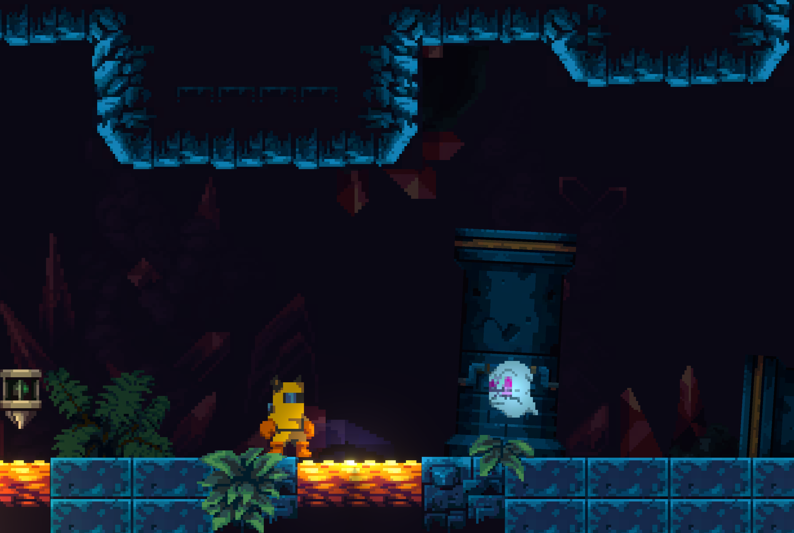
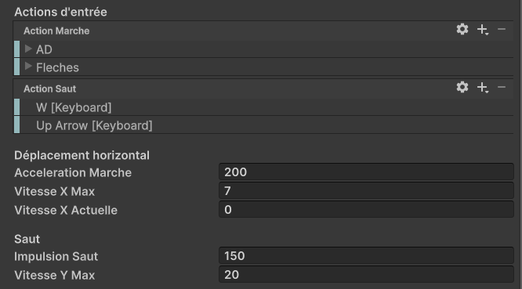
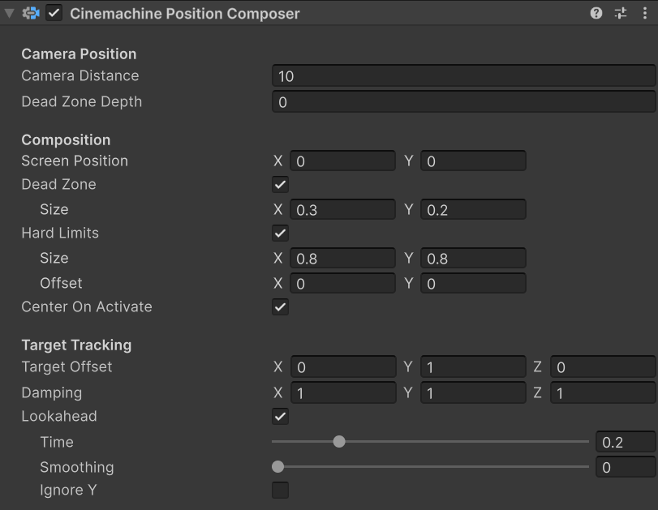
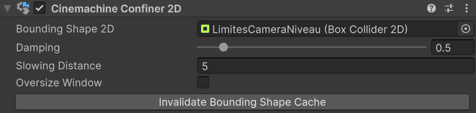
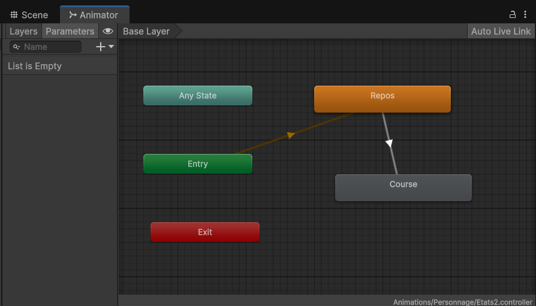
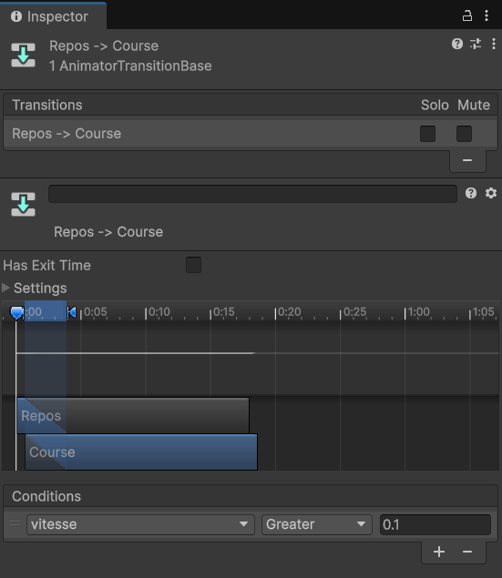

# Projet en classe : La caverne de la mort

Dans les prochains cours (16 à 23), nous allons réaliser un jeu de type "platformer" où le joueur contrôle un personnage qui doit traverser un niveau et éviter des ennemis et des obstacles dangereux. Voici un [exemple jouable](https://h26-2j2.github.io/projet-caverne/) de ça qu'on va créer en classe.

{ width: 80%; }

## Cours 17 - Déplacer le jouer avec la physique

On va implémenter ce déplacement en deux étapes : déplacement simple et avec des fonctionnalités extras.

1. Ajouter un **Rigidbody2D** et un **BoxCollider2D** a l'objet Personnage.
2. Dans `Start()`, on récupère une référence `rb` au **Rigidbody2D** avec `GetComponent<>()`.
3. Créer un nouveau script `DeplacementPlatformer.cs`.

### Configuration de contrôle

1. Importer la bibliothèque `UnityEngine.InputSystem`.
2. Définir deux variables publiques `InputAction` nommées `entreeMarche` et `entreeSaut`.
3. On prépare les InputActions dans `OnEnable()` et `OnDisable()`.
4. Dans l'**Inspector**, on ajoute des bindings : un positif/négatif pour `actionMarche` et un simple pour `actionSaut`.
5. Pour le mouvement et l'input, on va synchroniser les inputs avec la physique. Pour faire ça, on va dans **Edit > ProjectSettings > Input System Package > Settings** et on change **Update Mode > Process Events in Fixed Update**. Pour plus de détails, voir [la documentation](https://docs.unity3d.com/Packages/com.unity.inputsystem@1.19/manual/timing-optimize-fixed-update.html).
6. Dans notre script, on va créer une fonction `FixedUpdate()` et, dans cette fonction, deux variables `float` locales : `axeMarche` avec la valeur de notre `actionMarche` et `intensiteMarche` avec la valeur absolue de cet axe (`Mathf.Abs(axeMarche)`).

### Appliquer la logique de la marche

On veut avoir du mouvement de marche avec des accélerations pour donner un style plus fluide aux déplacements.

1. Créer des champs publiques `float` pour `acccelerationMarche`, `vitesseXMax` et `vitesseXActuelle`.
1. On multiplie l'`axeMarche` par l'`accelerationMarche` et on somme au `rb.linearVelocityX`.
2. On limite la valeur de `rb.linearVelocityX` avec un `Mathf.Clamp()` et la `vitesseXMax`.
3. On garde la valeur de `rb.linearVelocityX` dans la variable `vitesseXActuelle` parce qu'elle sera outil pour gérer les animations et le visuel du personnage.

### Appliquer la logique du saut

Pour le saut, on va commencer avec une implémentation qui ne limite pas láctivation du saut et où son hauteur est toujours la même.

1. Changer le `Gravity Scale` du Rigidbody2D a `5f`.
2. Créer des champs publics `float` pour `accelerationSaut` et`vitesseYMax`.
3. Si `actionSaut.WasPressedThisFrame()`, on va commencer le saut, donc le `tempsSaut = 0f`.
      1. On applique l'impulsion vers le haut avec la méthode `rb.AddForce(Vector2.up * impulsionSaut, ForceMode2D.Impulse)`. Le `Vector2.up` défine la direction et l'`impulsionSaut` l'intensité de la force. L'argument `ForceMode2D.Impulse` applique cette accélération de façon immédiate.
      2. Pour éviter des déplacements extrêmes, on limite la valeur de `rb.linearVelocityY` avec un `Mathf.Clamp()` et la `vitesseYMax`.

### Configuration exemple

Voici quelques valeurs intéressantes pour la configuration du composant : 



## Cours 18 - Contrôle de caméra avec Cinemachine

### Configuration de base : 2D Camera

1. Si le package **Cinemachine** n'est pas installé, aller sur *Window > PackageManager >Unity Registry* et l'installer.
2. On ajoute un composant **Cinemachine Brain** à la **Main Camera** de la scène.
3. On crée un nouvel objet dans la scène avec *GameObject >  Cinemachine > Targeted Cameras > 2D Camera*. Nommer cet objet **CinemachineCamera**.
4. Dans le nouvel objet **CinemachineCamera**, on change la propriété `Tracking Target` à notre objet de Personnage.
5. On change la propriété `Lens` à 5 pour répliquer la taille de la caméra défaut.

### Composition dynamique

Le composant **Cinemachine Position Composer** permet d'encadrer l'objet cible (`Tracking Target`) dynamiquement, avec des **zones mortes** (où la caméra ne suive pas la cible), **anticipation** (Lookahead, quand la caméra suit une estimation de la position future de la cible) et des **limites de cadre**. 



### Limites de niveau pour la caméra

On peut aussi définir des limites sur l'espace général de la scène. Les étapes pour configurer des limites sont :

1. On clique sur le bouton *Add Extension* de notre **CinechineCamera** et on ajoute un composant **Cinemachine Confiner2D**.
2. On ajoute un nouvel objet vide dans la scène nommé **LimitesCameraNiveau** avec un **BoxCollider2D**. Éditer la forme du collider pour délimiter l'espace de la caméra. Activer l'option `IsTrigger`.
3. On connecte cet objet **LimitesCameraNiveau** à la propriété `Bounding Shape 2D` du **Confiner2D**.



## Cours 19 - Gestion d'animations multiples avec Animator pt.1

### Préparation des animations : course, repos

1. On utilise le **Sprite Editor** pour découper et définir les pivots des sprites `player-idle` et `player-run`
2. Avec le panneau **Animation** et l'objet *Visuel* de notre *Personnage* sélectionné, on va créer deux [animations image par image](16_AnimationImageParImage), une pour le repos et une autre pour la course. Les deux doivent être en boucle (**Animation Clip > Loop Time actif**).
3. La création de ces animations va aussi créer un composant **Animator** à l'objet *Visuel* et un fichier du type **Animator Controller**. On va double-cliquer le fichier du type Animator Controller pour explorer notre [machine d'état qui va gérer les animations multiples](19_GestionAnimationsMultiples1_Animator).

### Configuration des états, paramètres et transitions

1. On va définir l'animation de **repos** comme notre animation défaut (*Bouton droit sur l'etat > Set Default Layer State*).
2. On créer une transition de **repos à course** (*Bouton droit > Make Transition*).	
	
3. On va aussi créer une transition de retour **course à repos**.
4. Après sélectionner les flèches de chaque transition, on désactive l'option *HasExitTime* des transitions.
5. On retourne au panneau Animator. Dans l'onglet Parameters, on va ajouter un nouveau paramètre du type float nommé `vitesse`.
6. Dans les transitions, on va créer des **conditions** en utilisant ce paramètre:
	1. Transition *Repos > Course* : vitesse `Greater` 0.1.
	2. Transition *Course > Repos* : vitesse `Less` 0.1.
	

### Connexion avec notre logique de jeu (scripts)

1. Pour envoyer les informations de nos scripts vers l'Animator, on utilise les fonctions `SetFloat()` , `SetBool()` et `SetTrigger()` de la composante **Animator**.
2. Dans un nouveau script `Personnage.cs` ajouté à notre objet *Personnage*, on va prendre des références à l'**Animator** de l'objet *Visuel* et à notre composant **DeplacementPlatformer**:

```csharp
Animator anim;
DeplacementPlatformer deplacement;

void Start(){
	anim = GetComponentInChildren<Animator>();
	deplacement = GetComponent<DeplacementPlatformer>();
}
```

3. On va récupérer la vitesse horizontal du personnage, calculer son intensité, c.à.d. la valeur absolue `Mathf.Abs()`, et garder dans une variable float `intensiteVitesseX`.
4. Après, on va envoyer cette information au paramètre `vitesse` de notre Animator, en utilisant la méthode `SetFloat()`.
```csharp
void Update(){
	float intensiteVitessseX = 0f;
	intensiteVitesseX = Mathf.Abs(deplacement.vitesseX);
	anim.SetFloat("vitesse", intensiteVitesseX);
}
```

#### Tourner le personnage avec `flipX`

1. Pour que le personnage tourne à la bonne direction, soit en repos ou en course, on va utiliser la propriété *flipX* de sont **SpriteRenderer**.
2. Quand l'intensité de notre vitesse horizontale est plus grande que zéro, c.-à.-d. on a un mouvement n'importe la direction, on va vérifier quel le signe de notre vitesse avec `Mathf.Sign()`. Si négatif (-1f), on veut changer `flipX = true` pour refléter le sprite.

```csharp
// Dans le script Personnage.cs attaché au objet Personnage.
SpriteRenderer sr;

// Dans Start()
sr = GetComponentInChildren<SpriteRenderer>();

// Dans Update()
// ... à la fin de la méthode.
if (intensiteVitesseX > 0f){
	if (Mathf.Sign(deplacement.vitesseX) < 0){
		sr.flipX = true;
	}
	else {
		sr.flipX = false;
	}
}
```

## Cours 20 - Gestion d'animations multiples avec Animator pt.2 (saut, Raycast)

### Détection du sol

Pour bloquer des double-sauts, on veut le modifier pour qu'il soit activé seulement quand le personnage est au sol. On va aussi utiliser un Raycast pour détecter si le joueur est proche d'un objet avec des calques spécifiques (avec une masque).

1. Créer des champs publics `float` pour `vitesseYMax`, un champs `LayerMask masqueSol` et un champs `bool estAuSol`.
2. Pour faire la **détection du sol**:
   3. On va tester si le personnage est au sol avec la méthode `Physics2D.Raycast(rb.position, Vector2.down, 1f, calquesSol)` qui lance un rayon d'un mètre de longueur à partir de son pivot vers en bas. Les objets hors les `calquesSol` vont être ignorés.
   4. On garde le résultat dans une variable locale `RaycastHit2D hit`.
      1. Si `hit.collider` est nul, le rayon n’a pas touché d’objets dans les calques du sol.
      2. Si `hit.collider` n'est pas nul, le rayon a touché le sol.
      3. On garde le résultat de ces conditions dans la variable `estAuSol`.
  5. On ajoute la méthode `Debug.DrawRay(rb.position, Vector2.down * distance, Color.green);` pour visualiser le rayon dans le jeu.
  
### Changements à l'Animator Controller

1. On va créer un nouveau état **Saut** avec l'AnimationClip du saut.
2. Ajouter un paramètre du type `bool` nommé `estAuSol`.
3. Créer une transition entre **AnyState -> Saut** avec la condition `estAuSol` égale à vrai. Décocher l'option *HasExitTime*.
4. Créer une transition entre Saut -> Repos avec la condition `estAuSol` égale à faux. Décocher l'option `HasExitTime`.
5. Dans notre script `Personnage.cs`, on ajoute la ligne `animator.SetBool("estAuSol", estAuSol)` à la fin de notre `Update()` pour envoyer la valeur de cette variable vers la machine d'états.

## Cours 21 - Instanciation de projectiles

### Création du prefab

1. On ajoute un nouveau **GameObject** nommé `Projectile`.
2. On ajoute un **SpriteRenderer** avec un sprite de balle, un **Rigidbody2D** sans gravité et un **CircleCollider2D**.
3. On va aussi créer un script `Projectile.cs` et l'ajouter à cet objet.
4. Dans le script on ajoute la logique suivante :
    ```csharp
    public void Declencher(float vitesseX)
    {
        GetComponent<SpriteRenderer>().flipX = vitesseX < 0;
        GetComponent<Rigidbody2D>().linearVelocityX = vitesseX;
    }

    public void OnCollisionEnter2D(Collision2D collision)
    {
        Destroy(gameObject);
    }
    ```
5. On l'enregistre comme un prefab dans un dossier Prefabs dans le panneau _Project_.

### Action et instanciation

2. Dans notre script `Personnage.cs`, on ajoute un champ public `InputAction` nommée `actionTir` et on la configure dans `OnEnable()` et `OnDisable()`.
3. On ajoute aussi un champ public du type `Projectile` nommé `prefabProjectile`, un  `Vector2` nommé `offsetDepartTir` avec la valeur `0.5f` et un `float` nommé `vitesseTir` avec `10f`.
4. On utilise `sr.flipX` pour traiter la position de départ. Si il est vrai, le personnage regarde la droite, donc on somme la position de départ à la position du personnage. Si non , on la subtracte.
    ```csharp
    float signeDirection = (sr.flipX) ? 1 : -1;
    Vector2 positionDepart = rb.position + (offsetDepartTir * signeDirection);
    ```
5. Dans notre` Update()`, on vérifie que `actionTir` a été pressée dans ce cadre. C'est dans cet `if` qu'on va instancier notre prefab.
6. On ajoute `var nouveauTir = Instantiate(prefabProjectile, positionDepart, transform.rotation)`.
7. On exécute la méthode `nouveauTir.Declencher(Vector2.right * signeDirection * vitesseTir);` pour lancer le projectile.

### Intégration de l'animation et de l'état de tir

1. Créer une animation avec les sprites de `player-shoot` nommée `Perso-Tir`. Décocher l'option de `Loop Time` dans l'**AnimationClip**.
2. 
3. Dans l'**AnimatorController** pour le Personnage, ajouter un nouveau paramètre du type Trigger nommé `tir`.
4. Dans le code du personnage, juste après l'instanciation du projectile, on utilise `anim.SetTrigger("tir")` pour mettre à jour la machine d'états.
5. On ajoute aussi des transitions dans l'**AnimatorController**: `Any State -> Pers-Tir` et `Perso-Tir -> Perso-Repos`. La première transition est déclenchée par le trigger `tir`. La seule condition de sortie est le `HasExitTime`.

## Cours 22 - Gestion d'ennemis et listes

À venir.

## Cours 23 - Post processing et lumières 2D

À venir.