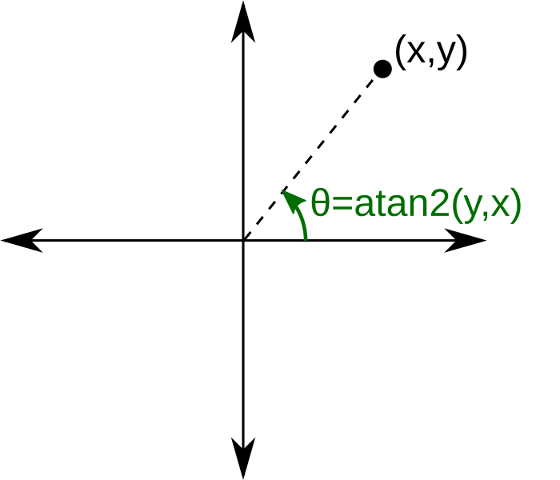

# Calculer l'angle et la distance entre deux objets

Lorsqu'il s'agit de jeux en 2D ou en 3D, il est souvent nécessaire de calculer l'angle et la distance entre deux objets pour diverses raisons, telles que l'orientation des personnages, la détection des collisions, ou le ciblage des ennemis ou simplement le curseur de la souris.

## Calculer la distance entre deux objets

Pour calculer la distance entre deux objets dans Unity, vous pouvez utiliser la méthode `Vector2.Distance` pour les jeux en 2D ou `Vector3.Distance` pour les jeux en 3D.

```csharp
GameObject objetA; // Référence au premier objet
GameObject objetB; // Référence au second objet

float CalculerDistance()
{
    // Retourne la distance entre les deux objets
    return Vector2.Distance(objetA.transform.position, objetB.transform.position);
}
```

## Calculer l'angle entre deux objets

On peut calculer l'angle entre deux objets en utilisant la méthode Atan2 et Rad2Deg de la classe Mathf pour obtenir l'angle en radians, puis le convertir en degrés. Cela calculera l'angle entre la ligne reliant les deux objets et l'axe horizontal (tangente inverse).



```csharp
public GameObject cible; // Référence à l'objet cible Ex: un ennemi, une cible à atteindre, etc.

float CalculerAngle(Vector2 pointA, Vector2 pointB)
{
    //Trouve l'angle en radians entre les deux points
    float angle = Mathf.Atan2(pointB.y - pointA.y,pointB.x - pointA.x);

    // Convertit l'angle de radians en degrés
    angle = Mathf.Rad2Deg * angle;

    // Retourne l'angle en degrés lorsque la fonction est appelée
    return angle;
}

void Update()
{

    //On oriente le personnage ou l'objet vers la cible
    float angle = CalculerAngle(transform.position, cible.transform.position);
    transform.eulerAngles = new Vector3(0, 0, angle);
}
```

## Utilisations créatives

-   **Missile à tête chercheuse** : Utilisez le calcul d'angle pour orienter un missile vers une cible en mouvement seulement si la cible est dans une certaine distance.
-   **Champ de vision** : Déterminez si un ennemi peut "voir" le joueur en calculant l'angle entre la direction de l'ennemi et la position du joueur.
-   **Tower Defense** : Orientez les canons des tours vers les ennemis les plus proches en utilisant la distance et l'angle pour améliorer la précision des tirs.
-   **Déclencher une alarme** : Activez une alarme ou un événement lorsque le joueur entre dans une certaine distance d'un objet spécifique.

## Ex: Orienter un objet vers le curseur de la souris lors du lancer d'un projectile

Dans cet exemple, nous réutilisons les notions de calcul d'angle et de distance pour orienter un projectile vers la position du curseur de la souris lors d'un lancer. Le projectile sera créé à partir d'un prefab et sa vitesse sera déterminée par la distance entre le point de lancement et la position du curseur.

De plus, nous réutilisons nos connaissances sur les `InputAction` pour détecter le clic de la souris et celles sur le `LineRenderer` pour dessiner une ligne de visée entre le point de création et la position du curseur (cours 5 et 15).

```csharp
// Script du joueur
public float forceLancer = 1f; // Force appliquée au lancer du projectile
public GameObject projectilePrefab; // Référence au prefab du projectile
public Transform pointLancerProjectile; // Point de lancement du projectile
public InputAction mouvementLancerJoueur; // Action d'entrée pour le lancer
private LineRenderer ligneLancer; // Composant LineRenderer pour dessiner la trajectoire

void Start()
{
    ligneLancer = GetComponent<LineRenderer>();
    ligneLancer.positionCount = 2; // Ligne avec deux points
    ligneLancer.enabled = false; // Désactiver la ligne au départ
    projectilePrefab.SetActive(false); // Désactiver le prefab au départ
}

float CalculerAngle(Vector2 pointA, Vector2 pointB)
{
    float angle = Mathf.Atan2(pointB.y - pointA.y, pointB.x - pointA.x);
    angle = Mathf.Rad2Deg * angle;
    return angle;
}

float CalculerDistance(Vector2 pointA, Vector2 pointB)
{
    return Vector2.Distance(pointA, pointB);
}

void Update()
    {

        //On dessine la trajectoire de lancer tant que le joueur maintient le clic
        if (mouvementLancerJoueur.IsPressed())
        {
            // On dessine une ligne entre le point de lancement et la position du curseur
            ligneLancer.enabled = true;

            Vector2 positionCurseur = Camera.main.ScreenToWorldPoint(
                Mouse.current.position.ReadValue()
            );

            ligneLancer.SetPosition(0, pointLancerProjectile.position);
            ligneLancer.SetPosition(1, positionCurseur);
        }

        //Lorsque le joueur relâche le clic, on lance le projectile
        if (mouvementLancerJoueur.WasReleasedThisFrame())
        {
            // On désactive la ligne de lancer pour voir le projectile
            ligneLancer.enabled = false;

            Vector2 positionCurseur = Camera.main.ScreenToWorldPoint(
                Mouse.current.position.ReadValue()
            );

            // Calculer l'angle et la distance entre le point de lancement et la position du curseur
            float angle = CalculerAngle(pointLancerProjectile.position, positionCurseur);
            float distance = CalculerDistance(pointLancerProjectile.position, positionCurseur);

            // On clone et lance le projectile
            GameObject copie = Instantiate(
                projectilePrefab,
                pointLancerProjectile.position,
                pointLancerProjectile.rotation
            );
            //On oriente le projectile vers le curseur
            copie.transform.eulerAngles = new Vector3(0, 0, angle);

            //On applique une vitesse(vélocité) au projectile en fonction de la distance et de la force de lancer
            //Plus la distance est grande, plus la vitesse sera élevée
            copie.GetComponent<Rigidbody2D>().linearVelocity = copie.transform.right * distance * forceLancer;

            // On active le projectile cloné
            copie.SetActive(true);
        }
    }
```
