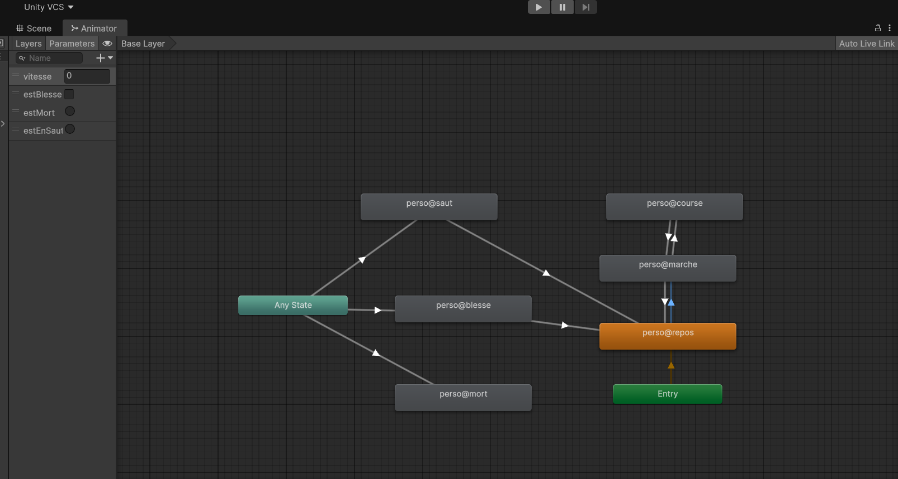
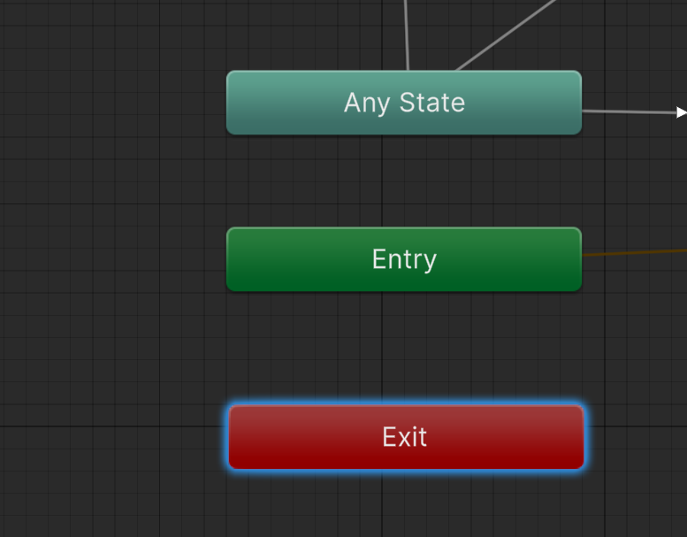
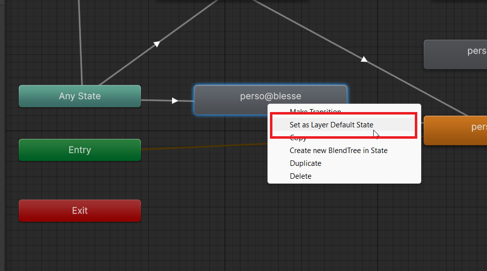
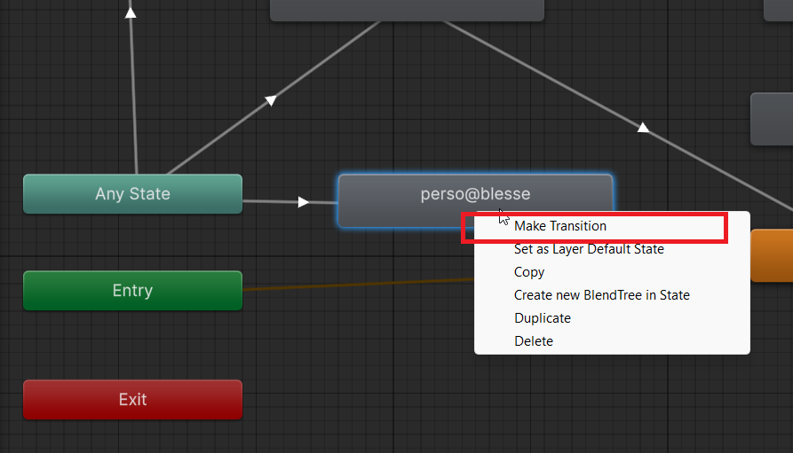
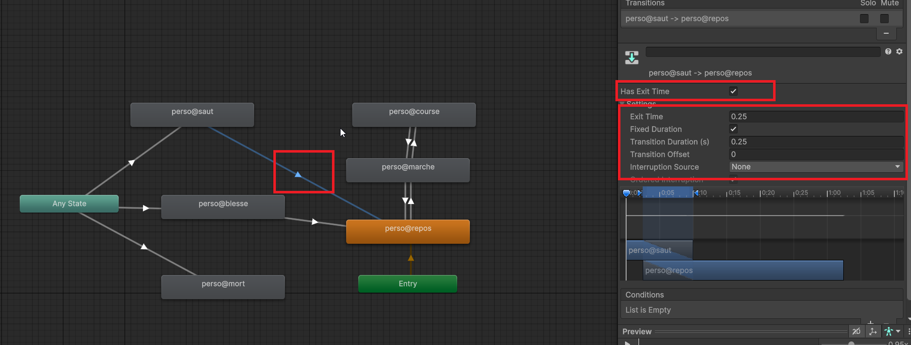
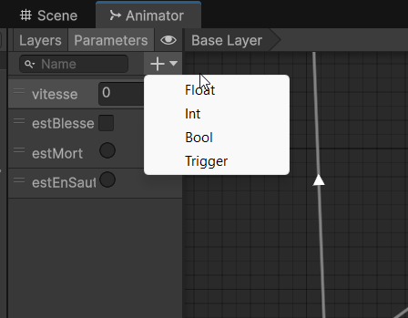
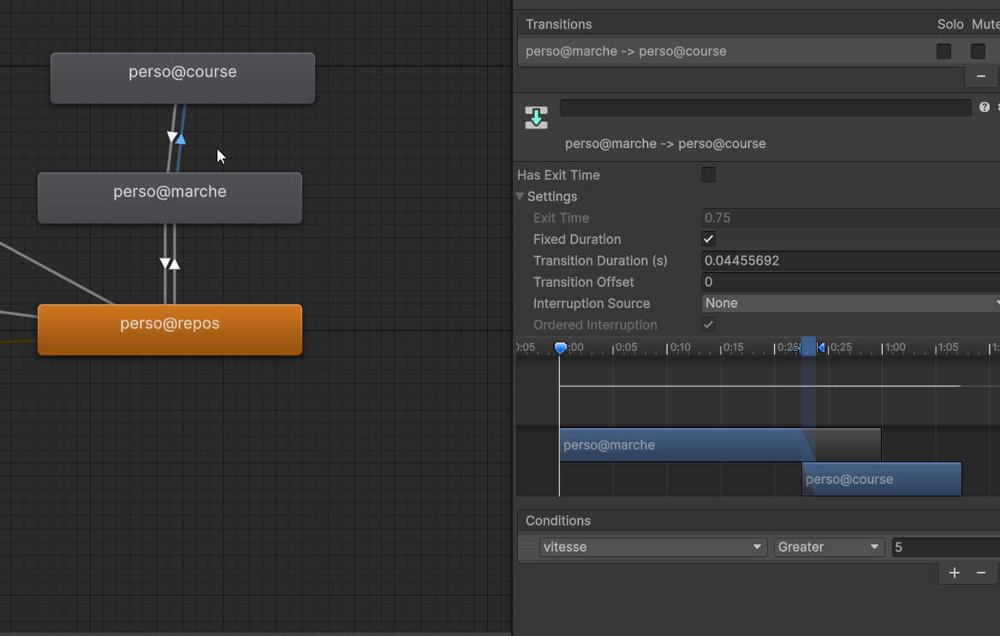
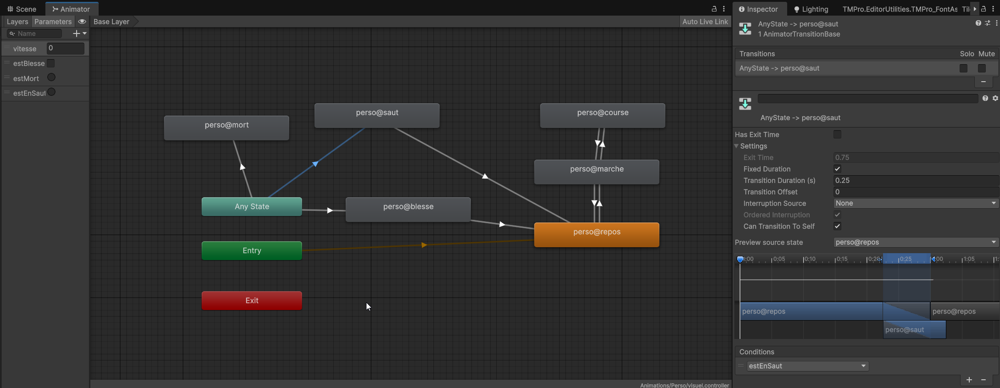

# Gestion animations multiples pt. 1

Dans ce chapitre, nous allons apprendre à gérer plusieurs animations pour un même GameObject en utilisant le composant **Animator** de Unity aussi appelé "Mecanim" . Nous verrons comment créer et organiser différentes animations, ainsi que comment les faire interagir entre elles.

## Créer plusieurs animations pour un même GameObject

Il est tout à fait possible d'avoir plusieurs animations pour un même GameObject. Par exemple, un personnage peut avoir des animations de marche, de saut, d'attaque, etc. Pour gérer ces différentes animations, nous allons utiliser le composant **Animator**. Chaque animation est créée dans un fichier d'animation distinct, et le composant Animator permet de les organiser et de les faire interagir grâce à des états et des transitions.

Les animations sont organisées dans une **machine à états d'animation** (Animation State Machine) qui permet de définir les différentes animations et les conditions de transition entre elles. Par exemple, vous pouvez définir une transition de l'animation de marche à l'animation de saut lorsque le personnage appuie sur la touche de saut.

Dans la fenêtre Animation, vous pouvez créer plusieurs animations pour le même GameObject en suivant les étapes décrites dans les chapitres précédents. Chaque fois que vous créez une nouvelle animation, elle sera ajoutée à la machine à états d'animation du composant Animator. Sinon, vous pouvez glisser-déposer les fichiers d'animation dans la fenêtre Animator pour les ajouter à la machine à états.

## La fenêtre Animator

La fenêtre Animator est l'endroit où vous pouvez organiser et gérer les différentes animations de votre GameObject. Vous pouvez y créer des états d'animation, définir des transitions entre ces états, et ajouter des paramètres pour contrôler les transitions.

Par défaut, lorsque vous créez une animation pour un GameObject, Unity crée automatiquement un état d'animation pour cette animation dans la fenêtre Animator. Vous pouvez ensuite ajouter d'autres états pour les autres animations que vous avez créées.



## Les états d'animation et les transitions

Chaque état d'animation représente une animation spécifique (par exemple, marche, saut, attaque). Vous pouvez créer des transitions entre ces états pour définir comment et quand les animations changent. Les transitions peuvent être basées sur des conditions, telles que des paramètres booléens, des triggers ou des valeurs numériques. Par exemple, vous pouvez créer une transition de l'état de marche à l'état de course lorsque la vitesse du personnage dépasse une certaine valeur.

Les états `Entry`, `Any State` et `Exit` sont des états spéciaux dans la machine à états d'animation.

- L'état `Entry` est attaché à l'animation qui sera jouée par défaut lorsque le jeu commence. C'est l'état de départ de la machine à états d'animation.
- L'état `Any State` permet de créer des transitions vers n'importe quel autre état, ce qui est utile pour les animations qui peuvent être déclenchées à tout moment (par exemple, une animation de mort).
- L'état `Exit` est utilisé pour sortir de la machine à états d'animation, généralement pour revenir à un état précédent ou pour terminer une séquence d'animations. À ce moment là, le GameObject peut revenir à l'état `Entry` ou à un autre état défini dans la machine à états.



Vous pouvez définir l'animation par défaut qui sera jouée lorsque le jeu commence en faisant en cliquant avec le bouton droit sur l'état d'animation et en sélectionnant "Set as Layer Default State". Cela garantit que cette animation sera jouée dès le début du jeu. Elle sera attachée à l'état `Entry` de la machine à états d'animation. Si vous ne définissez pas d'animation par défaut, Unity jouera la première animation que vous avez créée pour ce GameObject.



Vous pouvez définir des transitions entre ces états pour contrôler comment et quand les animations changent. En cliquant avec le bouton droit sur un état d'animation dans la fenêtre Animator, vous pouvez créer une transition vers un autre état en sélectionnant "Make Transition" et en cliquant ensuite sur l'état de destination.



## Propriétés d'une transition

Chaque transition entre les états d'animation a des propriétés que vous pouvez ajuster pour contrôler le comportement de la transition. Vous pouvez les afficher dans l'inspecteur en cliquant sur la flèche qui relie les deux états. Par exemple, vous pouvez définir la durée de la transition, la courbe d'interpolation, et les conditions de transition basées sur les paramètres que vous avez définis dans la machine à états d'animation.

- `Has Exit Time` : Si cette option est cochée, la transition ne se produira qu'après la fin de l'animation actuelle. Si elle est décochée, la transition peut se produire à tout moment en fonction des conditions définies. Donc, pour une animation de mort, vous voudrez probablement décocher cette option pour que la transition vers l'animation de mort puisse se produire immédiatement lorsque le personnage meurt, sans attendre la fin de l'animation en cours.
- `Transition Duration` : Cette propriété définit la durée de la transition entre les deux états. Une durée plus longue créera une transition plus fluide, tandis qu'une durée plus courte rendra la transition plus rapide. Pour une animation de mort, vous pouvez choisir une durée de transition plus courte pour que l'animation de mort soit réactive et se déclenche rapidement lorsque le personnage meurt. Pour une animation de marche à course, vous pouvez choisir une durée de transition plus longue pour que la transition soit plus fluide et naturelle.



## Les paramètres d'animation

Les paramètres d'animation sont des variables que vous pouvez définir dans la fenêtre Animator pour contrôler les transitions entre les états d'animation. Il existe plusieurs types de paramètres, tels que les booléens, les triggers, les floats et les ints. Vous pouvez utiliser ces paramètres pour créer des conditions de transition entre les différentes animations.

- Les paramètres booléens sont utilisés pour des conditions simples qui peuvent être vraies ou fausses (par exemple, "EstAccroupi" ou "PossedeArmure").
- Les triggers sont des paramètres qui sont activés une seule fois pour déclencher une transition (par exemple, "Mort" ou "Attaque"). Ils sont automatiquement réinitialisés après avoir été utilisés pour une transition, ce qui les rend idéaux pour des événements ponctuels.
- Les paramètres float sont utilisés pour des conditions basées sur des valeurs numériques (par exemple, "Vitesse" pour contrôler la transition entre la marche et la course).
- Les paramètres int sont utilisés pour des conditions basées sur des valeurs entières (par exemple, "NbDeVies" pour contrôler une animation de la couleur du UI si le personnage est presque mort).



Ensuite, pour créer une transition basée sur un paramètre, vous pouvez cliquer sur la flèche de transition entre les états d'animation et ajouter une condition dans l'inspecteur. Par exemple, vous pouvez créer une transition de l'état de marche à l'état de course lorsque le paramètre "vitesse" est supérieur à 5.



## Contrôler les animations par programmation

Pour déclencher des animations par programmation, vous pouvez utiliser les méthodes de la classe `Animator` dans vos scripts.

- `SetBool(string name, bool value)` : Permet de définir la valeur d'un paramètre booléen.
- `SetTrigger(string name)` : Permet d'activer un trigger pour déclencher une transition.
- `SetFloat(string name, float value)` : Permet de définir la valeur d'un paramètre float.
- `SetInteger(string name, int value)` : Permet de définir la valeur d'un paramètre int.

Par exemple, si vous avez un paramètre booléen "EstAccroupi" dans votre machine à états d'animation, vous pouvez le définir dans votre script de la manière suivante :

```csharp
Animator animator = GetComponent<Animator>();
animator.SetBool("EstAccroupi", true); // Le personnage s'accroupit
animator.SetBool("EstAccroupi", false); // Le personnage se relève
```

De même, si vous avez un trigger "Attaque", vous pouvez l'activer dans votre script comme ceci :

```csharp
Animator animator = GetComponent<Animator>();
animator.SetTrigger("Attaque"); // Le personnage attaque
```

Pour les paramètres float et int, vous pouvez les définir de la même manière en utilisant les méthodes `SetFloat` et `SetInteger` respectivement.

```csharp
Animator animator = GetComponent<Animator>();
animator.SetFloat("Vitesse", 5f); // Définit la vitesse du personnage
animator.SetInteger("NbDeVies", 3); // Définit le nombre de vies du personnage
```

## Exemple de script pour gérer les animations de déplacement d'un personnage

Voici un exemple classique d'animator pour un personnage qui se déplace horizontalement et qui peut sauter. Le script utilise les paramètres d'animation pour contrôler les transitions entre les animations de marche et de saut, de blessure, de mort, etc.


```csharp
using UnityEngine;
using UnityEngine.InputSystem;

public class DeplacementPersonnage : MonoBehaviour
{
    Animator anim;
    Rigidbody2D rb;
    float vitesseDeplacement = 5f;
    float forceSaut = 300f;

    float deplacementHorizontal = 0f;
    bool sautEnCours = false;

    public InputAction mouvementHorizontalJoueur;
    public InputAction mouvementSautJoueur;

    void Enable()
    {
        mouvementHorizontalJoueur.Enable();
        mouvementSautJoueur.Enable();
    }
    void Disable()
    {
        mouvementHorizontalJoueur.Disable();
        mouvementSautJoueur.Disable();
    }

    void Start()
    {
        anim = GetComponent<Animator>();
        rb = GetComponent<Rigidbody2D>();
    }

    void Update()
    {
       deplacementHorizontal = mouvementHorizontalJoueur.ReadValue<float>();
       sautEnCours = mouvementSautJoueur.WasPressedThisFrame();

       // Met à jour le paramètre "Vitesse" dans l'Animator pour contrôler les transitions d'animation
       anim.SetFloat("Vitesse", Mathf.Abs(rb.velocity.x));

       if (sautEnCours)
       {
            anim.SetTrigger("Saut");
       }
    }

    void FixedUpdate()
    {
        rb.velocity = new Vector2(deplacementHorizontal * vitesseDeplacement, rb.velocity.y);
        if (sautEnCours)
        {
            rb.AddForce(new Vector2(0f, forceSaut));
            sautEnCours = false;
        }
    }
}
```

## Pour aller plus loin - Blend Trees

Les Blend Trees sont des outils avancés dans Unity qui permettent de combiner plusieurs animations en fonction de paramètres, créant ainsi des transitions fluides. Ils sont particulièrement utiles pour les animations de personnages, comme la marche, la course et le saut, où vous souhaitez que les transitions soient naturelles et réactives. Pour en savoir plus sur les Blend Trees, vous pouvez consulter la documentation officielle de Unity : [Blend Trees](https://docs.unity3d.com/6000.3/Documentation/Manual/class-BlendTree.html).

## Références

[Documentation officielle Unity sur le composant Animator](https://docs.unity3d.com/6000.3/Documentation/Manual/AnimationOverview.html)
