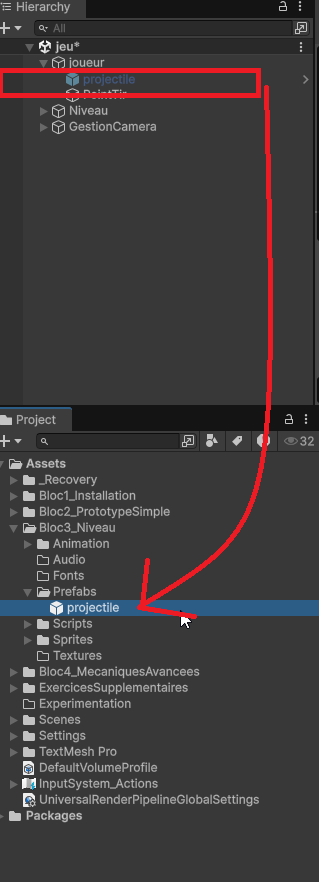
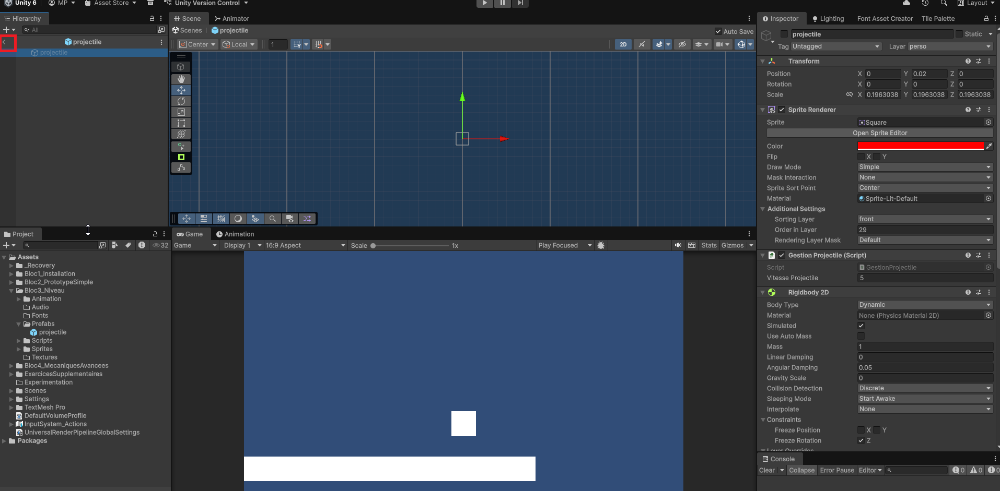
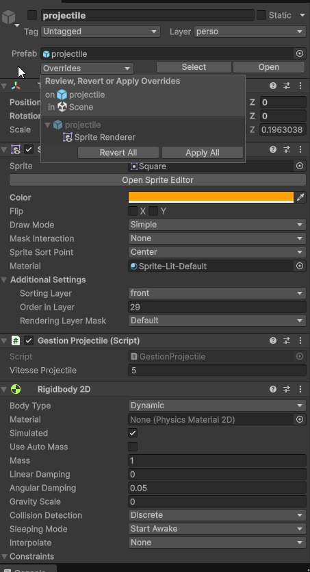

# Instanciation et objets préfabriqués (Prefabs)

Les **objets préfabriqués** (ou _Prefabs_) sont des modèles d'objets que vous pouvez créer dans Unity pour réutiliser facilement des configurations d'objets complexes. Ils permettent de créer des clones (instances) d'objets avec les mêmes propriétés, composants et hiérarchies, facilitant ainsi la gestion et la modification de plusieurs objets similaires dans une scène.

## Création d'un Prefab

Pour créer un Prefab, vous n'avez qu'à créer un objet dans votre scène, le configurer comme vous le souhaitez (ajouter des composants, définir des propriétés, etc.), puis faire glisser cet objet depuis la hiérarchie vers le dossier "Assets" dans le panneau "Project". Cela crée un fichier Prefab que vous pouvez réutiliser.

Ce prefab peut être modifié ultérieurement, et toutes les instances de ce prefab dans la scène seront mises à jour automatiquement si vous appliquez les modifications au prefab.

Ce prefab servira de modèle pour créer des copies (instances) dans la scène.

Vous pouvez glisser-déposer le prefab depuis le dossier "Assets" vers la hiérarchie pour créer une instance de ce prefab dans la scène et effectuer des modifications spécifiques à cette instance si nécessaire. (Exemple les variables publiques dans un script attaché à un ennemi).

**Les prefabs devraient être regroupés dans un dossier "Prefabs" dans le dossier "Assets" pour une meilleure organisation du projet.**

## Instanciation/clonage/duplication d'un Prefab via le script

En programmation, l'instanciation signifie simplement la copie d'un nouvel objet à partir d'un modèle (comme un prefab).

Pour instancier un Prefab via un script, vous pouvez utiliser la méthode `Instantiate()`. Attention, au lieu de glisser-déposer l'objet de la hiérarchie, vous devez faire glisser le prefab depuis le dossier "Assets" vers une variable publique dans votre script.

Lors de l'instanciation, vous devez préciser la position et la rotation de l'objet instancié. Il est fréquent d'utiliser la position et la rotation d'un autre objet dans la scène pour cela comme point de création (Spawn Point).

Vous pouvez ensuite garder en mémoire la référence de l'objet instancié dans une variable si vous souhaitez le manipuler par la suite.



```csharp
using UnityEngine;
public class PrefabInstantiator : MonoBehaviour
{
    // Référence au prefab à instancier
    public GameObject prefab;
    public GameObject pointDeCreation;

    void Start()
    {
        // Instanciation du prefab à la position du point de création avec la rotation du point de création
        GameObject copie = Instantiate(prefab, pointDeCreation.transform.position, pointDeCreation.transform.rotation);
        copie.name = "ObjetInstancié"; // Renommer l'objet instancié
        copie.SetActive(true); // Activer l'objet instancié si nécessaire
    }
}
```

## Ex: Lancer un projectile

Voici un exemple plus concret d'utilisation des Prefabs pour lancer un projectile (comme une balle) depuis un point de création (spawn point) lorsque l'utilisateur appuie sur une touche.

```csharp
// Script du joueur
using UnityEngine;
using UnityEngine.InputSystem;

public class PlayerController : MonoBehaviour
{
    public GameObject projectilePrefab; // Référence au prefab du projectile
    public GameObject pointCreation; // Point de création du projectile
    public float vitesse = 20f; // Vitesse du projectile

    public InputAction tirJoueur;


    private void OnEnable()
    {
        tirJoueur.Enable();
    }

    private void OnDisable()
    {
        tirJoueur.Disable();
    }

   void Update()
    {
        // Vérifier si la touche de tir est pressée
        if (tirJoueur.WasPressedThisFrame())
        {
            LancerProjectile();
        }
    }

    void LancerProjectile()
    {
        // Instancier le projectile à la position et rotation du point de création
        GameObject projectile = Instantiate(projectilePrefab, pointCreation.transform.position, pointCreation.transform.rotation);

        // Appliquer une force au projectile pour le faire avancer
        // On récupère le composant Rigidbody du projectile, s'il en a un
        Rigidbody rb = projectile.GetComponent<Rigidbody>();
        if (rb != null)
        {
            // Donner une vitesse au projectile dans la direction avant du point de création
            rb.linearVelocity = pointCreation.transform.forward * vitesse;
        }

    }
}
```

```csharp
// Script du projectile
// Assurez-vous que le prefab du projectile a un composant Rigidbody2D et un Collider2D pour gérer les collisions.
using UnityEngine;

public class Projectile : MonoBehaviour
{
    public float dureeVie = 5f; // Durée de vie du projectile avant destruction

    void Start()
    {
        // Détruire le projectile après une certaine durée
        Destroy(gameObject, dureeVie);
    }

    private void OnCollisionEnter2D(Collision2D collision)
    {
        // Gérer la collision avec d'autres objets (par exemple, infliger des dégâts)

        //Ex: On récupère le script Joueur et on diminue la vie de 10
        // Assurez-vous que l'objet avec lequel le projectile entre en collision a un Script "Joueur"
        // et une méthode publique DiminuerVie(int montant)
        collision.gameObject.GetComponent<Joueur>().DiminuerVie(10);

        // Détruire le projectile à l'impact
        Destroy(gameObject);
    }
}
```

## Modifier un prefab

Pour modifier un prefab, vous pouvez double-cliquer sur le prefab dans le dossier "Assets" pour l'ouvrir dans le mode d'édition de prefab. Vous pouvez ensuite apporter des modifications à l'objet, ajouter ou supprimer des composants, et ajuster les propriétés.

Une fois que vous avez terminé, cliquez sur le bouton "Retour à la scène" pour revenir à votre scène principale. Toutes les instances du prefab dans la scène seront mises à jour avec les modifications apportées.

{width="100%"}

Si vous avez fait des changements individuels à une version d'un prefab dans la scène et que vous souhaitez revenir à la version originale du prefab, vous pouvez sélectionner l'objet dans la hiérarchie, puis cliquer sur le bouton "Override" et ensuite "Revert" dans l'inspecteur pour annuler les modifications locales.

{width="100%"}
