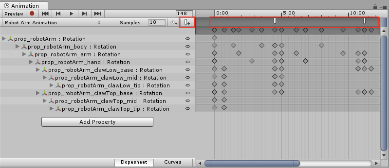
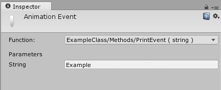

# Gestion avancée des ennemis avec StateMachineBehaviour

Nous avons vu comment connecter des animations simples à des actions de personnage. Il est possible d'aller plus loin en utilisant les StateMachineBehaviour de Unity pour gérer des comportements plus complexes, notamment pour des ennemis avancés comme des boss ayant des phases d'attaque variées.

## États de l'Animator

L'Animator de Unity permet de créer d'ajouter des logiques de programmation en utilisant des StateMachineBehaviour. Ces comportements peuvent être déclenchés lorsqu'une animation débute, se met à jour ou se termine.

Par exemple, pour un ennemi avec plusieurs phases d'attaque, vous pouvez déplacer l'ennemi vers le joueur lorsqu'une animation d'attaque commence, changer de phase lorsque l'animation se termine, ou choisir une nouvelle attaque aléatoire pendant l'animation.

## Création d'un StateMachineBehaviour

Pour ajouter des comportements aux états de l'Animator, suivez ces étapes :

1. Ouvrez la fenêtre Animator en sélectionnant le GameObject du boss et en cliquant sur "Window" > "Animation" > "Animator".
2. Ajoutez des animations pour chaque animation du boss (par exemple, "Idle", "Attack", "Defend").
3. Cliquez avec le bouton droit sur un état et sélectionnez "Add Behaviour" pour attacher un script personnalisé à cet état.
4. Dans le script, vous pouvez utiliser les méthodes `OnStateEnter`, `OnStateUpdate`, et `OnStateExit` pour définir le comportement du boss lors de l'entrée, de la mise à jour et de la sortie de l'état.

### États disponibles dans StateMachineBehaviour

-   `OnStateEnter`: Appelé lorsque l'animation entre dans cet état.
-   `OnStateUpdate`: Appelé à chaque frame pendant que l'animation est dans cet état. C'est un peu comme la méthode `Update()` dans un MonoBehaviour.
-   `OnStateExit`: Appelé lorsque l'animation quitte cet état. On peut l'utiliser pour nettoyer ou réinitialiser des variables ou choisir la prochaine action de manière aléatoire.

## Exemple de script StateMachineBehaviour

Voici un exemple de script attaché à un état d'attaque :

```csharp
using UnityEngine;
using UnityEngine.Animations;

public class BossAttackBehaviour : StateMachineBehaviour
{
    public GameObject projectilePrefab;
    public GameObject joueur;
    public float vitesseDeplacement = 2f;
    public float dureeMaxAttaque = 5f;
    public float timer=0f;
    // Appelé lorsque l'état est entré
    override public void OnStateEnter(Animator animator, AnimatorStateInfo stateInfo, int layerIndex)
    {
        timer = 0f;
        InvokeRepeating("lancerProjectile", 0f, 1f); // Lancer un projectile toutes les secondes

    }

    // Appelé à chaque frame pendant que l'état est actif
    override public void OnStateUpdate(Animator animator, AnimatorStateInfo stateInfo, int layerIndex)
    {
        timer += Time.deltaTime;
        if(timer >= dureeMaxAttaque)
        {
            animator.SetTrigger("PhaseRecuperation");
            return;
        }
        // Tant qu'on est dans l'état d'attaque, se déplacer vers le joueur
        transform.position = Vector2.MoveTowards(transform.position, joueur.transform.position, vitesseDeplacement * Time.deltaTime);

        // Si on est proche du joueur, déclencher une attaque de corps à corps
        if(Vector2.Distance(transform.position, joueur.transform.position) < 1f)
        {
            animator.SetTrigger("PhaseAttaqueCorpsACorps");
        }
    }

    // Appelé lorsque l'état est quitté
    override public void OnStateExit(Animator animator, AnimatorStateInfo stateInfo, int layerIndex)
    {
        // Désactiver l'attaque du boss
        cancelInvoke("lancerProjectile");
    }

    void lancerProjectile()
    {

        GameObject projectile = Instantiate(projectilePrefab, transform.position, transform.rotation);
        Vector2 direction = (joueur.transform.position - transform.position).normalized;
        projectile.GetComponent<Rigidbody2D>().linearVelocity = direction * 10f; // Vitesse du projectile
    }
}
```

## Déclencher une action spécifique avec des événements d'animation

Dans la ligne de temps de la fenêtre Animation, vous pouvez ajouter des événements d'animation pour déclencher des changements de phase ou d'autres actions spécifiques. Par exemple, vous pourriez synchroniser le déclenchement d'un son d'attaque avec un moment précis de l'animation ou lancer un sort.





[Animation Events dans Unity](https://docs.unity3d.com/Manual/script-AnimationWindowEvent.html)

[Documentation officielle de Unity sur StateMachineBehaviour](https://docs.unity3d.com/ScriptReference/StateMachineBehaviour.html)
