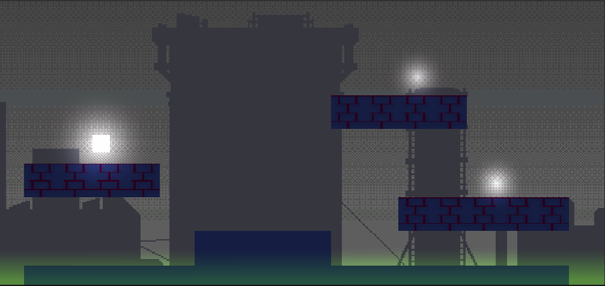
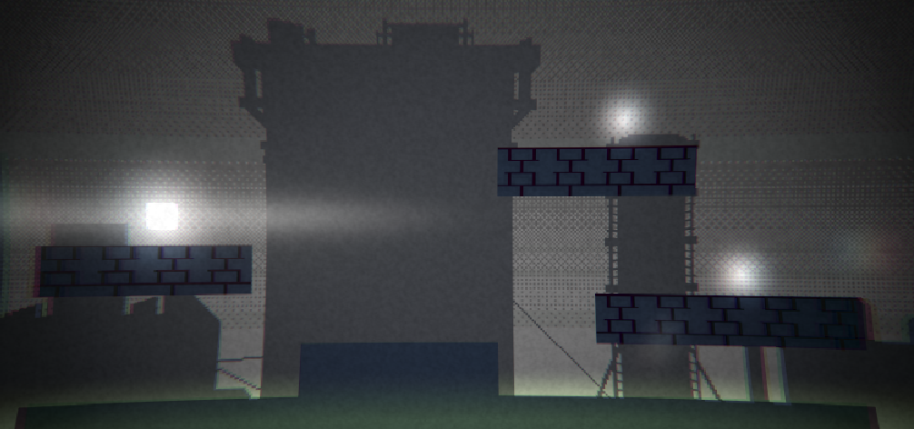
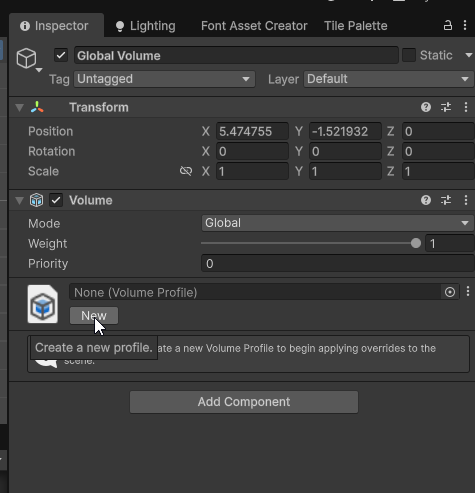
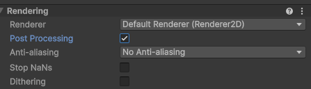
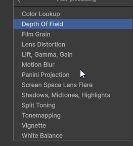
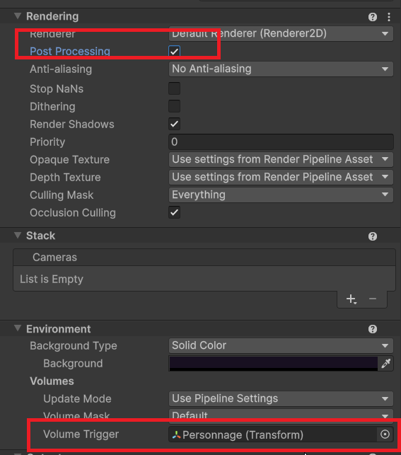

# Design de niveau : Post-Processing

Le post-traitement (Post-Processing) est une technique utilisée pour améliorer l'apparence visuelle d'un jeu en appliquant divers effets graphiques après le rendu de la scène. Unity propose un système de post-traitement puissant et flexible qui permet aux développeurs de créer des effets visuels impressionnants pour leurs jeux. Il peut être utilisé pour ajuster les couleurs, la luminosité, le contraste, ajouter des effets de flou, de vignettage, et bien plus encore.

À noter que le post-traitement peut avoir un impact significatif sur les performances, en particulier sur les appareils mobiles ou les configurations matérielles plus anciennes. Il est donc important de tester et d'optimiser les effets utilisés pour garantir une expérience fluide pour les joueurs.

{width="75%"}

{width="75%"}

## Configuration du Post-Processing dans Unity

Lorsque vous créez un nouveau projet Unity avec le gabarit "Universal 2D", le **POST-TRAITEMENT EST DÉJÀ CONFIGURÉ PAR DÉFAUT**.

Si vous utilisez un autre projet plus ancien, vous devrez peut-être configurer le post-traitement manuellement. Allez dans le menu **Window > Package Manager**, recherchez "Post Processing" et installez-le si ce n'est pas déjà fait.

## Ajouter un volume de post-traitement global

Le volume de post-traitement global applique des effets à toute la scène, indépendamment de la position de la caméra.

1. **Ajouter un Volume de Post-Processing** : Créez un GameObject vide dans votre scène et ajoutez-lui un composant **Volume** via le menu **Component > Rendering > Volume**. Sélectionnez le type **Global** pour que les effets s'appliquent à toute la scène.
2. **Créer un Profil de Post-Processing** : Dans le composant Volume, cliquez sur **New** à côté de **Profile** pour créer un nouveau profil de post-traitement.

3. **Ajouter des effets de Post-Processing** : Cliquez sur le bouton **Add Override** dans le profil de post-traitement pour ajouter des effets tels que **Bloom**, **Color Grading**, **Vignette**, **Depth of Field**, etc.
4. Sur la caméra principale de la scène, assurez-vous _Post Processing_ est activé dans le composant **Rendering**.
   

## Effets courants de Post-Processing

- **Bloom** : Ajoute un effet de halo lumineux autour des objets brillants, ce qui peut donner un aspect plus réaliste et immersif. En combinant avec des sources de lumière intenses, le bloom peut simuler la dispersion de la lumière dans une lentille d'appareil photo.
- **Color adjustments** : Ajuste les niveaux de couleur, la saturation, le contraste et la luminosité pour améliorer l'apparence générale de la scène.
- **Vignette** : Ajoute un assombrissement progressif des bords de l'écran, ce qui peut aider à focaliser l'attention du joueur sur le centre de l'écran.
- **Motion Blur** : Ajoute un flou de mouvement aux objets en mouvement rapide, ce qui peut améliorer la sensation de vitesse et de dynamisme.À utilser avec précaution, car il peut rendre la scène difficile pour les joueurs sensibles au mal des transports ou à la fatigue visuelle.
- **Chromatic Aberration** : Simule la dispersion de la lumière à travers une lentille, créant un effet de séparation des couleurs aux bords de l'écran.À utilser avec précaution, car il peut rendre la scène difficile pour les joueurs sensibles au mal des transports ou à la fatigue visuelle.
- **Film Grain** : Ajoute un effet de grain similaire à celui des films traditionnels, ce qui peut donner un aspect rétro ou artistique à la scène. Vous pouvez également créer votre propre texture de grain pour un effet personnalisé pour créer un aspect télévisuel ancien ou stylisé.
- **Lens Distortion** : Simule la distorsion optique causée par les lentilles d'appareils photo, ce qui peut être utilisé pour créer des effets visuels intéressants ou pour simuler des perspectives inhabituelles.
- **White Balance** : Ajuste la température des couleurs de la scène pour corriger les dominantes de couleur indésirables ou pour créer une ambiance spécifique.

Il y a d'autres effets disponibles dans le post-traitement de Unity, et vous pouvez les combiner pour créer des looks uniques adaptés à votre jeu.

## Ajouter un volume local (créer une zone avec des effets de post-traitement spécifiques)

En plus des volumes globaux, vous pouvez créer des volumes de post-traitement locaux qui n'affectent qu'une partie spécifique de la scène. Cela est utile pour créer des effets visuels distincts dans différentes zones du jeu. Cette zone se déclenche lorsque l'élément défini dans l'onglet Volume Trigger entre dans le collider du volume local. Ceci est configuré dans la section **Environnement** de la caméra principale. Vous glisserez généralement le personnage du joueur dans la section Volume Trigger pour que les effets de post-traitement s'appliquent lorsque le joueur entre dans le volume local.

1. Créez un **Box Volume** (ou un autre type de volume) en allant dans le menu **GameObject > Volume > Box Volume**.
2. Positionnez et redimensionnez le volume pour couvrir la zone souhaitée dans votre scène en modifiant le collider de celui-ci. Assurez-vous que le collider est suffisamment grand pour que la caméra puisse entrer dans le volume et déclencher les effets de post-traitement.
3. Assurez-vous que la case **Post-Processing** est cochée dans la caméra principale.
4. Dans le composant Volume, créez un nouveau profil de post-traitement ou utilisez-en un existant.
5. Ajoutez et configurez les effets de post-traitement spécifiques pour ce volume local.
6. Ajuster le paramètre **Blend Distance** pour définir la distance sur laquelle les effets de post-traitement s'estomperont lorsque la caméra entre ou sort du volume. Cela crée une transition plus fluide entre les effets du volume local et les effets globaux.
7. Ajustez le paramètre **Weight** pour contrôler l'intensité des effets de post-traitement dans le volume local. Une valeur de 1 signifie que les effets sont appliqués à pleine intensité, tandis qu'une valeur de 0 signifie qu'ils ne sont pas appliqués du tout. Généralement, vous voudrez régler ce paramètre à 1 pour que les effets du volume local soient pleinement appliqués lorsque la caméra est à l'intérieur du volume mais cela pourrait être modifié par programmation pour créer des effets dynamiques.
8. Ajustez le paramètre **Priority** si vous avez plusieurs volumes qui se chevauchent. Un volume avec une priorité plus élevée prendra le dessus sur les autres. Si vous avez un volume global et un volume local qui se chevauchent, le volume local aura généralement la priorité.

[Documentation officielle Unity sur le post-traitement](https://docs.unity3d.com/Packages/com.unity.postprocessing@3.0/manual/index.html)
